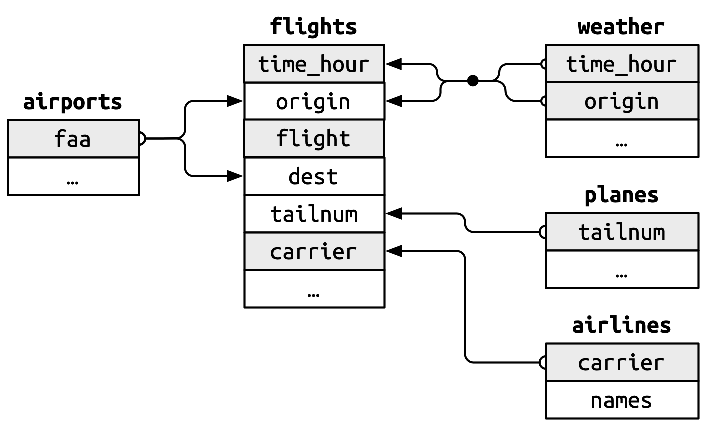
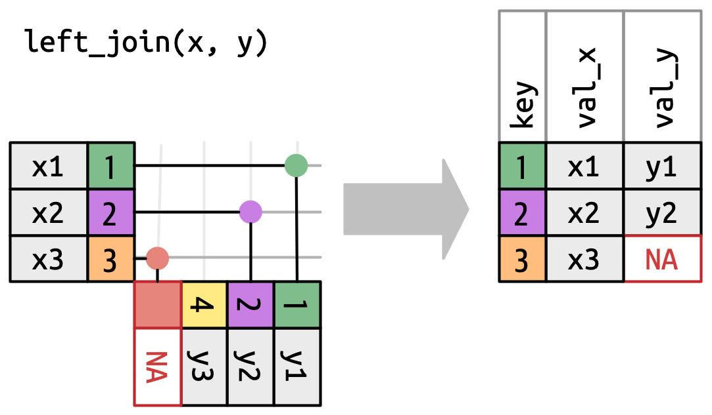
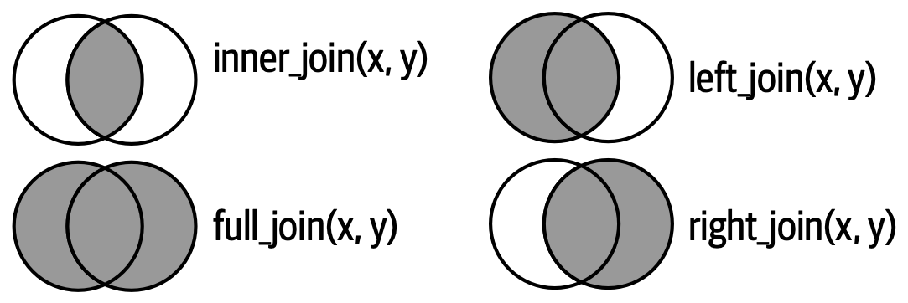

## De qué trata la clase de hoy

El **objetivo principal** es poner en práctica los ***verbos*** principales del **Data Wrangling**, es decir, las operaciones fundamentales utilizadas para la transformación y limpieza de datos. En otras palabras, el 80 % del trabajo si nos atenemos a la regla 80/20.

1.  **Primera parte:** revisión de la clase pasada para poder clonar el repositorio que contiene este archivo o hacer el primer `git pull`. Agregar **contribuidores** a un repositorio.
2.  **Segunda parte**: **repaso** de operaciones de filtrado, agregación y cruce de tablas usando el paquete nycflights13.
3.  **Tercera parte:** estudiar **un caso real usando datos de Argentina.** Vamos a cruzar indicadores económicos provinciales de Nación con el Producto Bruto Geográfico (PBG) de la Provincia de Buenos Aires para responder una pregunta concreta: ***¿Qué peso tiene la economía bonaerense en el total nacional?***
4.  **Cuarta parte**: cómo crear y correr un ***script*** **de R**,

La idea de esta clase es que puedan ir corriendo y pensando las operaciones que vamos a hacer en paralelo, pudiendo también tomar caminos alternativos, si así lo desean. No existe un único camino para llegar al mismo resultado.

------------------------------------------------------------------------

## 1. Repaso de operaciones básicas

### Preparación del entorno

Primero, cargamos los paquetes que vamos a utilizar. Usaremos la colección `tidyverse` para manipular los datos y `nycflights13` para la primera parte.

```{r}
# Instalamos los paquetes si no los tenemos 
# install.packages(c("tidyverse", "nycflights13", "skimr", "scales", "ggplot2", "pacman"))

# Los cargamos en el entorno
library(tidyverse)
library(nycflights13)
library(skimr)
library(scales)
```

El paquete `nycflights13` contiene datos de todos los vuelos que salieron de Nueva York en 2013. Es una base de datos muy utilizada porque es ideal para aprender dado que la información está desmenuzada en varias tablas (**vuelos**, **aerolíneas**, **aviones**, **clima**, **aeropuertos**).

{width="433"}

### Exploración y Verbos Básicos

Veamos la tabla principal: `flights`.

```{r}
glimpse(flights)
```

Notemos el número de filas (**observaciones**) y columnas (**variables**), así como también los nombres y los diferentes formatos en la cual se estructuran:\<int\>, \<dbl\> y \<dtm\>.

```{r}
cat(
  names(flights)
)
```

Podemos usar la función de agregación `count` para ver cuántos vuelos tuvo cada aerolínea.

```{r}
# formato anidado
# arrange(count(flights, carrier), -n) 

# formato pipe
flights |>
  count(carrier, sort=TRUE)
```

Supongamos, ahora, que queremos **ver sólo los vuelos de la aerolínea United Airlines (`UA`) que hayan tenido un retraso en la salida (`dep_delay`) de más de 60 minutos**, y nos interesan únicamente las columnas de fecha, destino y el retraso.

```{r}
vuelos_retrasados_ua = flights |> 
  filter(carrier == "UA", dep_delay > 60) |> 
  select(year, month, day, dest, dep_delay, tailnum)

head(vuelos_retrasados_ua)
```

Utilizamos el verbo `filter` para filtrar la tabla por la columna `carrier` (aerolínea) y `dep_delay` (retraso en la salida). Notar que usamos ",", pero que el comando funciona también si usamos "&". Después, seleccionamos aquellas únicamente aquellas variables que nos interesan para identificar el vuelo. El comando `head`, tanto como el `glimpse`, nos sirven para darnos una idea del contenido de la tabla.

Si nos interesa, por ejemplo, tener una noción de en qué momento del año el retraso en el despegue es mayor podríamos agregar los datos por mes y tomar valores promedio.

```{r}
retraso_mensual = vuelos_retrasados_ua |> 
  group_by(month) |>
  # group_by(day) |> 
  summarize(
    retraso_promedio = mean(dep_delay, na.rm = TRUE),
    cantidad_vuelos = n()
  ) |> 
  # arrange(desc(retraso_promedio))
  arrange(desc(cantidad_vuelos))

retraso_mensual
```

Este combo (`group_by + summarize`) se re contra usa en la práctica porque condensa mucha información que, seguramente, sea difícil de interpretar en los datos crudos.

La librería también nos provee otra base de datos: `planes`

```{r}
glimpse(planes)
```

¿Para qué nos puede servir esta base de datos? Por ejemplo, si tuviésemos la **hipótesis de que aquellos vuelos que más tardaron en arrancar fueron aquellos cuyos aviones fueron construidos hace más tiempo.**

```{r}
vuelos_con_aviones = vuelos_retrasados_ua |> left_join(planes, by = "tailnum")|> 
  # Renombramos para no confundir el año del vuelo con el año del avión
  rename(year_flight = year.x, year_plane = year.y) |> 
  select(year_flight, month, dest, dep_delay, tailnum, year_plane, model)  
vuelos_con_aviones |> arrange(-dep_delay) |> head()
```

{width="301"}

El `left_join` deja inertes los valores de la tabla izquierda (x) y recorta los de la derecha (y) a medida. En consecuencia, si comparamos la variable que indica el número de avión de `vuelos_retrasados_ba` con la misma variable en `vuelos_con_aviones` obtenemos exactamente el mismo resultado, es decir, no se perdió nada de la tabla original.

```{r}
all(
select(vuelos_con_aviones, tailnum) == select(vuelos_retrasados_ua, tailnum)
)
```

```{r}
# var = planes |> select(year) |> unique() |> arrange(year) # ERROR esto no nos sirve porque no los mismos aviones que vuelos_retrasadaos_ua

vuelos_con_aviones |> select(year_plane) |> unique() |> arrange(year_plane) #ACÁ sí podemos ver el verdadero año en que se construyeron
```

Las operaciones de `join` más usuales se sintetizan gráficamente en este diagrama de Venn donde cada circulo representa el conjunto de valores referidos a la columna de interés en cada tabla (x e y)

{width="393"}

En base a estas operaciones se pueden construir otras más complejas que pueden ser de gran utilidad, por ejemplo, el `anti_join` mantiene las observaciones de x que no tienen una coincidencia en y. En el diagrama de Venn esto corresponde al area sombreada que queda si al `left_join` le sacamos `inner_join`.

En el caso que estamos viendo esto nos puede servir para encontrar los valores que se pasaron por alto cuando hicimos el `left_join`.

```{r}
vuelos_huerfanos <- vuelos_retrasados_ua |> 
  anti_join(planes, by = "tailnum")

# Vemos cuántos son
nrow(vuelos_huerfanos)
```

Esto significa que hay 63 aviones que no reportaron demoras de más de 60 minutos. Antes de seguir con la segunda parte, les dejo un momento para que piensen qué se obtiene en cada caso al realizar las operaciones de acá abajo.

```{r}

tabla_1 = vuelos_retrasados_ua |> 
  semi_join(planes, by = "tailnum")

tabla_2 = vuelos_retrasados_ua |> 
  inner_join(planes, by = "tailnum")

tabla_3 = vuelos_retrasados_ua |> 
  mutate(twenty_yo=year-20) |> 
  left_join(planes, join_by(
      tailnum == tailnum,          
      twenty_yo >= year         
    )
  ) |> 
  filter(!is.na(year.y)) |> 
  arrange(-dep_delay)
```

~~tabla_1 (`semi_join`): esta tabla contiene los vuelos de `vuelos_retrasados_ua` realizados sólo por aviones que existen en la base de datos planes. A diferencia de un join común, el semi_join no agrega columnas nuevas de la tabla de aviones.~~

~~tabla_2 (`inner_join`): es similar a la anterior, pero con una diferencia clave: sí agrega todas las columnas de la tabla planes (como el fabricante, modelo, motores, etc.). Si un vuelo fue realizado por un avión que no figura en la lista de planes, ese vuelo desaparece de esta tabla. Es la intersección pura entre ambas bases.~~

~~tabla_3 (`left_join` con condición): acá se complica porque buscamos un subconjunto muy específico. Estamos intentando unir la información de ambas tablas, sólo si ese avión tenía más de 20 años de antigüedad al momento del vuelo. Esto podría ser porque sospechamos que los aviones con 20 años de antigüedad o más presentan fallas que conllevan en demoras.~~

## 2. Operaciones en un caso real: exploración de datos de la economía Argentina

Vamos a trabajar con dos bases de datos reales. El objetivo es cruzar el **PBI** (Valor Agregado Bruto) total del país con el **PBG** (Producto Bruto Geográfico) de la Provincia de Buenos Aires y ver qué proporción representa la PBA frente al país a lo largo de los años.

**Disclaimer**: no soy economista ni aficionado de estos temas, pero sí me parece importante aclarar que cuando uno se enfrenta a un fenómeno que no conoce es importante estudiar un poco de qué se trata para poder entender decidir qué vamos a hacer.

Vamos a utilizar la serie a **precios constantes con base 2004** porque funciona como un año de referencia que permite aislar el efecto de la inflación. Al valuar la producción de años posteriores con los precios fijos de 2004, los cambios observados en la variable reflejan exclusivamente el **crecimiento real** o físico de la economía (mayor cantidad de bienes y servicios producidos) y no meras variaciones en el nivel general de precios.

### Carga de los Datos

Descargamos los datos directamente desde sus URLs oficiales ([PBG](https://catalogo.datos.gba.gob.ar/dataset/pbg) y [Nación](https://www.argentina.gob.ar/economia/politicaeconomica/regionalysectorial/informesproductivos/datasets)). La primera es el desglose de la provincia por actividad (rural, ganadera, etc.) y la segunda el desglose del PBG por provincia.

```{r}
# Base 1: Indicadores Provinciales
ruta_nacion = "../data/indicadores-provinciales.csv"
ruta_catalogo_nacion = "../data/indicadores-provinciales-catalog.csv"
nacion = read_csv(ruta_nacion)
catalogo_nacion = read_csv(ruta_catalogo_nacion)
```

```{r}
# Base 2: PBG Provincia de Buenos Aires (Corregida la fecha al final)
ruta_pba = "../data/pbg-base-2004-serie-31122004-31122023.csv"
pba_raw = read_csv(ruta_pba)
```

**Atención**: notemos que en el documento hay tres columnas vacías que fueron llenadas con los nombres 7, 8, 9.

```{r}
pba_raw |> select(7,8,9)
```

```{r}
# Las borramos
pba_raw <- pba_raw %>% select(-c(7:9))
```

### Limpieza de las bases

La base `nacion` es muy amplia y contiene muchos indicadores. Primero exploramos:

```{r}
# Inspección rápida (revisar antes de elegir indicador)
nacion |> select(indicador) |> unique()
```

Contrastamos contra lo que dice el catálogo en una inspección rápida.

```{r}
glimpse(catalogo_nacion)
catalogo_nacion |> select(field_title, field_description) |> head(20)
```

Digeramos el comando que vamos a usar a continuación para **eliminar columnas con datos faltantes** (`na`). En este caso esta operación no hace ningún efecto dado que no hay columnas enteras de datos faltantes.

**1)** **`is.na()`** identifica los valores faltantes.

**2)** El punto (**`.`**) actúa como un marcador de posición (*placeholder*) que representa a la columna que se está evaluando en cada paso.

**3)** Aplicamos la negación (**`!`**) para que los datos reales pasen a ser `TRUE` y los faltantes `FALSE`.

**4)** Luego, usamos **`any()`** para verificar si existe al menos un valor verdadero (es decir, un dato útil) en toda la columna. Finalmente, combinamos **`where()`** y la tilde (**`~`**) para aplicar esta función de filtrado a todas las columnas del dataset, conservando solo aquellas que no estén totalmente vacías.

```{r}
pba = pba_raw |> select(
      where(~ any(!is.na(.)))
    )
```

En esta celda estandarizamos los nombres. **Atención:** acá los nombres dejan de ser los de la tabla original, es importante que el código sea transparente respecto a estos cambios para tener mayor reproducibilidad.

```{r}
pba = pba |> rename(
  actividad = actividad_detalle,
  sector_letra = actividad_sector_letra,
  sector_detalle = actividad_sector_detalle,
  year = anio,
  valor_corrientes = valor_precios_corrientes,
  valor_constantes = valor_precios_constantes
) |> mutate(year = as.integer(year))
glimpse(pba)
```

### Continuamos con el análisis exploratorio

```{r}
# Vemos cuáles son las fuentes disponibles para los datos que nos interesan
nacion |> 
  filter(
    sector_nombre=='Indicadores Provinciales',
    indicador == 'PBG - Base 2004'
    ) |> 
  select(fuente) |> 
  unique() # 17 provincias de 24 (si contamos CABA) -> faltan datos? seguimos adelante como si no pasara nada, pero esto si quiseramos hacer un analisis de datos real es un problema

```

Seleccionamos aquella fuente que tenga a la provincia de Buenos Aires.

```{r}

# Seleccionamos Provincia de Buenos Aires
pbg_pba_NACION = nacion |>
  filter(
    sector_nombre=='Indicadores Provinciales',
    indicador == 'PBG - Base 2004',
    str_detect(fuente, 'Buenos Aires'),
    unidad_de_medida=="miles de pesos a precios de 2004"
  ) |> 
  mutate(
    year = year(indice_tiempo), 
    valor = valor/1000
  ) |> 
  select(year, unidad_de_medida, valor)
head(pbg_pba_NACION)
```

Y agregamos los datos a nivel nacional (17 provincias aparentemente: CUIDADO --\> más adelante vamos a ver los problemas que conlleva).

```{r}

# Agregamos los datos (17 provincias) para ver la serie de nación
pbi_NACION = nacion |> 
  filter(
    sector_nombre == 'Indicadores Provinciales',
    indicador == 'PBG - Base 2004',
    unidad_de_medida=="miles de pesos a precios de 2004" # ojo acá
  ) |> 
  mutate(year = year(indice_tiempo), valor = valor/1000) |> # hacemos la conversión a millones de pesos
  # Agrupamos por año para sumar todas las provincias que aparezcan en ese año
  group_by(year) |> 
  summarise(
    pbi = sum(valor, na.rm = TRUE),
    provincias_contabilizadas = n() # Esto te sirve para chequear si siempre son 17
  )
head(pbi_NACION)
```

Agregamos los valores de la base de datos de PBA a valores constantes, igual que en el otro caso. Estos valores están en millones de pesos, lo podemos revisar si visitamos el catálogo que se encuentra disponible en la página original (revisar más arriba).

```{r}

pba_agg_PBA <- pba  |> 
  group_by(year)  |> 
  summarize(
    pbg_pba_const = sum(as.numeric(valor_constantes), na.rm = TRUE), 
    .groups = "drop"
  ) |> 
  arrange(year)
head(pba_agg_PBA)
```

Podemos auditar los datos para notar que no todos los años están cargados los datos de todas las provincias

```{r}
# Veamos cuántas observaciones hay por año
auditoria_nacion <- pbi_NACION |> 
  select(year, provincias_contabilizadas) |> 
  unique() |> 
  arrange(year)

head(auditoria_nacion, 30)
```

Podemos comparar la proporción asignada a nación si comparamos ambas bases

```{r}
# pba_agg_PBA es el que calculamos con la base de PBA
proporcion_pbi_PBA = pba_agg_PBA |> 
  left_join(pbi_NACION, by="year") |> 
  mutate(proporcion_pba = 100 * (pbg_pba_const / pbi)) |> 
  select(year, proporcion_pba)

# pbg_pba_NACION es el que calculamos con la base de nacion
proporcion_pbi_NACION = pbg_pba_NACION |> 
  left_join(pbi_NACION, by="year") |> 
  mutate(proporcion_pba = 100 * (valor / pbi)) |> 
  select(year, proporcion_pba)

head(proporcion_pbi_PBA)
head(proporcion_pbi_NACION, 10)
```

```{r}
# Unificamos las dos mediciones para comparar
comparativa_proporciones <- proporcion_pbi_PBA |> 
  rename(prop_desde_pba_file = proporcion_pba) |> 
  left_join(proporcion_pbi_NACION, by = "year") |> 
  rename(prop_desde_nacion_file = proporcion_pba) |> 
  # Pasamos a formato largo para graficar
  pivot_longer(cols = starts_with("prop"), 
               names_to = "fuente_dato", 
               values_to = "porcentaje")

# Graficamos
ggplot(comparativa_proporciones, aes(x = year, y = porcentaje, color = fuente_dato)) +
  geom_line(size = 1) +
  geom_point() +
  labs(
    title = "Peso de PBA en el Total de 17 Provincias",
    subtitle = "Comparativa según fuente de datos (Nación vs. Provincia)",
    x = "Año",
    y = "Proporción (%)",
    color = "Fuente de Información"
  ) +
  theme_minimal() +
  scale_color_manual(values = c("firebrick", "steelblue"),
                     labels = c("Datos Nación (PBG)", "Suma Sectores PBA (VAB)"))
```

Al contrastar las dos series, observamos inconsistencias.. Esto se debe a un problema de **integridad referencial entre fuentes**: el denominador (Nación) no siempre contiene la misma cantidad de provincias reportadas año a año, lo que genera saltos artificiales en la proporción.

```{r}
head(pbi_NACION)
pbi_NACION |> select(provincias_contabilizadas) |> unique()

```

es esperable que si cambiamos la cantidad de provincias involucradas en el promedio, la proporción asignaba a BA varíe. De hecho, una posible razón por la cual las series decaen en el tiempo es que el número de provincias aumenta con el correr de los años.

```{r}
pbi_NACION |> select(year, provincias_contabilizadas)
```

La principal diferencia entra las series se debe a que estamos mezclando el PBG (que incluye impuestos) del archivo de Nación con la suma de sectores del archivo provincial que no los incluye.

**¿Qué nos llevamos de acá?** Si queremos hacer un análisis que sea realmente fiable hay que entender las bases de datos con las cuales trabajamos, no basta únicamente con bajarlas y procesarlas bajo la pretensión de que sean tal como creemos.

Para obtener una respuesta válida a nuestra pregunta inicial, deberíamos normalizar el denominador asegurándonos de que comparamos el dato de Buenos Aires contra un total nacional consistente y proveniente de la misma fuente técnica. **¿Qué se les ocurre para solucionarlo?**
