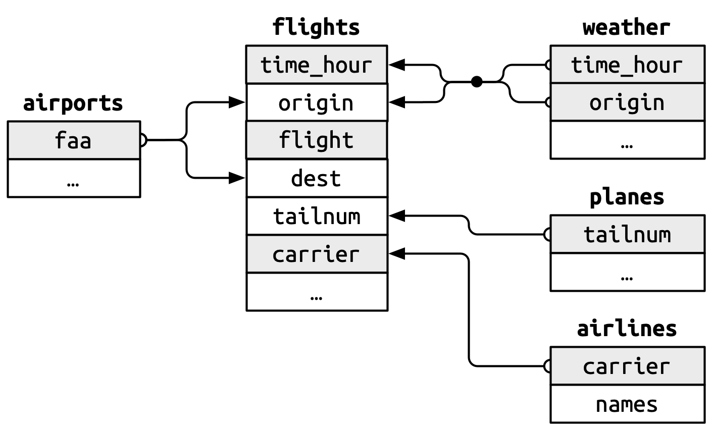
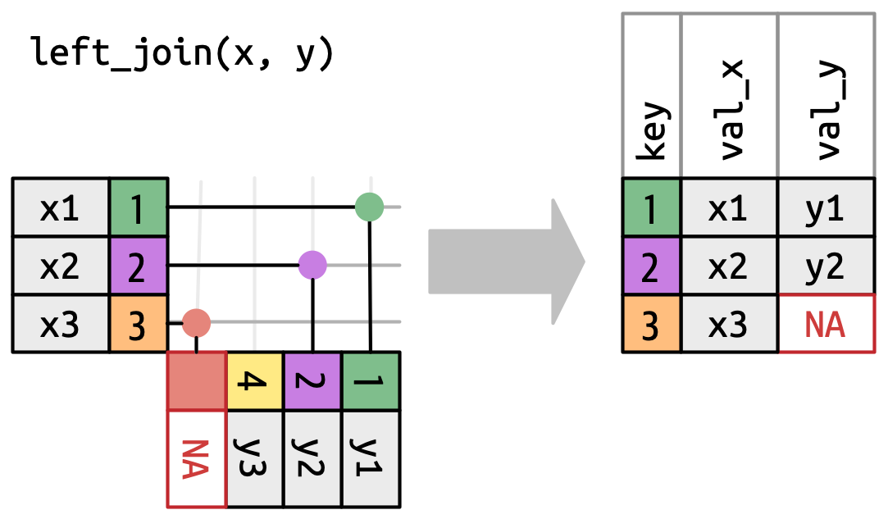
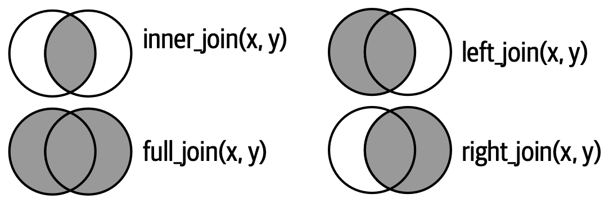

## De qué trata la clase de hoy

El **objetivo principal** es poner en práctica los ***verbos*** principales del **Data Wrangling**, es decir, las operaciones fundamentales utilizadas para la transformación y limpieza de datos. En otras palabras, el 80 % del trabajo si nos atenemos a la regla 80/20.

1.  **Primera parte:** revisión de la clase pasada para poder clonar el repositorio que contiene este archivo o hacer el primer `git pull`. Agregar **contribuidores** a un repositorio.

2.  **Segunda parte**: **repaso** de operaciones de filtrado, agregación y cruce de tablas usando el paquete nycflights13.

3.  **Tercera parte:** estudiar **un caso real usando datos de Argentina.** Vamos a cruzar indicadores económicos provinciales de Nación con el Producto Bruto Geográfico (PBG) de la Provincia de Buenos Aires para responder una pregunta concreta:

    > *¿Qué peso tiene la economía bonaerense en el total nacional?*

4.  **Cuarta parte**: cómo crear y correr un ***script*** **de R**,

La idea de esta clase es que puedan ir corriendo y pensando las operaciones que vamos a hacer en paralelo, pudiendo también tomar caminos alternativos, si así lo desean. No existe un único camino para llegar al mismo resultado.

------------------------------------------------------------------------

## 2. Repaso de operaciones básicas

### Preparación del entorno

Primero, cargamos los paquetes que vamos a utilizar. Usaremos la colección `tidyverse` para manipular los datos y `nycflights13` para la primera parte.

```{r}
# Instalamos los paquetes si no los tenemos 
# install.packages(c("tidyverse", "nycflights13", "skimr", "scales", "ggplot2", "pacman"))

# Los cargamos en el entorno
library(nycflights13)
library(tidyverse)
```

El paquete `nycflights13` contiene datos de todos los vuelos que salieron de Nueva York en 2013. Es una base de datos muy utilizada porque es ideal para aprender dado que la información está desmenuzada en varias tablas (**vuelos**, **aerolíneas**, **aviones**, **clima**, **aeropuertos**).

{width="433"}

### Exploración y Verbos Básicos

Veamos la tabla principal: `flights`.

```{r}
glimpse(flights)
```

Notemos el número de filas (**observaciones**) y columnas (**variables**), así como también los nombres y los diferentes formatos en la cual se estructuran:\<int\>, \<dbl\> y \<dtm\>.

```{r}
cat(
  cat("\n\nNombres de las columnas procesadas:\n", names(flights), sep ="\n")
)
```

Podemos usar la función de agregación `count` para ver cuántos vuelos tuvo cada aerolínea.

```{r}
# formato anidado
# arrange(count(flights, carrier), -n) 

# formato pipe
flights |> count(carrier, sort=TRUE)
```

Supongamos, ahora, que queremos **ver sólo los vuelos de la aerolínea United Airlines (`UA`) que hayan tenido un retraso en la salida (`dep_delay`) de más de 60 minutos**, y nos interesan únicamente las columnas de fecha, destino y el retraso.

```{r}
vuelos_retrasados_ua = flights |> 
  filter(carrier == "UA", dep_delay > 60) |> 
  select(year, month, day, dest, dep_delay, tailnum)

head(vuelos_retrasados_ua)
```

Utilizamos el verbo `filter` para filtrar la tabla por la columna `carrier` (aerolínea) y `dep_delay` (retraso en la salida). Notar que usamos ",", pero que el comando funciona también si usamos "&".

Después, seleccionamos únicamente aquellas variables que nos interesan para identificar el vuelo. El comando `head`, así como el `glimpse`, nos sirve para darnos una idea del contenido de la tabla.

Si nos interesa, por ejemplo, tener una noción de en qué momento del año el retraso en el despegue fue mayor, podríamos agregar los datos por mes y tomar valores promedio.

```{r}
retraso_mensual = vuelos_retrasados_ua |> 
  group_by(month) |>
  summarize(
    retraso_promedio = mean(dep_delay, na.rm = TRUE),
    cantidad_vuelos = n(),
    .groups = "drop" # Si después modificamos algo, no lo va a hacer sobre cada grupo, sino sobre el resultado del summarize
  ) |> 
  # ungroup() |> #igual a pasar .groupd = "drop"
  # arrange(desc(retraso_promedio))
  arrange(desc(cantidad_vuelos))

retraso_mensual
```

Este combo (`group_by + summarize`) se re contra usa en la práctica porque condensa mucha información que, seguramente, sea difícil de interpretar en los datos crudos.

### Unión de tablas

La librería también nos provee otra base de datos: `planes`

```{r}
glimpse(planes)
```

¿Para qué nos puede servir esta base de datos? Por ejemplo, si tuviésemos la **hipótesis de que**

> **aquellos vuelos que más tardaron en arrancar fue porque tenían aviones construidos hace más tiempo.**

Para empezar a ordenar la información podemos, primero, ver aquellos vuelos con aviones identificados en la tabla de `planes`.

```{r}
vuelos_retrasados_ua_con_aviones = vuelos_retrasados_ua |> 
  left_join(planes, by = "tailnum")|> 
  # Renombramos para no confundir el año del vuelo con el año de creación del avión
  rename(year_flight = year.x, year_plane = year.y) |> 
  select(year_flight, month, dest, dep_delay, tailnum, year_plane, model)  

vuelos_retrasados_ua_con_aviones |> arrange(-dep_delay) |> head(10)
```

{width="301"}

El `left_join` deja inertes los valores de la tabla izquierda (x) y recorta los de la derecha (y) a medida. En consecuencia, si comparamos la variable que indica el número de avión de `vuelos_retrasados_ua` con la misma variable en `vuelos_retrasados_ua_con_aviones` obtenemos exactamente el mismo resultado, es decir, no se perdió nada de la tabla original.

```{r}
all(
  select(vuelos_retrasados_ua_con_aviones, tailnum) == select(vuelos_retrasados_ua, tailnum)
)
```

```{r}
vuelos_retrasados_ua_con_aviones |> 
  select(year_plane) |> 
  unique() |> # Sirve para eliminar repeticiones (1,1,2,3,4,4) ->(1,2,3,4)
  arrange(desc(year_plane)) 
```

Así, vemos los años en que fueron construidos los aviones, siendo que el más nuevo se corresponde con de análisis (2013).

Las operaciones de `join` más usuales se sintetizan gráficamente en este diagrama de Venn donde cada circulo representa el conjunto de valores referidos a la columna de interés ("*by=columna_de_interes*") en cada tabla (x e y)

{width="393"}

En base a estas operaciones se pueden construir otras más complejas que pueden ser de gran utilidad, por ejemplo, el `anti_join` mantiene las observaciones de x que no tienen una coincidencia en y. En el diagrama de Venn esto corresponde al área sombreada que queda si al `left_join` le sacamos `inner_join`.

En el caso que estamos viendo esta operación nos puede servir para encontrar los valores que se pasaron por alto cuando hicimos el `left_join`.

```{r}
vuelos_huerfanos <- vuelos_retrasados_ua |> 
  anti_join(planes, by = "tailnum")

# Vemos cuántos son
numero_de_vuelos_huerfanos = nrow(vuelos_huerfanos)

sprintf( # Se usa para hacer insertar variables en el texto, bajo el placeholder %
  "En el año 2013, hubo %i que no tienen su modelo registrado.",
  numero_de_vuelos_huerfanos
)
```

Esto significa que hay 63 aviones que no reportaron demoras de más de 60 minutos.

Antes de seguir con la segunda parte, les dejo un momento para que piensen qué se obtiene en cada caso al realizar las operaciones de acá abajo.

```{r}

tabla_1 = vuelos_retrasados_ua |> 
  inner_join(planes, by = "tailnum")

tabla_2 = vuelos_retrasados_ua |> 
  semi_join(planes, by = "tailnum")

tabla_3 <- vuelos_retrasados_ua |> 
  # Unimos solo con aviones fabricados en 1990 o antes
  mutate(twenty_yo = year-20) |> 
  inner_join(
    planes, 
    by = join_by(tailnum == tailnum, twenty_yo >= year) 
  ) |> 
  summarize(
    retraso_promedio_vintage = mean(dep_delay, na.rm = TRUE),
    cantidad_vuelos = n()
  )
```

**tabla_1** (`inner_join`): esta tabla contiene los vuelos de `vuelos_retrasados_ua` realizados sólo por aviones que existen en ambas bases. Es la intersección pura entre ambas bases.

**tabla_2** (`semi_join`): es conceptualmente similar al `inner_join`, pero no agrega columnas nuevas (las que estaban en la tabla de `planes`), sólo filtra las filas de `vuelos_retrasados_ua`.

**tabla_3** (`left_join` con condición lógica): acá se complica porque buscamos un subconjunto muy específico. Estamos intentando unir la información de ambas tablas, sólo si ese avión tenía más de 20 años de antigüedad al momento del vuelo. Luego resumimos el resultado con un promedio.

## 3. Operaciones en un caso real: exploración de datos de la economía Argentina

Vamos a trabajar con dos bases de datos reales. El objetivo es cruzar el **PBI** (Producto Bruto Interno) total del país con el **PBG** (Producto Bruto Geográfico) de la Provincia de Buenos Aires y ver qué proporción representa la PBA frente al país a lo largo de los años.

[**DISCLAIMER**]{.underline}: no soy economista ni aficionado de estos temas, pero sí me parece importante aclarar que cuando uno se enfrenta a un fenómeno que no conoce es importante estudiar un poco de qué se trata para poder entender decidir qué hacer.

En este sentido, vamos a utilizar la serie a **precios constantes con base 2004** porque es un indicador que es invariante a la inflación. Al valuar la producción de años posteriores con los precios fijos de 2004, los cambios observados en la variable reflejan exclusivamente el **crecimiento real** o físico de la economía —mayor cantidad de bienes y servicios producidos— y no meras variaciones en el nivel general de precios.

### Carga de los Datos

Descargamos los datos directamente desde sus URLs oficiales ([PBG](https://catalogo.datos.gba.gob.ar/dataset/pbg) y [Nación](https://www.argentina.gob.ar/economia/politicaeconomica/regionalysectorial/informesproductivos/datasets)). La primera base es el desglose de la producción de PBA por actividad (rural, ganadera, etc.) y la segunda el desglose del PBI por provincia.

```{r}
# Base 1: Indicadores Provinciales
ruta_nacion = "../data/indicadores-provinciales.csv"
ruta_catalogo_nacion = "../data/indicadores-provinciales-catalog.csv"

nacion = read_csv(ruta_nacion)
catalogo_nacion = read_csv(ruta_catalogo_nacion)
```

```{r}
# Base 2: PBG Provincia de Buenos Aires (Corregida la fecha al final)
ruta_pba = "../data/pbg-base-2004-serie-31122004-31122023.csv"
pba_raw = read_csv(ruta_pba)
```

**Atención**: notemos que en el documento hay tres columnas vacías que fueron llenadas con los nombres 7, 8, 9.

```{r}
pba_raw |> select(7,8,9)
```

```{r}
# Las borramos
# pba_raw <- pba_raw %>% select(-c(7:9))

# O utilizamos unas lineas que borran cualquier columna que tengan NA's
pba = pba_raw |> 
  select(
    where(~any(!is.na(.)))
  )
# Más adelante cómo se puede hacer esto de una forma más simple

# Veamos cada comando por separado (para comentar y descomentar individualmente)

# is.na(pba_raw) # Nos cambia todos los valores por TRUES donde hay NA y FALSES donde no los hay

# is.na(pba_raw$actividad_sector_letra) #una columna específica

# !is.na(pba_raw$actividad_sector_letra) # igual, pero damos vuelta los valores de TRUES y FALSE --> donde hay NA's pasa a haber un FALSE

# any(!is.na(pba_raw$actividad_sector_letra)) # Si hay aunque sea un TRUE, devuelve TRUE (es decir, si hay almenos un dato, devuelve TRUE)

```

Desarmemos un poco el comando de arriba.

1.  `is.na()` identifica los valores faltantes.
2.  El punto (`.`) actúa como un marcador de posición (*placeholder*) que va a representa a todas las columna en las cuales se va a ejecutar la función `is.na()`.
3.  Aplicamos la negación (`!`) para que los datos reales pasen a ser `TRUE` y los faltantes `FALSE`.
4.  Luego, usamos `any()` para verificar si existe al menos un valor verdadero (es decir, un dato útil) en toda la columna.
5.  Finalmente, combinamos `where()` y la tilde (`~`) para aplicar la función de filtrado a todas las columnas del dataset, conservando solo aquellas que no estén totalmente vacías.

### Limpieza de las bases

La base `nacion` es muy amplia y contiene muchos indicadores. Primero exploramos:

```{r}
# Inspección rápida (revisar antes de elegir indicador)
cat(names(nacion), delimiter=' ')

nacion |> select(indicador) |> unique()


```

Contrastamos contra lo que dice el catálogo en una inspección rápida.

```{r}
# glimpse(catalogo_nacion)
# catalogo_nacion |> select(field_title, field_description) |> head(20)
```

En esta celda estandarizamos los nombres de PBA.

[**Atención**]{.underline}**:** acá los nombres dejan de ser los de la tabla original, es importante que el código sea transparente respecto a estos cambios para tener mayor reproducibilidad. Más adelante, vamos a ver una función que hace esto mismo de forma automática para ahorrarnos la identificación manual.

```{r}
pba = pba |> 
  rename(
    actividad = actividad_detalle,
    sector_letra = actividad_sector_letra,
    sector_detalle = actividad_sector_detalle,
    year = anio,
    valor_corrientes = valor_precios_corrientes,
    valor_constantes = valor_precios_constantes
  ) |> 
  mutate(year = as.integer(year))
```

### Continuamos con el análisis exploratorio

Vemos cuáles son las fuentes disponibles de indicadores provinciales de PBG con base en 2004.

```{r}
nacion |> 
  filter(
    sector_nombre=='Indicadores Provinciales',
    indicador == 'PBG - Base 2004'
    ) |> 
  select(fuente) |> 
  unique()
```

Vemos que **hay 17 provincias de 24 (si contamos CABA)**, lo cual lleva a preguntarnos, ¿faltan datos? Seguimos adelante como si no pasara nada, pero teniendo en cuenta que si quisiéramos hacer un anáslisis cuantitativo real de los datos esto es un problema.

Seleccionamos aquella fuente que tenga a la provincia de Buenos Aires para calcular el PBG, según nación (`_NACION`). Luego, cambiamos la unidad de medida para que sea comparable con aquella que utiliza la otra base de datos (millones de pesos).

```{r}

# Seleccionamos Provincia de Buenos Aires
pbg_pba_NACION = nacion |>
  filter(
    sector_nombre=='Indicadores Provinciales',
    indicador == 'PBG - Base 2004',
    str_detect(fuente, 'Buenos Aires'),
    unidad_de_medida=="miles de pesos a precios de 2004"
  ) |> 
  mutate(
    unidad_de_medida="millones de pesos a precios de 2004", # sonrescribimos el nombre de la unidad
    year = year(indice_tiempo), # usamos la función year de tidyverse que transforma datetime a integer
    valor = valor/1000 # hacemos la conversión de miles a millones
  ) |> 
  select(year, unidad_de_medida, valor)
head(pbg_pba_NACION)
```

Y agregamos los datos a nivel nacional, para calcular proporciones. [Recordar que tenemos 17 provincias en vez de 24, esto va a ser un problema más adelante]{.underline}.

```{r}

# Agregamos los datos para ver la serie de nación (PBI)
pbi_NACION = nacion |> 
  filter(
    sector_nombre == 'Indicadores Provinciales',
    indicador == 'PBG - Base 2004',
    unidad_de_medida=="miles de pesos a precios de 2004" 
  ) |> 
  mutate(
    unidad_de_medida="millones de pesos a precios de 2004",
    year = year(indice_tiempo), 
    valor = valor/1000
  ) |> 
  # Agrupamos por año para sumar todas las provincias que aparezcan en ese año
  group_by(year) |> 
  summarise(
    pbi = sum(valor, na.rm = TRUE),
    provincias_contabilizadas = n() # esto nos servirá para chequear si siempre son 17
  ) |> 
  ungroup()

head(pbi_NACION, 10)
```

Antes de pasar al base de PBA, notemos que el número total de provincias tenidas en cuenta para calcular el PBI cada año varía, incluso, en los primeros años tenemos únicamente 2 provincias. Esto es un problema severo.

Agregamos los valores de la base de datos de PBA a valores constantes, igual que en el otro caso. Estos valores ya están en millones de pesos, lo podemos revisar si visitamos el catálogo que se encuentra disponible en la página oficial (revisar más arriba).

```{r}

pba_agg_PBA <- pba  |> 
  group_by(year)  |> 
  summarize(
    pbg_pba_const = sum(as.numeric(valor_constantes), na.rm = TRUE), 
    .groups = "drop"# equivalente a ungroup
  ) |> 
  arrange(year)
head(pba_agg_PBA)
```

Podemos comparar la proporción que representa el PBG de PBA respecto al PBI del país, año a año, bajo la salvedad de que este resultado estará mal.

```{r}
# pba_agg_PBA es el que calculamos con la base de PBA
porcentaje_pbi_PBA = pba_agg_PBA |> 
  left_join(pbi_NACION, by="year") |> 
  mutate(porcentaje_pba = 100 * (pbg_pba_const / pbi)) |> 
  select(year, porcentaje_pba)

# pbg_pba_NACION es el que calculamos con la base de nacion
porcentaje_pbi_NACION = pbg_pba_NACION |> 
  left_join(pbi_NACION, by="year") |> 
  mutate(porcentaje_pba = 100 * (valor / pbi)) |> 
  select(year, porcentaje_pba)

porcentajes = porcentaje_pbi_NACION |> 
  inner_join(porcentaje_pbi_PBA, by='year') |> 
  rename(
    porcentaje_pba_segun_NACION=porcentaje_pba.x,
    porcentaje_pba_segun_PBA=porcentaje_pba.y
    )
head(porcentajes)
```

```{r}
# Unificamos las dos mediciones para comparar
comparativa_porcentajes <- porcentajes |> 
  # Pasamos a formato largo para graficar
  pivot_longer(
    cols = starts_with("porcentaje"), # todas las columnas que arranquen con "porcentaje" seran mandadas a una columna 
    names_to = "fuente_del_dato", # llamada "fuente_del_dato"
    values_to = "porcentaje" # el valor que tomaban esas variables se guardaran, desagregados en una nueva columna llamada "porcentaje"
  )
head(comparativa_porcentajes)

# Graficamos 
ggplot(comparativa_porcentajes, aes(x = year, y = porcentaje, color = fuente_del_dato)) +
  geom_line(linewidth = 1) +
  geom_point() +
  labs(
    title = "Peso de PBA en el Total de 17 Provincias",
    subtitle = "Comparativa según fuente de datos (Nación vs. Provincia)",
    x = "Año",
    y = "Proporción (%)",
    color = "Fuente de Información"
  ) +
  theme_minimal() +
  scale_color_manual(values = c("firebrick", "steelblue"),
                     labels = c("Datos Nación (PBG)", "Suma Sectores PBA (VAB)"))
```

Al contrastar las dos series, observamos inconsistencias... Esto se debe a un problema de **integridad referencial entre fuentes**: el denominador (Nación) no siempre contiene la misma cantidad de provincias reportadas año tras año, lo que genera saltos artificiales en la proporción.

```{r}
pbi_NACION |> select(provincias_contabilizadas) |> arrange(provincias_contabilizadas) |> unique() 

head(pbi_NACION)
```

Este error afecta ambas series por igual, dado que ambos porcentajes se calculan tomando la división con el PBI de nación. Sin embargo, hay otra diferencia no menor que hay que tener en cuenta qye es la mezcla del PBG (que incluye impuestos) del archivo de Nación con la suma de la actividad de los sectores del archivo provincial, que no los incluye. Por esta razón, ambas series tienen la misma tendencia, salvo una diferencia cercana de 10 puntos porcentuales.

**¿Qué nos llevamos de acá?**

Si queremos hacer un análisis que sea realmente fiable hay que entender las bases de datos con las cuales trabajamos, no basta únicamente con bajarlas y procesarlas bajo la pretensión de que sean tal como creemos.

Para obtener una respuesta válida a nuestra pregunta inicial, deberíamos normalizar el denominador asegurándonos de que comparamos el dato de Buenos Aires contra un total nacional consistente y proveniente de la misma fuente técnica. Además, habría que incluir los impuestos nacionales que se agregan al PBG de PBA.
