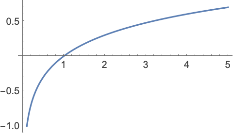

## ¿De qué trata la clase de hoy?

Hoy vamos a integrar dos técnicas fundamentales para el análisis de datos: *web scraping y Natural Language Processing* *(NLP)*. La idea es que puedan extraer información de la web de forma automatizada y luego analizarla para descubrir patrones y temas relevantes.

1.  **Primera parte**: vamos a aprender a hacer scraping de noticias de ~~la ONU sobre Paz y Seguridad~~ Global Voices (un sitio de noticias) utilizando `rvest` y `httr2`.
2.  **Segunda parte**: vamos a usar las herramientas que aprendimos en las clases previas para limpiar y transformar los datos extraídos usando herramientas del `tidyverse`.
3.  **Tercera parte**: aplicaremos técnicas de **NLP** (tokenización, lematización, eliminación de *stop words* y cálculo de $TF-IDF$) para identificar los términos más relevantes en las noticias.
4.  **Cuarta parte**: visualizaremos los resultados con `ggplot2` para interpretar los hallazgos. Esto lo vamos a usar únicamente para interpretar los resultados, no lo vamos a ver en detalle. Sin embargo, más adelante van a poder volver sobre esta clase para ver en detalle cómo podemos generar visualizaciones.

------------------------------------------------------------------------

### Librerías necesarias

```{r}
#| label: load-packages
#| message: false
#| warning: false
#| cache: false

# Si no tienen instalados estos paquetes, descomenten la línea siguiente:
# install.packages(c("tidyverse", "rvest", "httr2", "tidytext", "robotstxt", "stopwords"))

library(tidyverse)  # Manipulación de datos
library(rvest)      # Web scraping
library(httr2)      # Requests HTTP
library(tidytext)   # Análisis de texto
library(udpipe)     # Lematización
library(robotstxt)  # Verificar permisos de scraping
library(here)       # Manejo de rutas de archivos
library(xml2)       # Manejo de HTML (guardar la página completa x ej)
```

## 1. Web scraping de noticias de la ONU

### ¿Por qué scrapear?

Muchas veces los datos que necesitamos no están disponibles en formatos descargables como CSV o Excel, como veníamos trabajando hasta ahora, sino que se encuentran en páginas web. El web *scraping* nos permite automatizar la extracción de esta información.

Antes de hacer *scraping*, **siempre** debemos tener en cuenta:

-   El archivo `robots.txt` del sitio.
-   Los Términos de Servicio.
-   Que podemos sobrecargar los servidores (usar pausas entre *requests*)

### Verificando permisos de scraping

Antes de scrapear, verificamos que el sitio lo permita:

```{r}
# Verificamos si podemos scrapear el sitio de noticias de la ONU
allowed = paths_allowed(
  paths = "https://es.globalvoices.org/category/topics/migration-immigration/",
  bot = "*"
)
cat(
  "Permiso para scrapear:", allowed, "\n"
)

# paths = "https://news.un.org/es/news/topic/peace-and-security", --> FALSE, una pena, era la idea original de la clase
```

Si el resultado es `TRUE`, podemos proceder. Si es `FALSE`, deberíamos buscar otra fuente o contactar al administrador del sitio.

### Sobre la fuente

Según el sitio oficial [GlobalVoices](https://es.globalvoices.org/about/) se trata de una **comunidad internacional** y una organización sin fines de lucro que opera a nivel global. Se trata de una red multilingüe de blogueros, traductores y activistas de todo el mundo que informan sobre temas que suelen ser ignorados por los medios tradicionales.

[**Importante**]{.underline}: es importante conocer un poco de dónde sacamos los datos para entender y/o prevenir sesgos. En este caso particular, seleccioné este medio porque permite *scrapear* los datos libremente y la estructura *html* tiene la complejidad justa para la clase.

### Explorando la estructura HTML

Primero, vamos a cargar la página principal de noticias sobre migraciones e inmigraciones en lenguaje español. Para eso, vamos a usar la librería `rvest` que es el estándar de R para hacer *scraping*. Algunos comandos útiles son

-   `read_html(url)`: descargar y parsea una página.
-   `html_elements(node, css)`: selecciona múltiples *tags* coincidentes.
-   `html_element(node, css)`: selecciona el primer *tag* coincidente.
-   `html_text2(node)`: extrae texto limpio.
-   `html_attr(node, name)`: extrae el valor de un atributo.
-   `html_table(node)`: convierte una tabla HTML a un data frame.
-   `str_trim()`: limpia espacios en blanco al inicio y al final del texto (esta es del *tidyverse*).

```{r}
#| cache: false
# URL de la página de noticias sobre Paz y Seguridad de la ONU en español
# url_noticias <- "https://news.un.org/es/news/topic/peace-and-security"
url_noticias <- "https://es.globalvoices.org/category/topics/migration-immigration/"

# Leemos el HTML de la página
pagina_html <- read_html(url_noticias)

# Inspeccionamos la estructura
pagina_html
```

```{r}
#| cache: false
# Es una buena práctica guardar el html y registrar cuándo la descargamos
data_dir = here("05_tutorial", "data")

if (!dir.exists(data_dir)) {
  dir.create(data_dir)
} else {
  cat(
    "'data' ya existe. Se sobrescribirá el archivo de la página HTML.\n"
    )
}

# Guardamos en formato rds para uso interno y registro de fecha de descarga
attr(pagina_html, "fecha_descarga") <- Sys.time()

# Guardamos en html para abrir en el navegador si queremos 
# (el atributo no se vá a guardar, pero lo vamos a usar más tarde)
write_html(pagina_html, file = file.path(data_dir, "pagina_noticias_gv.html"))
```

Ahora necesitamos identificar los **selectores CSS** correctos para extraer los elementos que nos interesan. Para eso podemos usar herramientas como **SelectorGadget** y/o las **DevTools del navegador** (F12 en Chrome/Firefox).

Es importante recordar que el *html* tiene **una estructura anidada y la idea es acceder a los nodos del árbol para ver que contiene cada uno**. Para esto, tener en cuenta que

-   Los tags con nombre `x` se seleccionan con: `x`
-   Los tags con `id='x'` se seleccionan con: `#x`
-   Los tags con `class='x'` se seleccionan con: `.x`
-   Para seleccionar un tag `y` adentro de otro tag `x` en cualquier nivel de profundidad (*descendant*), se usa: `x y`
-   Para seleccionar un tag `y` adentro de otro tag `x` en primer nivel de profundidad (*child*), se usa: `x > y`
-   Para seleccionar un tag `y` que sigue inmediatamente a otro tag `x`, se usa: `x + y`
-   Para seleccionar un tag `x` que sea el n-ésimo *hijo* de su *padre*, se usa: `x:nth-child(n)`
-   Para seleccionar tags con determinado atributo y/o valor, se usa: `[attribute]`, `tag[attribute]` o `[attribute = "value"]`.
-   Se pueden sumar selectores usando la coma "`,`": `x , y , z`, por ejemplo.

Exploremos un poco la [página web](https://es.globalvoices.org/category/topics/migration-immigration/) desde el navegador para identificar aquellas partes que nos interesan.

### Extrayendo títulos y resúmenes

```{r}
# Extraemos los nodos de los títulos de las noticias
nodos_titulos <- pagina_html |>
  html_elements(".post-title a") # Selector para títulos (tag "a" dentro de la class=post-title)
  
# Nos quedamos con el texto de cada uno
titulos <- nodos_titulos |>
  html_text2() |> # Extraemos el texto limpio de cada nodo
  str_trim()  # Limpiamos espacios en blanco

# Sus urls
urls <- nodos_titulos |> 
  html_attr("href") # Accedemos al atributo href para obtener las urls de cada noticia

# Extraemos los resúmenes/descripciones
resumenes <- pagina_html |>
  html_elements(".post-tagline") |>  # Selector para resúmenes
  html_text2() |>
  str_trim()

# Extraemos las fechas de publicación
fechas <- pagina_html |>
  html_elements(".datestamp") |>  # Selector para fechas
  html_text2() |>
  str_trim()


# Verificamos cuántos elementos extrajimos
cat("Títulos extraídos:", length(titulos), "\n")
cat("Urls extraídas:", length(urls), "\n")
cat("Resúmenes extraídos:", length(resumenes), "\n")
cat("Fechas extraídas:", length(fechas), "\n")
```

Cuando estamos haciendo un análisis exploratorio ir y venir al navegador **es buena práctica para entender cómo se estructura visualmente la información**. Fíjense que aparecen más fechas urls y títulos (29) que resúmenes (25), esto se debe a que las cuatro primeras noticias aparecen únicamente como títulos.

Los selectores CSS (`".post-title"`, `".post-tagline"`, etc.) [pueden cambiar con el tiempo si el sitio web modifica su estructura]{.underline}. Si los selectores no funcionan, hay que inspeccionar el HTML actual del sitio para encontrar los correctos.

### Creando el dataset

Combinamos toda la información en un `data.frame` que condense lo que tenemos hasta ahora.

```{r}
# Aseguramos que todos los vectores tengan la misma longitud, para el dataframe
inicio <- 4
n_final <- length(resumenes)

# Creamos un tibble con los datos extraídos (descartamos aquellas que no tienen copete, las primeras 4 en este caso)
noticias_gv <- tibble(
  titulo = titulos[inicio:(inicio+n_final-1)],
  url = urls[inicio:(inicio+n_final-1)], 
  resumen = resumenes[1:n_final],
  fecha_raw = fechas[inicio:(inicio+n_final-1)] # raw porque es un character, por ahora
)

# Mostramos las primeras noticias
noticias_gv
```

### Función para sistematizar el *scraping* de una página

Podemos sintetizar lo que estuvimos haciendo en una función que *scrapee* la página y obtenga los **títulos, resúmenes, fechas y urls de las noticias** en forma sistemática**.**

```{r}
#| eval: true
#| echo: true

# Función para scrapear una página de noticias
scrapear_gv <- function(url, first_page=FALSE) {
  
  # Pausa para no sobrecargar el servidor
  Sys.sleep(2)
  
  # Leemos la página
  html <- read_html(url)
  
  # Extraemos los elementos que identificamos con el Selector o el Inspector
  titulos_nodos <- html |>
    html_elements(".post-title a")
  
  titulos <- titulos_nodos |>
    html_text2() |>
    str_trim()
  
  urls <- titulos_nodos |>
    html_attr("href")
  
  resumenes <- html |>
    html_elements(".post-tagline") |>
    html_text2() |>
    str_trim()
  
  fechas <- html |>
    html_elements(".datestamp") |>
    html_text2() |>
    str_trim()
  
  # Si es la primera primera página, sabemos que las primeras 4 noticias no tien
  # en resumen
  final <- length(resumenes)
  inicio <- 4
  
  # Retornamos un tibble
  if (first_page){
  return(
    tibble(
      titulo = titulos[inicio:(inicio+final-1)],
      url = urls[inicio:(inicio+final-1)],
      resumen = resumenes[1:final],
      fecha_raw = fechas[inicio:(inicio+final-1)]
    )
  )} else {
    tibble(
      titulo = titulos[1:(final)],
      url = urls[1:(final)],
      resumen = resumenes[1:(final)],
      fecha_raw = fechas[1:(final)]
    )
  }
}

```

```{r}
# Veamos que funciona para la página que ya usamos antes
scrapear_gv("https://es.globalvoices.org/category/topics/migration-immigration/", first_page=TRUE)

# Y también para otra arbitraria de la misma web
# scrapear_gv(paste0("https://es.globalvoices.org/category/topics/migration-immigration/page/", 8))
```

### Iteramos el *scraping* sobre varias páginas

Armamos una función que permita realizar lo que hicimos sobre las primeras `n` páginas.

```{r}
#| eval: true
#| echo: true
scrapear_n_gv <- function(n) {

  # Armamos el tibble de la primera página
  noticias_pagina <- scrapear_gv("https://es.globalvoices.org/category/topics/migration-immigration/", first_page = TRUE)
  
  # Mandamos un mensaje que informe que corrió bien
  mensaje <- paste("\nPágina", 1, "de", n, "scrapeada correctamente. Total noticias hasta ahora:", nrow(noticias_pagina))
  message(mensaje)


  # Salteamos la primera página que tiene una url distinta e iteramos sobre las siguientes
  for (i in 2:n) {
    
    # Pausa para no sobrecargar el servidor (ya tiene una la función, pero por las dudas)
    Sys.sleep(1)  
    url <- paste0("https://es.globalvoices.org/category/topics/migration-immigration/page/", i)
    noticias_pagina_i <- scrapear_gv(url)
    
    # Concatenamos los resultados
    noticias_pagina <- bind_rows(noticias_pagina, noticias_pagina_i)
    
    # Mandamos un mensaje que informe que corrió bien
    mensaje <- paste("\nPágina", i, "de", n, "scrapeada correctamente. Total noticias hasta ahora:", nrow(noticias_pagina))
    
    message(mensaje)
  }
  
  # Agregamos una columna de id's que nos permita identificar unívocamente cada noticia
  noticias_pagina <- noticias_pagina |> mutate(id = row_number())
  
  
  # Devolvemos el tibble completo
  return(noticias_pagina)
}

```

Podríamos trabajar con más de `n=3`, pero ya estaríamos usando muchos recursos. La idea es que este código funcione como machete.

```{r}

# Esto puede tardar un poco, depende de la cantidad de páginas y la conexión
noticias_gv = scrapear_n_gv(n=3) # EN CLASE PONER <4!
```

### Función que permita extraer el cuerpo del noticia

Genial, ahora sería útil, para cada noticia, extraer el cuerpo asociado. Esto va a enriquecer nuestra base de datos

```{r}
# Definimos una función que extrae el texto de cada noticia haciendo request al url
extraer_cuerpo_noticia = function(url) {
  Sys.sleep(1) # Pausa para no sobrecargar el servidor
  html_noticia = read_html(url)
  
  # El selector para el texto completo de la noticia puede variar según la estructura del sitio
  cuerpo_noticia = html_noticia |>
    html_elements(".entry-container") |> # Selector para el contenido de la noticia
    html_elements(".entry p" ) |> # Extraemos los párrafos para obtener el texto completo (sin headers ni partes que puedan dificultar mucho el análisis)
    html_text2() |>
    str_trim()
  
  # Concatenamos todos los párrafos
  cuerpo_noticia = str_c(cuerpo_noticia, collapse = " ")
  
  # Eliminamos caracteres 
  cuerpo_noticia = str_replace_all(cuerpo_noticia, "[\\r\\n\\t]+", " ")
  
  # Eliminamos todo tipo de comillas (estándar, tipográficas, simples, dobles, backticks y porcentajes)
  cuerpo_noticia = str_replace_all(cuerpo_noticia, "[\\\"'“”‘’«»`´%()]", "")
  
  # Eliminamos espacios múltiples
  cuerpo_noticia = str_squish(cuerpo_noticia)  # parecido a trim, pero además saca dos o más espacios seguidos
  
  return(cuerpo_noticia)
}

# La probamos con una noticia cualquiera
extraer_cuerpo_noticia(
  "https://es.globalvoices.org/2025/07/29/moldavia-se-queda-vacia-las-cuatro-olas-de-emigracion-de-moldavia/"
)
```

Ahora aplicamos esta función a cada noticia de nuestro *dataset* para obtener una **nueva BD que contenga los cuerpos de las noticias.**

[**ATENCIÓN**]{.underline}**:** si el `n` anterior era muy grande vamos a estar ejecutando la función por cada una de las `n*#de noticias en cada página`. Esto no significa que el archivo sea especialmente pesado, pero sí que el tiempo de ejecución va a ser largo. Por ejemplo, para `n=3` y teniendo en cuenta que en cada página hay 75 noticias, vamos a leer el texto de 225 notas. Esto tardará \~4 minutos, dado que por cada noticia tenemos un `Sys.sleep(1).`

```{r}
# Creamos otra base de datos para almacenar los cuerpos
cuerpos_noticias_gv <- noticias_gv |>
  select(id, url) |> # mismo ID que el dataset original para hacer un join más tarde
  mutate(cuerpo = map_chr(url, extraer_cuerpo_noticia)) |> 
  select(-url) # tiene id y cuerpo nada más

# Guardamos esta tabla por separado para ahorrar memoria y no tener que volver a hacer scraping cada vez que queramos analizar el texto

# Le asignamos la misma fecha de descarga que el dataset original por consistencia
attr(cuerpos_noticias_gv, "fecha_descarga") <- pagina_html |> attr("fecha_descarga")

cuerpos_noticias_gv |> write_rds(
  file.path(data_dir, "cuerpos_noticias_gv")
)
```

Ahora sí, metemos todo en la misma tabla, porque en este análisis es relevante la identificación.

```{r}
noticias_gv <- noticias_gv |> left_join(cuerpos_noticias_gv, by="id")
```

------------------------------------------------------------------------

## 2. Limpieza y Transformación de Datos

### Limpieza de fechas

Las fechas extraídas están en formato de texto. Vamos a convertirlas a un formato que pueda interpretar el `tidyverse.`

```{r}
# Dependiendo del formato real este código lo tendriamos que ajustar
noticias_limpio <- noticias_gv |>
  mutate(
    fecha = case_when(
      # Si el formato es "dd/mm/yyyy".
      str_detect(
        fecha_raw,  "\\d{1,2}/\\d{1,2}/\\d{4}"
      ) ~ lubridate::dmy(fecha_raw, locale = "es_ES.UTF-8"), 
      # Si el formato es "20 marzo 2024" (letras), el regex sería diferente:
      str_detect(
        fecha_raw, "\\d{1,2} [a-z]+ \\d{4}"
      ) ~ lubridate::dmy(fecha_raw, locale = "es_ES.UTF-8"),
      # Si el formato es diferente, agregamos más casos
      TRUE ~ lubridate::as_date(NA)
    )
  )

# La función del tidyverse que usamos en el primer caso se define en el orden que se presentan los datos --> dmy (day, month, year); ymd(year, month, day)
# Esta función es lo suficientemente inteligente como para no tener que detectar patrones. Sólo fue una excusa para usar regex

# Podríamos haberla llamado fecha = lubridate::dmy(fecha_raw, locale="es_ES.UTF-8")

# Verificamos
noticias_limpio |> select(fecha_raw) |> head()
noticias_limpio |> select(fecha) |> head()
```

### Combinando título y cuerpo

Para el análisis de texto, vamos a crear una columna que combine el título y el resumen:

```{r}
noticias_limpio <- noticias_limpio |>
  mutate(
    texto_completo = str_c(titulo, ". ", cuerpo),
    # Limpiamos caracteres extraños y normalizamos
    texto_completo = str_replace_all(texto_completo, "[\\r\\n\\t]+", " "),
    texto_completo = str_squish(texto_completo)  # Elimina espacios múltiples
  ) |>
  select(-cuerpo) # Eliminamos la columna original de cuerpo para ahorrar espacio

# En general los editores de texto esconden los comandos
# \n -> salto de línea
# \t -> tabulación
# \r -> retorno de carro (en algunos sistemas es similar a \n) 

# Guardamos el objeto para futuro análisis
# Le asignamos la misma fecha de descarga que el dataset original por consistencia
attr(noticias_limpio, "fecha_descarga") <- pagina_html |>  attr("fecha_descarga") 
noticias_limpio |>
  mutate(texto=texto_completo) |> 
  select(id, titulo, texto) |>
  write_rds(
    file.path(data_dir, "noticias_gv_limpio.rds")
  )

# Verificamos el resultado
noticias_limpio |>
  select(id, titulo, texto_completo) |>
  head(2)
```

### Estadísticas básicas del corpus

```{r}
# Longitud promedio del texto
noticias_limpio |>
  mutate(n_caracteres = nchar(texto_completo)) |>
  summarise(
    promedio_caracteres = mean(n_caracteres, na.rm = TRUE),
    mediana_caracteres = median(n_caracteres, na.rm = TRUE),
    min_caracteres = min(n_caracteres, na.rm = TRUE),
    max_caracteres = max(n_caracteres, na.rm = TRUE),
    total_noticias = n()
  ) |> 
  pivot_longer(
    cols=everything(),
    names_to="Métricas", 
    values_to="Valores"
  ) |> 
  # Transformamos la columna final a entero
  mutate(Valores = as.integer(Valores))
```

------------------------------------------------------------------------

## 3. Análisis con NLP

### ¿Qué es NLP?

NLP *(Natural Language Processing*) es un conjunto de técnicas que nos permiten analizar texto de forma cuantitativa. Veamos técnicas fundamentales:

1.  **Lematización:** reducir las palabras a su forma base —lema. Por ejemplo, "corriendo" a "correr".
2.  **Tokenización**: dividir el texto en palabras individuales.
3.  **Eliminación de *stop words***: quitar palabras muy comunes que no aportan significado ("el", "la", "de", etc.).
4.  **TF-IDF**: identificar qué términos son más distintivos dentro del corpus de noticias.

### Lematización y tokenización

La lematización es el proceso de mapear palabras a su forma base. Para hacer esta identificación, muchas veces, es necesario el contexto. Por ejemplo, la palabra "vino" adquiere distintos significados en "Él [vino]{.underline} ayer" y "El [vino]{.underline} estaba riquísimo". El primer caso se mapea a "vino" y el segundo a "ir".

Otro proceso similar es el *stemming*. Esta operación, en contraste, recorta sufijos heurísticamente (más rápido, pero menos preciso, lo cual puede generar palabras inexistentes), mientras que la lematización usa análisis morfológico y contextos para encontrar la forma base del diccionario. En este caso, "historial" e "historia" podrían ser mapeadas a "histori" por más que no tengan nada que ver.

Por lo tanto, si lematizamos **debemos hacerlo sí o sí** **antes (o en simultáneo) con la tokenización el texto.**

```{r}
# Descarga y carga el modelo de lematización en español
m_es <- udpipe_download_model(language = "spanish", overwrite = FALSE)
modelo_es <- udpipe_load_model(m_es$file_model)

# Lematiza el texto completo
noticias_lemas <- udpipe_annotate(
    modelo_es, 
    x = noticias_limpio$texto_completo, 
    doc_id = noticias_limpio$id
  ) |>
  as.data.frame() |>
  mutate(id=as.integer(doc_id)) |> 
  select(id, lemma, upos) 

# Agregamos los titulares
noticias_lemas <- noticias_lemas |> 
  left_join(
    noticias_limpio |> select(id, titulo), 
    by = "id"
  )
```

La ***tokenización*** es el proceso de dividir el texto en unidades más pequeñas (*tokens*), usualmente palabras o pseudopalabras.

En este caso, la celda de abajo separa el texto palabras. Sin embargo, no vamos a seguir por este camino ya que la el proceso de lematización que hicimos arriba ya identificó las palabras de cada noticia.

```{r}
# # Tokenizamos el texto (dividimos en palabras)
# noticias_tokens <- noticias_limpio |>
#   select(id, titulo, texto_completo) |>
#   unnest_tokens(
#     output=palabra, 
#     input=texto_completo,
#     token="words" # podemos usar characters, ngrams, sentences, paragraphs, etc. Ver doc.
#   ) 
# 
# # La función unnest_tokens() del paquete tidytext hace todo el trabajo de tokenización, limpieza básica y normalización (pone todo en minúscula, elimina puntuación, etc.). 
# # Notar que transforma el tibble original a formato long, donde cada fila es un token (palabra) de una noticia específica.
# 
# # Veamos el resultado
# head(noticias_tokens, 10)
# # ¿Cuántos tokens tenemos en total?
# noticias_tokens |>
#   summarise(
#     total_palabras = n(),
#     palabras_unicas = n_distinct(palabra),
#     porcentaje_unicas = 100*(palabras_unicas/total_palabras)
#   ) |> 
#   pivot_longer(
#     cols=everything(),
#     names_to="Métricas", 
#     values_to="Valores"
#   )
```

Si continuamos con noticias_lemas notamos que en la columna lemma ya tenemos identificados los *tokens*. **Filtramos únicamente sustantivos (**`NOUN`**) , verbos (**`VERB`**) y adjetivos (**`ADJ`**) dado que seguramente condensen más carga semántica.**

```{r}
noticias_lemas$upos |> unique() 
noticias_lemas <- noticias_lemas |> filter(upos %in% c("NOUN", "VERB", "ADJ"))   
```

### Eliminación de *stop words*

Las *stop words* son palabras muy comunes que aparecen en casi todos los textos pero que aportan poco significado analítico. En español, estas incluyen artículos ("el", "la"), preposiciones ("de", "en"), pronombres, etc.

En caso de que haber seleccionado sustantivos, verbos y adjetivos no haya sido suficiente forzamos a que estas palabras desaparezcan.

```{r}
# Cargamos las stop words en español del paquete tidytext
data("stopwords", package = "stopwords")

stop_es <- stopwords::stopwords("es")

# Ponemos también palabras en inglés, porque hay citas que están en ese idioma
stop_en <- stopwords::stopwords("en")

stop_words <- tibble(lemma = c(stop_es, stop_en))

# Verificamos algunas stop words
head(stop_words, 20)
tail(stop_words, 20)
```

Hacemos un `antijoin` entre la BD y las `stop_word_es`. El objetivo es quedarnos únicamente con las palabras que no estén en `stop_words`.

```{r}
# Contamos las palabras antes
numero_de_palabras <- nrow(noticias_lemas)

# Eliminamos las stop words
noticias_lemas <- noticias_lemas |>
  anti_join(stop_words, by = "lemma") |>
  # También eliminamos números y palabras de una sola letra
  filter(
    !str_detect(lemma, "^\\d+$"), 
    nchar(lemma) > 2               # Tienen más de 2 caracteres
  )

# Desglocemos el regex "^\\d+$": el símbolo "^" indica el inicio de la cadena, "\\d+" representa una o más cifras (números), y el símbolo "$" indica el final de la cadena. En conjunto, "^\\d+$" coincide con cualquier cadena que consista exclusivamente en números, sin ningún otro carácter antes o después., por ejemplo, "2024" coincidiría, pero "covid19" no, porque tiene letras además de números.

# Podríamos haber hecho "\\d+": esto coincide con cualquier parte de la palabra que tenga números, por ejemplo "covid19" o "2024". En cambio, "^\\d+$" solo coincide con palabras que sean exclusivamente números, como "2024", pero no con "covid19".

# Comparamos: antes y después
cat("Tokens antes de eliminar stop words:", numero_de_palabras, "\n")
cat("Tokens después de eliminar stop words:", nrow(noticias_lemas), "\n")
cat(
  "Reducción relativa porcentual:", 
  round(
    100 * ((numero_de_palabras - nrow(noticias_lemas)) / numero_de_palabras),
    1
  ), 
  "%\n"
)
```

### Palabras más frecuentes

Antes de calcular TF-IDF, veamos cuáles son las palabras más comunes en nuestro corpus.

```{r}
palabras_frecuentes <- noticias_lemas |>
  count(lemma, sort = TRUE)

head(palabras_frecuentes, 20)
```

### Cálculo de TF-IDF

**TF-IDF** (*Term Frequency - Inverse Document Frequency*) es una métrica que identifica qué términos son más importantes en un documento en relación con todo el corpus.

-   **TF** (*Term Frequency*): qué tan frecuente es un término en un documento específico.
-   **IDF** (*Inverse Document Frequency*): qué tan raro es un término entre todos los documentos.

Sus fórmulas son:

$$
TF(t, d) = N_{d}(t) / (\sum_{t}N_{d}(t)),
$$donde $N_{d}(t)$ es el número de veces que aparece el término $t$ en el documento $d$ dividido por $\sum_t N(t,d)$, las apariciones totales de todos los términos en el documento $d$. El resultado se puede interpretar como una frecuencia normalizada (probabilidad).

$$
IDF(t) = log_{10}(\frac{D}{D_t}),
$$donde $D$ es el número total de documentos y $D_{t}$ el número total de documentos que contienen el término t.

En este sentido, notemos que cuando $D = D_{t}$ tenemos que el $IDF(t)=0$, lo cual tiene sentido porque se trata de un término que aparece en todos los documentos, osea que puede ser redundante. Ahora, si $D_t<<D$ el logaritmo se hace mucho más grande que 1.

Por ejemplo, si una palabra $\bar{t}$ está muy repetida en 1 solo documento sobre un total de 1000 documentos, tendremos que $IDF(\bar{t})=3$.

{fig-align="center" width="313"}

Por lo tanto, según cada métrica, la idea es darle más peso a palabras que

-   aparecen **muchas veces** en un documento específico ($TF$ alto),
-   aparecen en **pocos documentos** del total ($IDF$ alto).

```{r}
# Calculamos TF-IDF usando tidytext
noticias_tfidf <- noticias_lemas |>
  count(id, titulo, lemma) |>  # Contamos palabras por documento
  bind_tf_idf(lemma, id, n)    # Calculamos TF-IDF

# Guardamos esta BD para futuros análisis
attr(noticias_tfidf, "fecha_descarga") <- noticias_limpio |>  
  attr("fecha_descarga")
noticias_tfidf |> write_rds(
  file.path(data_dir, "noticias_tfidf.rds")
)
# Veamos el resultado
head(noticias_tfidf |> arrange(desc(tf_idf)), 10)
```

### Interpretando TF-IDF

Los valores de *TF-IDF* nos dicen qué palabras son más "distintivas" de cada noticia. Su fórmula es el producto de las dos métricas.

Es importante notar que esta métrica es función de $t$ y $d$, ya que combina una métrica global ($IDF(t)$) con otra local $TF(t,d)$.

$$
(TF-IDF) (t, d) = TF(t,d)\times IDF(t)
$$

```{r}
# Top 5 palabras por TF-IDF en cada noticia
top_palabras_por_noticia <- noticias_tfidf |>
  group_by(id, titulo) |>
  slice_max(tf_idf, n = 5) |> # el slice_max selecciona las filas con los valores más altos de la columna indicada (en este caso, tf_idf). El argumento n = 5 indica que queremos obtener las 5 filas con los valores más altos de tf_idf para cada grupo definido por id y titulo.
  ungroup() |>
  arrange(id, desc(tf_idf))

top_palabras_por_noticia |>
  select(id, lemma, tf_idf) 
  # arrange(desc(tf_idf))
```

### Análisis del corpus completo

¿Cuáles son los términos con mayor TF-IDF promedio en todo el corpus?

```{r}

# VARIAR EN CLASE: es interesarte notar qué información recuperamos en cada caso
n_docs <- 1

terminos_distintivos <- noticias_tfidf |>
  group_by(lemma) |>
  summarise(
    tfidf_promedio = mean(tf_idf),
    n_documentos = n(),
    mean_tf = mean(tf),
    mean_idf = mean(idf),
    frecuencia_total = sum(n)
  ) |>
  arrange(desc(tfidf_promedio)) |>
  # Filtramos términos que aparecen en al menos 1,2/10/50 documentos
  filter(n_documentos >= n_docs) 

head(terminos_distintivos, 20)
```

[**Importante**]{.underline}: noten cómo varían los resultados cuando cambiamos `n_docs`.

Si dejamos `n_docs` **en un valor bajo**, los términos que aparecerán más arriba tendrán pocos documentos, ya que esto les dará un IDF más alto. Esto podría suceder si hubo una noticia muy especifica sobre un tema que nunca más se volvió a hablar.

En cambio, si tomamos `n_docs` **moderado** (en relación al total de documentos) los valores que obtendremos serán más representativos del corpus completo, pero perderán IDF.

En el extremo, si tomamos **valores muy grandes de** `n_docs`, el IDF se volverá muy bajo y pasaremos a tener *stopwords* o términos que tienen poca importancia porque se pierde la relevancia del documento.

**¿Qué hacemos?**

A veces no se trata sencillamente de obtener el TF-IDF más alto y ya: hay que interpretar los resultados entendiendo qué cuantifican las métricas y cómo se reflejan en nuestro corpus.

Para eso, [**primero tenemos que tener noción del volumen del corpus y qué queremos mostrar, antes de hacer un análisis.**]{.underline}

-   Por ejemplo, si sabemos que nuestro corpus tiene 75 noticias y queremos buscar aquellos términos que hayan sido relevantes en los últimos meses/años, nos convendrá tomar un valor moderado (por ej. 10).

-   Si buscamos identificar noticias que se hayan salido del *mainstream*, es decir, que trate de cosas que no se hablan todos los días, podemos tomar un valor bajo (1 ó 2).

-   Si quisiéramos encontrar que términos toman mayor relevancia en noticias de inmigración en general. Es decir, queremos saber características del lenguaje y no encontrar temáticas, podemos usar un valor alto (50 por ej.).

------------------------------------------------------------------------

## 4. Visualización de Resultados

### Top términos por $TF-IDF$

Visualizamos los términos más distintivos del corpus. Para esto optamos por el primer enfoque (`n_docs=1`), es decir, queremos encontrar tópicos relevantes.

```{r}
#| fig-width: 10
#| fig-height: 6

# Seleccionamos los top 20 términos
top_terminos <- terminos_distintivos |>
  slice_max(tfidf_promedio, n = 20) # queremos obtener las 20 filas con los valores más altos de tfidf_promedio. 

# Creamos el gráfico
ggplot(top_terminos, aes(x = tfidf_promedio, 
                         y = reorder(lemma, tfidf_promedio))) +
  geom_col(fill = "#4292C6", alpha = 0.8) +
  labs(
    title = "Top 20 Términos Más Distintivos",
    subtitle = "Noticias de migración e inmigración - Global Voices (ES)",
    x = "TF-IDF Promedio",
    y = "Lemma",
    caption = "Fuente: es.globalvoices.org."
  ) +
  theme_minimal(base_size = 12) +
  theme(
    plot.title = element_text(face = "bold", size = 16),
    plot.subtitle = element_text(size = 12, color = "gray40"),
    axis.text.x = element_text(size = 12),
    axis.text.y = element_text(size = 12),
    panel.grid.major.y = element_blank(),
    panel.grid.minor = element_blank(),
    
  )
  
```

### Palabras por frecuencias

Podemos crear una visualización alternativa mostrando las palabras más frecuentes. El gráfico es del mismo estilo que el de arriba (variable categórica en `y`, numérica en `x`).

```{r}
#| fig-width: 10
#| fig-height: 6

# Top 30 palabras por frecuencia
top_frecuentes <- palabras_frecuentes |>
  slice_max(n, n = 30)

ggplot(top_frecuentes, aes(x = n, y = reorder(lemma, n))) +
  geom_segment(aes(x = 0, xend = n, 
                   y = reorder(lemma, n), yend = reorder(lemma, n)),
               color = "gray70") +
  geom_point(size = 4, color = "#08519C") +
  labs(
    title = "Top 30 Palabras Más Frecuentes",
    subtitle = "Después de eliminar stop words",
    x = "Frecuencia",
    y = NULL
  ) +
  theme_minimal(base_size = 12) +
  theme(
    plot.title = element_text(face = "bold", size = 16),
    plot.subtitle = element_text(size = 12, color = "gray40"),
    axis.text.x = element_text(size = 12),
    axis.text.y = element_text(size = 12),
    panel.grid.minor = element_blank(),
    panel.grid.major.y = element_blank()
  )
```

Acá vemos como salta un conjunto distinto de palabras, que no pondera el $IDF$.

### Comparación de métricas: Frecuencia vs TF-IDF

Es interesante comparar qué términos son más frecuentes vs. cuáles tienen mayor $TF-IDF$.

```{r}
#| fig-width: 14
#| fig-height: 8

# Combinamos ambas métricas
comparacion <- palabras_frecuentes |>
  left_join(
    terminos_distintivos |> select(lemma, tfidf_promedio, n_documentos),
    by = "lemma"
  ) |>
  filter(!is.na(tfidf_promedio)) |>
  slice_max(n, n = 80) # Tomamos las 50 palabras más frecuentes para comparar

# Gráfico de dispersión
ggplot(comparacion, aes(x = n, y = tfidf_promedio, color=n_documentos)) +
  geom_point(size = 3, alpha = 0.6) +
  ggrepel::geom_text_repel(
    aes(label = lemma),
    size = 10,
    max.overlaps = 25,
    box.padding = 0.5
  ) +
  scale_color_viridis_c(option = "plasma", end = 0.9) +
  labs(
    title = "Frecuencia vs. TF-IDF promedio",
    subtitle = "¿Las palabras más frecuentes son las más distintivas? ¿Cómo influye el número de noticias en el promedio?",
    x = "Frecuencia absoluta",
    y = "TF-IDF promedio",
    color="Número de noticias",
    caption = "Fuente: es.globalvoices.org."
  ) +
  theme_minimal(base_size = 15) +
  theme(
    plot.title = element_text(face = "bold", size = 16),
    plot.subtitle = element_text(size = 12),
    axis.text.x = element_text(size = 12),
    axis.text.y = element_text(size = 12),
    legend.position = c(0.85, 0.75), 
    legend.background = element_rect(fill = "white", color = "gray90"),
    legend.margin = margin(6, 10, 6, 10),
    # panel.grid.minor = element_blank()
  )
```

[**Interpretación**]{.underline}

Este gráfico es muy útil porque condensa casi todo el análisis que hicimos. Nos ayuda a interpretar las métricas y la discusión que planteábamos más arriba respecto al número de documentos promedio.

En términos de extremos, tendremos que valores muy a la derecha serán palabras con alta frecuencia. Mientras que palabras que estén muy arriba se asociaran a saliencia sobre el corpus total.

Finalmente, en la escala de colores identificamos el número de noticias en la cual aparece cada palabra. Este es el número tenido en cuenta para calcular el $TF-IDF$ promedio (`n_docs`).

Se observa que si tomamos un valor grande recuperamos palabras asociadas al lenguaje común del corpus ("país", "hacer", "persona", "año", etc.); con valores altos palabras salientes ("ucraniano", "ruso") y con valores medianos (\~10) tópicos generales ("visa", "estudiante", "mujer", "refugiado").

### Términos distintivos por noticia individual

Finalmente, podemos visualizar los términos más distintivos de algunas noticias seleccionadas, por ejemplo, las cuatro primeras.

```{r}
#| fig-width: 14
#| fig-height: 10

# Seleccionamos las primeras 4 noticias como ejemplo
noticias_seleccionadas <- top_palabras_por_noticia |>
  filter(id <= 4) |> # filtramos las 4 primeras
  group_by(id) |> # las agrupamos
  slice_max(tf_idf, n = 8) |> # tomamos las 8 palabras más distintivas de cada noticia 
  ungroup() |> # desagrupamos para seguir trabajando
  mutate(
    titulo_corto = str_trunc(titulo, width = 25) # creamos una versión corta del título para mostrar en el gráfico
  )

ggplot(noticias_seleccionadas, 
       aes(x = tf_idf, y = reorder_within(lemma, tf_idf, id))) +
  geom_col(fill = "#2171B5", alpha = 0.7) +
  scale_y_reordered() +
  facet_wrap(~ titulo_corto, scales = "free", ncol = 2) +
  labs(
    title = "Términos Más Distintivos por Noticia",
    subtitle = "Top 8 palabras según TF-IDF",
    x = "TF-IDF",
    y = NULL
  ) +
  theme_minimal(base_size = 11) +
  theme(
    plot.title = element_text(face = "bold", size = 14),
    plot.subtitle = element_text(size = 11, color = "gray40"),
    strip.text = element_text(size = 15, face = "bold"),
    axis.text.x = element_text(size = 12),
    axis.text.y = element_text(size = 12),
    panel.grid.minor = element_blank(),
    panel.grid.major.y = element_blank()
  )
```
