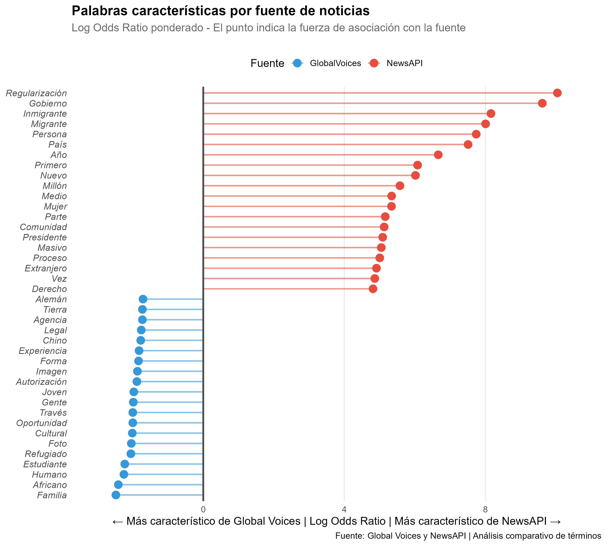

# ¿De qué trata la clase de hoy?

En la clase anterior trabajamos con **web scraping** para extraer noticias de [Global Voices](https://es.globalvoices.org/category/topics/migration-immigration/) sobre migración e inmigración. Hoy el plan es hacer lo mismo en forma más ordenada para comparar los resultados que obtuvimos con otro corpus.

1.  **Primera parte**: vamos a ver cómo conectarnos a **NewsAPI** para obtener noticias sobre migración e inmigración.

2.  **Segunda parte**: vamos a analizar el corpus de texto obtenido de forma similar a la clase anterior. El cálculo de $TF$, $TF-IDF$ y el análisis postserior les quedará como tarea.

3.  **Tercera parte**: compararemos **el léxico** de las BBDD utilizando **Log Odds Ratio.**

4.  **Cuarta parte**: para terminar vamos a visualizar los resultados con `ggplot2` (revisar también los gráficos de la clase pasada).

------------------------------------------------------------------------

### Librerías necesarias

```{r}
#| label: load-packages
#| message: false
#| warning: false
#| cache: false

# Paquetes necesarios
library(tidyverse)  # Manipulación de datos
library(rvest)      # Web scraping
library(httr2)      # Requests HTTP
library(tidytext)   # Análisis de texto
library(udpipe)     # Lematización
library(robotstxt)  # Verificar permisos de scraping
library(here)       # Manejo de rutas de archivos
library(xml2)       # Manejo de HTML (guardar la página completa x ej)
library(tm)         # Text Mining (Document Term Matrix) 

library(jsonlite)   # Para trabajar con JSON
library(tidylo)     # Log Odds Ratio ponderado
library(scales)     # Para formatear gráficos
library(glue)       # Para strings dinámicos

# Configuración global de gráficos
theme_set(theme_minimal(base_size = 12)) # Tema minimalista para ggplot2, base_size es el tamaño de fuente base
```

### APIs

Si bien el *web scraping* es una técnica poderosa, tiene limitaciones importantes.

- **No estructurado**: dependemos de la estructura HTML del sitio, que puede cambiar sin previo aviso.

- **Frágil**: un pequeño cambio en el diseño puede romper nuestro código.

- **Costoso**: requiere parsear HTML, lidiar con JavaScript, etc.

- **Límites éticos y legales**: debemos respetar `robots.txt` y las políticas del sitio.

Las **APIs (*Application Programming Interfaces*)** resuelven estos problemas. En general, los mismos sitios proveen su propia API para hacer *requests* de forma ordenada.

- **Datos estructurados**: recibimos JSON o XML, que en general, son más fáciles de procesar.
- **Estabilidad**: las APIs tienen contratos de versiones.
- **Eficiencia**: sólo pedimos lo que necesitamos, no necesitamos leer toda la estructura.
- **Legitimidad**: están diseñadas para ser consumidas programáticamente.

## 1. Nos conectamos con NewsAPI

### ¿Qué es un API Key?

Un **API Key** es como una "contraseña" que identifica quién está haciendo las consultas. Sirve para autenticar al usuario, controlar límites de uso (cuotas) y rastrear el uso para facturación.

### Obtener una API Key

Para que el código que vamos a usar funcione, cada usuario (nosotros) necesita su propia API Key de NewsAPI. Para obtener la API Key,

1.  entramos a [newsapi.org](https://newsapi.org/),

2.  "Get API Key",

3.  completamos el formulario (nombre, email, uso: "Education/Personal"),

4.  copiamos y guardamos la API Key que nos proporcionan.

[**IMPORTANTE**]{.underline}: para esta clase utilizaremos el plan **Developer** de [NewsAPI](https://newsapi.org/pricing). Es fundamental tener en cuenta los términos de servicio y las limitaciones técnicas para que nuestro script funcione correctamente y no infrinjamos sus políticas.

1.  **Uso Educativo y Local**: según sus [términos y condiciones](https://newsapi.org/terms) (actualizados en 2020), este plan es exclusivo para fines de aprendizaje y desarrollo en entornos locales. No debe utilizarse para alimentar sitios web públicos ni aplicaciones comerciales.

2.  **Límites de consulta**: contamos con un máximo de **100 solicitudes diarias** **por API Key**. Además, sólo podremos acceder a noticias publicadas en los **últimos 30 días, cualquier intento de buscar fechas anteriores devolverá un error.**

3.  **Profundidad de datos**: la versión gratuita solo permite visualizar los **primeros 100 resultados** de una búsqueda. Es importante notar qu**e la API no entrega el cuerpo completo de la noticia, sino un** **snippet o fragmento (aprox. 200 caracteres)**. Para análisis de texto profundo, en general, esto suele complementarse con técnicas de *scraping* sobre la URL original.

4.  **Buenas prácticas**: no hay que compartir la API Key en repositorios públicos como GitHub. Cada uno debe debe generar su propia clave para evitar bloqueos por exceso de tráfico.

### No subir nunca la API Key a GitHub

**No hacer esto:**

``` r
# ❌ MAL - La clave queda expuesta en el código
api_key <- "a1b2c3d4e5f6g7h8i9j0"
```

En su lugar, es conveniente usar variables de entorno. Para eso creamos un archivo `.Renviron` al mismo nivel que el *RProject* (`scope = "project"`).

```{r}
# DESCOMENTAR LAS LINEAS DE ABAJO PARA CREAR EL ARCHIVO
# install.packages("usethis")
# # Editar .Renviron
# usethis::edit_r_environ(scope = "project")
```

Ahí mismo pegamos la API Key sin comillas. Por ejemplo, `NEWS_API_KEY=a1b2c3d4e5f6g7h8i9j0`. Reiniciamos R y leemos la variable

```{r}
# La clave se lee de forma segura
api_key <- Sys.getenv("NEWS_API_KEY")

# Verificar que funciona (sin mostrar la clave completa)
if (api_key == "") {
  stop("No se encontró NEWS_API_KEY. Revisá tu archivo .Renviron")
} else {
  cat("API Key cargada")
}
```

### Construyendo la consulta con httr2

`httr2` es la versión moderna de `httr`. Usa un estilo de *pipeline* que es más legible. Para investigar qué parámetros podemos usar investigamos [el sitio oficial](https://newsapi.org/docs/endpoints/everything).

```{r}
#| cache: true

# Construir la request
consulta <- request("https://newsapi.org/v2/everything") |>
  req_url_query(
    q = "migration OR migrants OR migrant OR inmigration OR migración OR inmigración",  # Búsqueda 
    language = "es",                          # Idioma
    sortBy = "publishedAt",                   # Ordenar por fecha
    pageSize = 100,                           # Máximo por página
    apiKey = api_key
  )

# Ejecutar la request
respuesta <- consulta |> req_perform()

# Verificar el status
respuesta
```

### Procesar la respuesta JSON

```{r}
# Extraer el cuerpo de la respuesta como lista
datos_json <- respuesta |> resp_body_json()

# Ver la estructura de los datos (primeras 10 lineas)
str(datos_json, max.level = 1)
```

La respuesta tiene esta estructura (más fácil de visualizar en el *Environment*):

*`List of 3`*

*`$ status : chr "ok"`*

*`$ totalResults: int 2087`*

*`...etc`*

Vamos a convertir a `tibble` aquellas variables que nos interesan. Para eso usamos el operador `%||%` "null-coalescing" de `purrr`. Si el valor de la izquierda es `NULL`, devuelve el valor de la derecha. Útil para manejar campos faltantes en JSON.

```{r}
# Convertir articles a data frame
noticias_api <- datos_json$articles |>
  map_dfr(~ tibble( # map_dfr aplica la función a cada elemento de la lista y devuelve un data frame
    source = .x$source$name %||% NA,
    author = .x$author %||% NA,
    titulo = .x$title %||% NA,
    resumen = .x$description %||% NA,
    url = .x$url %||% NA,
    fecha_raw = .x$publishedAt %||% NA,
    cuerpo = .x$content %||% NA
  ))

# Agregar ID único y fuente
noticias_api <- noticias_api |>
  mutate(
    id = row_number(),
    fuente = "NewsAPI", # Para diferenciar de los Ids que obtuvimos la clase pasada
    # Combinar título resumen y contenido para análisis
    texto = str_c(titulo, resumen, cuerpo, sep = ". "),
    # Eliminamos caracteres 
    texto = str_replace_all(texto, "[\\r\\n\\t]+", " "),
    # Eliminamos todo tipo de comillas, backticks y porcentajes
    texto = str_replace_all(texto, "[\\\"'“”‘’«»`´%()]", ""),
    # Eliminamos espacios múltiples
    texto = str_squish(texto),
    # Explicación del Regex: busca exactamente el patrón "[+99 chars]"
    texto = str_remove_all(texto, " \\[\\+\\d+ chars\\]"),
    # 	2026-04-13T17:47:00Z
    fecha = as_date(as_datetime(fecha_raw))
  ) |>
  # Filtramos noticias de globalvoices que ya las tenemos
  filter(!str_detect(url, "globalvoices")) |> 
  select(id, fuente, source, titulo, texto, url, fecha)

head(noticias_api)
```

### Guardar los datos crudos para generar la segunda BD

En este caso, más que para preservar la estructura de los datos, lo hacemos para no gastar futuros *requests.*

```{r}
data_dir = here("06_tutorial", "data")

if (!dir.exists(data_dir)) {
  dir.create(data_dir)
} else {
  cat(
    "'data' ya existe. Se sobrescribirá el archivo de la página HTML.\n"
    )
}

# Guardamos en formato rds para uso interno y registro de fecha de descarga
attr(noticias_api, "fecha_descarga") <- Sys.time()
write_rds(noticias_api, file.path(data_dir, "noticias_api.rds"))
```

## 2. Procesamiento del lenguaje natural de las noticias

Vamos a aplicar el mismo procesamiento que en la clase anterior.

### Cargar datos de ambas fuentes

```{r}
# Leemos la BD de la clase anterior
global_voices_path = file.path(here('05_tutorial', 'data'), 'noticias_gv_limpio.rds')

noticias_gv <- read_rds(global_voices_path) |>
  mutate(fuente = "GlobalVoices") |> # Agregamos un segundo identificador
  select(id, fuente, titulo, texto)

# Datos nuevos de la API
noticias_api <- read_rds(file.path(data_dir, "noticias_api.rds")) |>
  select(id, fuente, titulo, texto)

# Combinar ambas fuentes asumiendo que no hay noticias en común
noticias_combinadas <- bind_rows(noticias_gv, noticias_api) |>
  mutate(id = row_number())  # Re-generar IDs únicos

noticias_combinadas |>
  count(fuente)
```

### Lematización con `udpipe`

[En la clase pasada vimos:]{.underline}

La lematización es el proceso de mapear palabras a su forma base. Para hacer esta identificación, muchas veces, es necesario el contexto. Por ejemplo, la palabra "vino" adquiere distintos significados en "Él [vino]{.underline} ayer" y "El [vino]{.underline} estaba riquísimo". El primer caso se mapea a "vino" y el segundo a "ir".

Otro proceso similar es el *stemming*. Esta operación, en contraste, recorta sufijos heurísticamente (más rápido, pero menos preciso, lo cual puede generar palabras inexistentes), mientras que la lematización usa análisis morfológico y sintáctico para encontrar la forma base del diccionario. En este caso, "historial" e "historia" podrían ser mapeadas a "histori" por más que no tengan nada que ver.

```{r}
# Cargar modelo de udpipe 
m_es <- udpipe_download_model(language = "spanish",overwrite=FALSE)
modelo_es <- udpipe_load_model(m_es$file_model)

# Lematiza el texto completo
noticias_lemas <- udpipe_annotate(
    modelo_es, 
    x = noticias_combinadas$texto, 
    doc_id = noticias_combinadas$id
  ) |> # devuelve un objeto de clase "udpipe_annotation"
  as.data.frame() |>
  mutate(id=as.integer(doc_id)) |> 
  select(id, lemma, upos) 

# Agregamos los titulares y las fuentes
noticias_lemas <- noticias_lemas |> 
  left_join(
    noticias_combinadas |> select(id, titulo, fuente), 
    by = "id"
  )
```

### Stopwords y selección de palabras relevantes

Convertimos a `tibble`, filtramos palabras relevante y eliminamos *stopwords*.

```{r}
# Cargamos las stop words en español del paquete tidytext
data("stopwords", package = "stopwords")
stop_es <- stopwords::stopwords("es")
stop_en <- stopwords::stopwords("en")
stop_words <- tibble(lemma = c(stop_es, stop_en))

# Convertir a tibble
tokens <- as_tibble(noticias_lemas) |>
  # Filtrar solo palabras (no puntuación)
  filter(upos %in% c("NOUN", "ADJ")) |>
  # Convertir los lemmas a minúsculas
  mutate(lemma = str_to_lower(lemma)) |>
  # Eliminar stopwords y palabras muy cortas
  anti_join(stop_words, by = "lemma") |>
  filter(str_length(lemma) > 2)

head(tokens)
```

En base a esta tabla ya podemos realizar exactamente el mismo análisis que la vez pasada ([les queda como tarea]{.underline}).

Antes de pasar a a ver *LogOddRatios* revisemo una representación visual que nos quedó pendiente la vez pasada.

### Document Term-Frequency Matrix

La Matriz de Frecuencia de Términos (Document-Term Matrix o **DTM**) es una representación matricial de un corpus de texto. En esta matriz:

- las filas representan los documentos individuales (por ejemplo, cada noticia o comunicado).

- las columnas representan los términos (las palabras o lemas).

- cada celda indica la frecuencia absoluta (el conteo) de un término específico dentro de un documento determinado.

Esta estructura es el punto de partida fundamental para aplicar algoritmos de Procesamiento de Lenguaje Natural (NLP), tales como la clasificación de textos, el análisis de sentimientos y el modelado de tópicos (topic modeling).

Para crearla, primero contamos la aparición de cada lema por documento y luego transformamos esos datos a un formato matricial utilizando el paquete `tm`. Para un corpus grande esta matriz escala proporcionalmente ($N_{DOCS}\times N_{TERMS}$). Por esta razón, para un análisis exploratorio (como el nuestro), es necesario restringir la matriz a algunos términos que sean de nuestro interés.

```{r}
# install.packages("tm")
# Calculamos la frecuencia de los tokens
frecuencia_tokens <- tokens |> 
  count(id, lemma, name = "n")  |>  
  arrange(id)

# Convertimos el data frame a una Document-Term Matrix (formato ancho)
matriz_dtm <- frecuencia_tokens|> 
  cast_dtm( document = id, term = lemma, value = n )

# Inspeccionamos la estructura de la matriz (es gigante)
# matriz_dtm

# Filtramos palabras clave del conflicto en Europa del Este
terminos_de_interes <- c("país", "gobierno", "ucraniano", "rusia", "invasión")
matriz_dtm_de_interes <- matriz_dtm[, colnames(matriz_dtm) %in% terminos_de_interes]
matriz_dtm_de_interes

# Mostramos unicamente las primeras 20 lineas de la matriz
as.matrix(matriz_dtm_de_interes)[1:20, ]
```

Algo que puede resultar interesante es estudiar cuántas veces aparecen nombrados a la par dos términos, por ejemplo, Rusia y Ucrania. Les queda como tarea.

Una forma sencilla de condensar la información de la matriz es sumarla en el eje vertical, de forma tal que se obtiene un conteo total (sobre todos los documentos) para cada término.

```{r}
#| fig-width: 10 
#| fig-height: 6
#| fig-align: center

# Convertimos la DTM a un data frame para ggplot
dtm_df <- as.data.frame(as.matrix(matriz_dtm_de_interes)) |>
  rownames_to_column(var = "id") |>
  pivot_longer(-id, names_to = "lemma", values_to = "n") |> 
  group_by(lemma) |> # Agrupamos por palabra
  summarise(frecuencia_total = sum(n)) # Sumamos todas las apariciones

# Graficamos la frecuencia de los términos de interés
ggplot(dtm_df, aes(x = lemma, y = frecuencia_total)) +
  geom_col(fill = "steelblue") +
  labs(
    title = "Frecuencia de términos de interés en la DTM",
    x = "Término",
    y = "Frecuencia",
    caption = "Fuente: Noticias combinadas de Global Voices y NewsAPI"
  ) +
  theme_minimal(base_size = 14) +
  theme(
    axis.text.x = element_text(angle = 45, hjust = 1),
    panel.grid.major.x = element_blank(),
    panel.grid.minor.x = element_blank()
  )
      


```

## 3. ¿Qué palabras son características de cada fuente?

Antes de responder la pregunta de arriba, cabe preguntarse por qué es relevante encontrar diferencias. Global Voices es un medio comunitario y activista, mientras que NewsAPI agrega medios que en general son *mainstream* (BBC, CNN, etc.). Entonces, resulta interesante preguntarse si hablan o no de la misma forma sobre migración.

Para lo que sigue vamos a decir que una palabra es "característica" de un grupo cuando **aparece mucho más en ese grupo que en el otro**.

### Log Odds Ratios

Si calculamos **la probabilidad de aparición de una término** $t$ **en un grupo** $i$ tenemos que

$$P_i(t) = \frac{f_i(t)}{n_i},$$donde $f_i(t)$ es la frecuencia de la palabra $t$ en el $i$-ésimo grupo y $n_i$ el número total de palabras en el mismo grupo. Para nosotros, los grupos podrían ser GlobalVoices o NewAPI.

La probabilidad es una función limitada en el rango $[0,1]$, lo cual dificulta hacer comparaciones con otras palabras dentro de un mismo grupo. Para eso, pueden ser útil los ***odds*** (razón de probabilidades),

$$\text{Odds}_i(t) = \frac{P_i(t)}{\sum_{w\neq t}P_i(w)} = \frac{P_i(t)}{1 - P_i(t)}.$$

Es decir, la proporción que representa $P_i(t)$ respecto a la suma del resto de las probabilidades del mismo grupo ($1-P_i(w)$). Si $P_i(t) = 0.8$ → $\text{Odds} = 0.8 / 0.2 = 4$ → "el término $t$ es 4 veces más probable que aparezca, frente a otras palabras del mismo grupo".

Si, ahora, queremos comparar los ***odds*** de dos grupos, podemos usar el cociente para un mismo término $t$ de grupos distintos

$$\text{Odds Ratio}(t) = \frac{\text{Odds}_i(t)}{\text{Odds}_j(t)}.$$

La interpretación en este caso sería, si $O_i=4$ y $O_j = 2$ → "en el grupo $i$ el término $t$ es 4 veces más probable, en el $j$ es 2 veces más probable que el resto" → $O_i/O_j=2$ → "en el grupo $i$ el término $t$ aparecerá 2 veces más que en el $j$".

Finalmente, para que el resultado sea simétrico en valor absoluto y hable de una noción de ordenes de magnitud aplicamos logaritmo,

$$\text{LOR}(t) = \log\left(\frac{\text{Odds}_i(t)}{\text{Odds}_j(t)}\right).$$

¿Por qué logaritmo? Notemos que si invertimos el orden del cociente lo único que cambia es el signo:

$$Log(\frac{O_i}{O_j})=Log(O_i)-Log(O_j)=-(Log(O_j)-Log(O_i))=-Log(\frac{O_j}{O_i}).$$

Es decir que si $O_i=9$ y $O_j = 1$ tendremos que

- $O_i / O_j = 9$
- $O_j / O_i = 0.11...$ ← **asimétrico en valor absoluto**
- $\log_{10}(O_i / O_j) = \log_{10}(10) = 1$
- $\log_{10}(O_i / O_j) = \log_{10}(0.1) = -1$ ← **simétrico en valor absoluto**

Algunos ejemplos:

| $P_A$ | $P_B$ | Odds $A$ | Odds $B$ | Odds Ratio | LogOddsRatio |
|:-----:|:-----:|:--------:|:--------:|:----------:|:------------:|
| 0.40  | 0.10  |   2/3    |   1/9    |     6      |   \~ 0.78    |
| 0.80  | 0.70  |    4     |   7/3    |    12/7    |   \~ 0.23    |
| 0.20  | 0.99  |   1/4    |    99    | 1/(99\*4)  |   \~ -2.59   |

***¿Qué tan probable es encontrar una palabra*** $t$ ***dado que estamos en un grupo determinado respecto al resto del corpus?***

::: callout-tip
### Interpretación del Log Odds Ratio (y weighted también)

- **LOR(**$t$**)** \> **0**: la palabra es más probable en el grupo $i$.
- **LOR(**$t$**) \< 0**: la palabra es más probable en el grupo $j$.
- **LOR(**$t$**)≈ 0**: la palabra aparece similar en ambos grupos.
- **\|LOR(**$t$**)\| grande**: diferencia considerable entre grupos.
:::

### Calcular Log Odds Ratio con `tidylo`

Contemos el número de palabras por fuente, para luego computar probabilidades, *odds*, etc.

```{r}
# Contar palabras por fuente
palabras_por_fuente <- tokens |>
  count(fuente, lemma, sort = TRUE)

palabras_por_fuente
```

Ahora aplicamos la función `bind_log_odds` para calcular el **Log Odds Ratio ponderado**.

La diferencia con el cálculo simple (el que mostramos arriba) está en que este indicador pondera los valores según la incertidumbre estadística, lo que significa que penaliza las palabras raras sobre las que el modelo tiene poca evidencia (pocas noticias en este caso) y otorga mayor peso a aquellas con una presencia robusta y distintiva en una fuente específica. Por esta razón, los valores entre fuentes no serán perfectamente simétricos o "espejo".

```{r}
# Calcular log odds ponderado
log_odds <- palabras_por_fuente |>
  bind_log_odds(
    set = fuente,      # La variable de grupo
    feature = lemma,   # La variable de palabras
    n = n              # La variable de conteos
  ) |>
  arrange(desc(log_odds_weighted))

log_odds |> 
  select(lemma, fuente, log_odds_weighted) |> 
  pivot_wider(
    names_from = fuente, 
    values_from = log_odds_weighted
  ) |>
  # Opcional: ver las palabras que tienen mayor diferencia
  mutate(diferencia = NewsAPI - GlobalVoices) |>
  # arrange(desc(abs(diferencia))) |> 
  slice_max(order_by=diferencia, n=10)
```

Veamos las palabras más características de cada fuente:

```{r}
# Top 10 de NewsAPI
log_odds |>
  filter(fuente == "NewsAPI") |>
  slice_max(log_odds_weighted, n = 10) |>
  select(lemma, n, log_odds_weighted)
```

```{r}
# Top 10 de Global Voices
log_odds |>
  filter(fuente == "GlobalVoices") |>
  slice_max(log_odds_weighted, n = 10) |>
  select(lemma, n, log_odds_weighted)
```

Si quisiéramos hacer un análisis fino deberíamos haber tenido en cuenta la cantidad de palabras por noticia para cada fuente, así como también el número de noticias y palabras en cada BD.

## 4. Visualización comparativa

### Gráfico de barras enfrentadas

Vamos a crear una visualización tipo "pirámide invertida" que muestra las palabras más características de cada fuente.

```{r}
#| fig-width: 10
#| fig-height: 9

# Seleccionar top 15 de cada fuente
top_palabras <- log_odds |>
  group_by(fuente) |>
  slice_max(log_odds_weighted, n = 20) |>
  ungroup() |>
  mutate(
    # Hacer que GlobalVoices tenga valores negativos para el gráfico
    log_odds_plot = if_else(
      fuente == "GlobalVoices", 
      -log_odds_weighted, 
      log_odds_weighted
    ),
    lemma = str_to_title(lemma),  # Capitalizar
    lemma = fct_reorder(lemma, log_odds_plot)  # Ordenar por valor
  )

# Gráfico
ggplot(top_palabras, aes(x = log_odds_plot, y = lemma, fill = fuente)) +
  geom_col() +
  geom_vline(xintercept = 0, linewidth = 1.2, color = "gray30") +
  scale_fill_manual(
    values = c("NewsAPI" = "#E74C3C", "GlobalVoices" = "#3498DB"),
    name = "Fuente"
  ) +
  scale_x_continuous(
  labels = abs,  # Mostrar valores absolutos
  expand = expansion(mult = c(0.1, 0.1))
  ) +
  labs(
    title = "Palabras características por fuente de noticias",
    subtitle = "Log Odds Ratio ponderado - Mayor valor = más característico de esa fuente",
    x = "← Más característico de Global Voices | Log Odds Ratio | Más característico de NewsAPI →",
    y = NULL,
    caption = "Fuente: Global Voices (scraping) y NewsAPI | Corpus sobre migración"
  ) +
  theme_minimal(base_size = 13) +
  theme(
    legend.position = "top",
    plot.title = element_text(face = "bold", size = 16),
    plot.subtitle = element_text(color = "gray40"),
    panel.grid.major.y = element_blank(),
    panel.grid.minor = element_blank(),
    axis.text.y = element_text(size = 11)
  )
```

### Otra alternativa

```{r}
#| fig-width: 10
#| fig-height: 9

final_plot = ggplot(top_palabras, aes(x = log_odds_plot, y = lemma, color = fuente)) +
  # Dibujamos la línea que sale desde el centro (0) hasta el punto
  geom_segment(
    aes(x = 0, xend = log_odds_plot, y = lemma, yend = lemma),
    linewidth = 0.8,
    alpha = 0.6
  ) +
  # Dibujamos el punto en el extremo
  geom_point(size = 4) +
  # Línea central divisoria
  geom_vline(xintercept = 0, linewidth = 1, color = "gray30") +
  # Escala de colores manual
  scale_color_manual(
    values = c("NewsAPI" = "#E74C3C", "GlobalVoices" = "#3498DB"),
    name = "Fuente"
  ) +
  # Formateo del eje X para que sea simétrico y positivo
  scale_x_continuous(
    labels = abs,
    expand = expansion(mult = c(0.1, 0.1))
  ) +
  labs(
    title = "Palabras características por fuente de noticias",
    subtitle = "Log Odds Ratio ponderado - El punto indica la fuerza de asociación con la fuente",
    x = "← Más característico de Global Voices | Log Odds Ratio | Más característico de NewsAPI →",
    y = NULL,
    caption = "Fuente: Global Voices y NewsAPI | Análisis comparativo de términos"
  ) +
  theme_minimal(base_size = 13) +
  theme(
    legend.position = "top",
    plot.title = element_text(face = "bold", size = 16),
    plot.subtitle = element_text(color = "gray40", margin = margin(b = 20)),
    panel.grid.major.y = element_blank(), # Quitamos líneas horizontales para limpiar el gráfico
    panel.grid.minor = element_blank(),
    axis.text.y = element_text(size = 11, face = "italic")
  )

```

Para guardar la figura podemos usar el comando `ggsave`.

```{r}
# Creamos la carpeta output
if (!dir.exists(here("06_tutorial", "output"))) {
  dir.create(here("06_tutorial", "output"))
}
ggsave(
  filename = here("06_tutorial", "output", "log_odds_comparativo.png"),
  plot = final_plot,
  width = 10,
  height = 9,
  dpi = 300
)
```

Si quiséramos leerla en otra celda podemos usar `Rmarkdown`

``` markdown
{width=80% fig-align="center"}
```

{width="80%" fig-align="center"}
