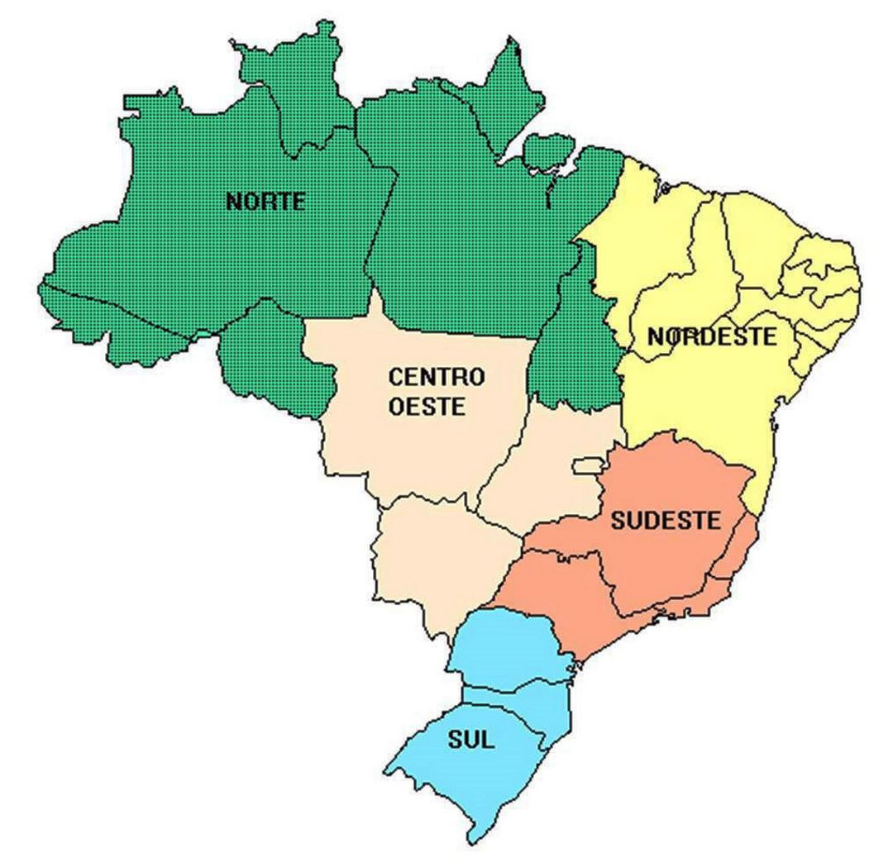

# ¿De qué trata la clase de hoy?

Hoy vamos a repasar cómo especificar, implementar y visualizar **modelos de regresión lineal**. La idea principal es que se lleven de este *notebook* herramientas útiles para comunicar resultados.

El flujo de trabajo de hoy quedó estructurado en cuatro partes:

1.  **Modelo base y la sintaxis del `tidyverse`**: cómo especificar y estimar un modelo para entender qué significa cada coeficiente.
2.  **Especificación avanzada**: logaritmos, polinomios e interacciones para capturar relaciones no lineales.
3.  **El paquete `broom`**: vamos convertir los modelos en objetos del `tidyverse` para mejorar la presentación de resultados y determinar de forma clara la bondad de los ajustes.
4.  **Visualizaciones**: herramientas gráficas para modelos lineales.

------------------------------------------------------------------------

## Librerías necesarias

```{r}
#| label: load-packages
#| message: false
#| warning: false
#| cache: false

# Instalamos pacman si no está disponible
if (!require("pacman")) install.packages("pacman")

pacman::p_load(
  tidyverse,    # manipulación y visualización de datos
  here,         # gestión de rutas relativas
  scales,       # formateo de ejes y etiquetas
  broom,        # convertir modelos en dataframes (tidy, glance, augment)
  modelsummary, # tablas de regresión al estilo de publicaciones académicas
  kableExtra,   # decoración de tablas kable
  janitor,      # limpieza de nombres
  webshot2,      # toma capturas de páginas web/html renderizado
  patchwork     # organizar el apilado de figuras
)
```

------------------------------------------------------------------------

## Preparación de los datos

Vamos a utilizar nuevamente los datos de Brasil.

Antes de armar un modelo necesitamos **construir un *dataset* único** que combine las distintas fuentes que venimos usando, bajo la premisa de que **nuestro objetivo será encontrar qué variables explican en promedio los resultados de las elecciones municipales del año 2020 para el partido PT** (Partido de los Trabajadores).

::: callout-note
**¿Por qué 2020 y por qué el PT?**

Los datos de `df_elections` corresponden a **elecciones municipales** (1996, 2000, 2004, 2008, 2012, 2016, 2020, 2024), no presidenciales. Usamos 2020 por ser la elección municipal más reciente con cobertura completa de municipios (algunas bases no tenían datos para el 2024) y elegimos el PT porque es de los que presentaron mayor cantidad de candidatos a lo largo del territorio.
:::

```{r}
#| label: cargar-datos
#| message: false
#| warning: false

# ----------------------------------------------------------
# Cargamos todas las fuentes de datos individuales

df_elections      <- readRDS(here("09_tutorial/data/elections.rds"))
df_finance        <- readRDS(here("09_tutorial/data/finance.rds"))
df_transfers      <- readRDS(here("09_tutorial/data/transfers_combined.rds"))
df_socioeconomic  <- readRDS(here("09_tutorial/data/socioeconomic.rds"))
df_municipalities <- readRDS(here("09_tutorial/data/municipalities.rds"))
```

Las variables del censo (Gini, IDH, pobreza) quedan excluidas porque solo están disponibles para 1991, 2000 y 2010, y mezclar datos de otros años no tiene sentido en el análisis que vamos a hacer.

De todos modos, `df_census` y `df_prices` están disponibles en `/data` si se les ocurre otro objeto de estudio. Por ejemplo, tratar de predecir el GDP de Brasil.

```{r}
#| label: construir-dataset-analitico
#| message: false
#| warning: false

# ----------------------------------------------------------
# Calculamos el porcentaje de votos al PT por municipio
# en el año electoral 2020 (elecciones municipales)

municipios_donde_compitio_pt <- df_elections |>
  filter(year == 2020, sigla_partido == "PT") |>
  pull(id_municipio)

df_voto_pt <- df_elections |>
  # Solo municipios con al menos 1 candidato, para el 2020
  filter(year == 2020, n_candidates>0) |>
  # Filtramos los municipios donde el PT no se presentó
  filter(id_municipio %in% municipios_donde_compitio_pt) |> 
  # Para cada municipio
  group_by(id_municipio) |>
  # calculamos el porcentaje de votos al PT sobre el total de votos nominales
  summarise(
    votos_pt     = sum(total_votes[sigla_partido == "PT"], na.rm = TRUE),
    votos_totales = sum(total_votes, na.rm = TRUE),
    .groups = "drop"
  ) |>
  # Evitamos divisiones por cero
  filter(votos_totales > 0, !is.na(votos_pt)) |>
  mutate(pct_pt = 100 * votos_pt / votos_totales) 


# ----------------------------------------------------------
# Variables socio-económicas del año 2020
# gdp: PIB total del municipio
# population: cantidad de habitantes
# Calculamos gdp_per_capita = gdp / population

df_socio_2020 <- df_socioeconomic |>
  filter(year == 2020) |>
  select(id_municipio, year, population, gdp) |>
  # PIB per cápita en reales nominales
  mutate(
    gdp_per_capita = gdp / population    
  ) |>
  # Tiramos NAs y divisiones por cero
  filter(population > 0, !is.na(gdp)) 

# ----------------------------------------------------------
# Transferencias del año 2020
# transfer_amount: monto total de subsidios (Bolsa Familia)
# transfer_n: número de beneficiarios únicos

df_transfers_2020 <- df_transfers |>
  filter(year == 2020) |>
  select(id_municipio, year, transfer_amount, transfer_n) |>
  filter(!is.na(transfer_amount), transfer_n > 0) 

# ----------------------------------------------------------
# Variables de gasto municipal por area programática (2020)
# health_exp: gasto en salud
# educ_exp:   gasto en educación
# urban_exp:  gasto en urbanismo y vivienda

df_finance_2020 <- df_finance |>
  filter(year == 2020) |>
  select(id_municipio, year, health_exp, educ_exp, urban_exp) 

# ----------------------------------------------------------
# Ensamblamos el dataset final con LEFT JOINs
# La base es df_voto_pt, todos los demás datos se agregan
# por municipio.

df_modelo <- df_voto_pt |>
  left_join(df_socio_2020,      by = "id_municipio") |>
  left_join(df_transfers_2020,  by = c("id_municipio", "year")) |>
  left_join(df_finance_2020,    by = c("id_municipio", "year")) |>
  left_join(
    df_municipalities |> select(id_municipio, region, capital, legal_amazon),
    by = "id_municipio"
  ) |>
  # Convertimos la región a factor (variable categórica) y "Sul" como referencia
  mutate(
    region       = factor(region, levels = c("Sul", "Sudeste", "Centro-Oeste", "Nordeste", "Norte")),
    capital      = as.integer(capital),      # 1 si es capital de estado
    legal_amazon = as.integer(legal_amazon)  # 1 si pertenece a la Amazonía Legal
  ) |>
  # Quitamos observaciones con valores faltantes en las variables clave
  drop_na(pct_pt, gdp_per_capita, population, transfer_n, region) |>
  # Filtramos valores extremos claramente erróneos
  filter(gdp_per_capita > 0, population > 0)

# Verificamos las dimensiones del dataset analítico
n_municipios <- df_modelo |> pull(id_municipio) |> n_distinct()
cat("Municipios en el dataset analítico:", n_municipios, "\n")
cat("Variables:", ncol(df_modelo)-1, "\n")
head(df_modelo)
```

## `kable`: tablas coquetas

En general, siempre y cuando un gráfico muestre la misma información en forma compacta y digerible, desaliento el uso de tablas. Pero, en ciertas ocasiones, sobre todo cuando se reportan métricas de bondad de ajustes, el uso de tablas se vuelve ineludible.

Antes de correr cualquier regresión, es buena práctica explorar la distribución de las variables (podríamos hacer gráficos de las distribuciones). Para eso podemos usar `kable` y `kableExtra` para hacer una tabla resumen con estadística descrpitiva que se vea coqueta.

```{r}
#| label: tabla-descriptiva
#| message: false
#| warning: false

# ----------------------------------------------------------
# Armamos una tabla de estadísticas descriptivas para las
# principales variables del modelo
tabla_desc <- df_modelo |>
  select(
    pct_pt, gdp_per_capita, population,
    transfer_n, health_exp, educ_exp, urban_exp
  ) |>
  pivot_longer(cols = everything(), names_to = "Variable", values_to = "valor") |>
  group_by(Variable) |>
  summarise(
    N        = sum(!is.na(valor)),
    Media    = mean(valor, na.rm = TRUE),
    `Des. Est.` = sd(valor, na.rm = TRUE),
    Mínimo   = min(valor, na.rm = TRUE),
    Mediana  = median(valor, na.rm = TRUE),
    Máximo   = max(valor, na.rm = TRUE),
    .groups = "drop"
  ) |>
  # Renombramos las variables para que sean legibles en la tabla
  mutate(Variable = case_match(
    Variable,
    "pct_pt"           ~ "% Votos PT (2020)",
    "gdp_per_capita"   ~ "PIB per cápita (R$)",
    "population"       ~ "Población",
    "transfer_n"       ~ "Número de transferencias",
    "health_exp"       ~ "Gasto en Salud (R$)",
    "educ_exp"         ~ "Gasto en Educación (R$)",
    "urban_exp"        ~ "Gasto en Urbanismo (R$)"
    # "health_exp"       ~ "Gasto en Salud per capita (R$)",
    # "educ_exp"         ~ "Gasto en Educación per capita (R$)",
    # "urban_exp"        ~ "Gasto en Urbanismo per capita (R$)"
  ))

# ----------------------------------------------------------
# Renderizamos con kable y kableExtra (recuerden f1 para ver más info)
tabla_desc |>
  knitr::kable(
    caption = "Tabla 1. Estadísticas descriptivas — Municipios de Brasil (2020)",
    digits  = 2,
    format  = "html",
    align   = c("l", rep("c", 6)) # alineación de las columnas left, center, right
  ) |>
  # Cuestiones de estilo
  kableExtra::kable_styling(
    bootstrap_options = c("striped", "hover", "condensed", "responsive"),
    full_width        = FALSE,
    font_size         = 15
  ) |>
  kableExtra::row_spec(0, bold = TRUE, background = "gray", color = "white") |>
  kableExtra::footnote(
    general = "Fuente: IBGE, TSE y Ministerio de Ciudadanía de Brasil.",
    general_title = "Nota: esta es una tabla coqueta"
  )
```

------------------------------------------------------------------------

# 1. El modelo lineal base y la sintaxis del `tidyverse`

## ¿Qué es un modelo lineal?

Los modelos de regresión lineal son de las herramientas más poderosas y omnipresentes en ciencia en general. Su lógica es simple: queremos **cuantificar cómo cambia en promedio una variable dependiente** $Y$ **cuando cambia una variable independiente** $X$**, al mantener las variables restantes constantes** (los economistas suelen decir *ceteris paribus*).

La forma general del modelo es

$$Y_i = \beta_0 + \beta_1 X_{1i} + \beta_2 X_{2i} + \ldots + \beta_k X_{ki} + \varepsilon_i,$$

donde

-   $Y_i$ es el resultado que queremos explicar (en nuestro caso, el **% de votos al PT** en el municipio $i$).
-   $\beta_0$ es el **intercepto**: el valor promedio de $Y$ cuando todos los $X$ valen cero. Es decir, una valor base respecto al cual las variables independientes sumaran o restaran.
-   $\beta_j$ es el **coeficiente** de la variable $X_j$: en nuestro modelo nos dirá cuántos puntos porcentuales cambia el voto al PT cuando $X_j$ aumenta en una unidad, *manteniendo fijas* todas las demás variables.
-   $\varepsilon_i$ es el **término de error**: condensa todo lo que el modelo no puede explicar para el municipio $i$.

El método que usa R para encontrar los mejores $\beta$ se llama **Mínimos Cuadrados Ordinarios (OLS —*Ordinary Least Squares—*)**. Este método minimiza la suma de los errores al cuadrado $\sum \varepsilon_i^2$ garantizando que la recta ajustada sea la que mejor se aproxima a los datos.

::: callout-tip
**Interpretación de coeficientes**

Un coeficiente $\hat{\beta}_1 = 0.3$ sobre `transfer_n` se leería así: *"Un aumento de 1 habitante sobre el total promedio de beneficiarios en un municipio **se asocia, en promedio, con un incremento** de 0.3 puntos porcentuales en el voto al PT, manteniendo constantes las demás variables del modelo."*

Es importante enfatizar que cuando se construye un modelo, en general, se habla de "asociaciones", "vinculaciones", "correlaciones" entre las variables dependientes e independientes, pero nunca de "causas" porque **para encontrar causalidad** entre dos variables ni siquiera basta con que los resultados sean significativos. En general, **se requiere un diseño experimental o cuasi-experimental específico que contemple todas las posibles contingencias.**
:::

## Inspeccionando la variable dependiente: ¿cómo se distribuye el voto al PT?

Antes de correr cualquier modelo, conviene mirar la distribución de la variable que queremos explicar. Un **violin plot** superpuesto con puntos individuales nos dice la forma de la distribución (el ancho del violín) y la variación real entre municipios (los puntos).

```{r}
#| label: fig-distribucion-pt
#| fig-width: 12
#| fig-height: 8
#| message: false
#| warning: false

# -----------------------------------------------------------------
# Paleta regional consistente que vamos a sostener en toda la clase
paleta_region <- c(
  "Sul"         = "#2166AC",
  "Sudeste"     = "#4DAC26",
  "Centro-Oeste"= "#D6604D",
  "Nordeste"    = "#F4A582",
  "Norte"       = "#762A83"
)
# Si se trata de un trabajo extenso, sostener la misma paleta de co
# lores para las mismas variables guía muchísimo la interpretación
# --> altamente recomendable


# ----------------------------------------------------------
# Violin + jitter de pct_pt por región
df_modelo |>
  # reordenamos las regiones acorde a la mediana de votos al PT
  mutate(region = fct_reorder(region, pct_pt, median)) |>
  # noten que usamos ggplot dentro deun pipe
  ggplot(aes(x = region, y = pct_pt, fill = region, color = region)) +
  geom_violin(
    alpha     = 0.5,
    linewidth = 0.5,
    width     = 0.9
  ) +
  geom_jitter(
    alpha  = 0.5,
    size   = 0.6,
    width  = 0.22
  ) +
  stat_summary(
    fun      = median,
    geom     = "crossbar",
    width    = 0.45,
    linewidth= 0.8,
    color    = "gray20"
  ) +
  # guide none quita la cajita de asignacion color→region
  scale_fill_manual(values  = paleta_region, guide = "none") + 
  scale_color_manual(values = paleta_region, guide = "none") +
  scale_y_continuous(labels = scales::label_percent(scale = 1),
                     breaks = seq(0, 100, 20)) +
  labs(
    title    = "Distribución del voto al PT por región",
    subtitle = "Cada punto es un municipio. La barra horizontal marca la mediana regional. Elecciones municipales 2020.",
    x        = NULL,
    y        = "% Votos al PT",
    caption  = paste0("Fuente: TSE (2020). N = ", n_municipios, " municipios.")
  ) +
  theme_minimal(base_size = 15) +
  theme(
    plot.title       = element_text(face = "bold", size = 15),
    plot.subtitle    = element_text(size = 12, color = "gray40"),
    panel.grid.major.x = element_blank(),
    panel.grid.minor   = element_blank(),
    axis.text.x      = element_text(size = 15, face = "bold")
  )
```

::: callout-note
**¿Qué vemos de estas distribuciones?**

Los datos se distribuyen heterogeneamente según la región. Esto nos anticipa que la variable `region` va a ser un predictor importante en los modelos. Si viéramos que hay regiones con distribuciones muy similares podríamos agruparlas para reducir redundancias en el modelo.
:::

## Modelo 1: estimando el modelo base con `lm()`

La función `lm()` (de *linear model*) es la herramienta estándar de R para OLS. La sintaxis básica es:

``` r
modelo <- lm(formula = Y ~ X1 + X2 + X3, data = data)
```

Cuando tenemos muchos predictores, el `tidyverse` ofrece un atajo muy conveniente: la fórmula `Y ~ .` que significa *"regresá Y sobre todas las demás variables"*. También está `Y ~ . - X3` que significa *"regresá Y sobre todas las variables, salvo X3".*

Esto es útil para exploración, aunque en la práctica siempre deberíamos pensar qué variables queremos incluir en el modelo con criterio teórico y contextual ya que no se trata de probar a fuerza bruta hasta encontrar algo.

::: callout-note
## Sobre las variables categóricas y el mapeo a las *dummy variables*

Para entender cómo se transforman variables categóricas en *dummy variables*, conviene pensar en términos binarios: 1s y 0s.

Si nuestro país tiene cinco regiones, la intuición sería construir cinco vectores que se mapeen uno a uno con cada región: (1,0,0,0,0)→"Norte", (0,1,0,0,0)→"Sul" y así. Sin embargo, hacer esto no es necesario porque el modelo solo necesita construir cuatro vectores ya que el quinto vector es redundante: si los cuatro primeros elementos tienen peso nulo, por descarte, la quinta región debe estar prendida.

Esa región que se queda deliberadamente sin asignación propia es la que llamamos "categoría de referencia". De esta forma, **cuando hay *dummy variables* el intercepto del modelo nos indica el peso de la referencia cuando el resto de las variables son cero**. Así, los pesos del resto de las regiones van a cuantificar cuántos puntos sube o baja el voto en comparación directa con la referencia. Por esta razón, conviene **elegir la referencia a conciencia de la hipótesis o la historia que queremos contar.**
:::

```{r}
#| label: modelo-base
#| message: false
#| warning: false

# ----------------------------------------------------------
# Modelo 1: modelo base con las variables principales
# Usamos un subconjunto seleccionado de variables para el
# "atajo del tidyverse" (y ~ .) y el modelo controlado

# SELECCIONAMOS LA REFERENCIA DE LA VARIABLE CATEGORICA  
# Elegimos Centro-OESTE para que quede primera en las regiones porque es la que tiene la mediana más baja en la distribución.
df_modelo  <- df_modelo |>
  mutate(
    region=fct_relevel(region, "Centro-Oeste")
  )

# Construimos un subconjunto con las variables que
# vamos a usar en el modelo base (para que y ~ . sea limpio)  
df_modelo_base <- df_modelo |> 
  select(
    pct_pt,            # Variable dependiente: % votos al PT
    gdp_per_capita,    # PIB per cápita del municipio
    population,        # Tamaño del municipio
    transfer_n,        # Transferencias sociales totales
    health_exp,        # Gasto municipal en salud 
    educ_exp,          # Gasto municipal en educación
    urban_exp,         # Gasto municipal en urbanismo
    region,            # Macro-región (variable categórica)
    legal_amazon       # Si pertenece a la Amazonía Legal (dummy)
  )

# ----------------------------------------------------------
# El atajo y ~ . ("punto"): regresá pct_pt sobre TODAS
# las demás columnas del dataframe df_modelo_base.
# R convierte automáticamente los factores en dummies, tomando
# como referencia la primera de las variables
modelo_1 <- lm(pct_pt ~ ., data = df_modelo_base)

# Veamos el output clásico
summary(modelo_1)
```

::: callout-note
**¿Cómo leer el output de `summary()`?**

-   **Estimate**: el coeficiente $\hat{\beta}$ nos dice cuánto cambia `pct_pt` cuando la variable sube una unidad.
-   **Std. Error**: el error estándar del coeficiente. Mide la incertidumbre de la estimación.
-   **T value**: el estadístico de prueba $t = \hat{\beta} / SE(\hat{\beta})$ que mide la "fuerza" del resultado como una relación de cuántos errores estándar se aleja nuestra estimación del cero (mayor a 2 o menor a -2 el efecto suele ser significativo).
-   **Pr(\>\|t\|)**: el p-valor. Si es menor al umbral (usualmente 0.05), rechazamos la hipótesis nula de que $\beta = 0$.
-   **R-squared**: la proporción de la varianza en `pct_pt` que explica el modelo. 1 → ajuste perfecto, 0 → no explica nada.
-   **Ejemplo**: veamos **`regionNordeste`**. Siendo `Centro-Oeste` la categoría de referencia, este coeficiente indica cuántos puntos porcentuales más (o menos) vota al PT en el Nordeste, manteniendo el resto de las variables fijas.
:::

{fig-align="center" width="296"}

::: callout-caution
**Algunos detalles de interpretación**

**1. R² ≈ 0.16 — ¿por qué tan bajo?**

El R² bajo no invalida el análisis. En datos de corte transversal con \~1000 municipios heterogéneos (diferencias históricas, geográficas, culturales), es completamente esperable que las pocas variables económicas disponibles expliquen una porción reducida de la varianza electoral.

Lo que más importa en este tipo de modelos no es el R² sino si los estimadores $\hat{\beta}$ son insesgados y consistentes. Un R² bajo simplemente podría significar que hay variación idiosincrática que el modelo no logra capturar —no particularmente que los efectos que sí encontramos sean falsos.

**2. `legal_amazon` negativo y significativo**

Los municipios de la Amazonía Legal votan aproximadamente entre 12.1 y 7 puntos porcentuales *menos* al PT, controlando por región. Esto parece sorprendente, dado que la Amazonía Legal incluye casi todo el Norte, región historicamente afines al PT. Sin embargo, la Amazonía Legal también abarca amplias zonas del Centro-Oeste con fuerte presencia del agronegocio y del evangelismo, bases electorales del bolsonarismo desde 2018.

Este resultado ilustra **el valor de las variables control: la región ya capta parte de la geografía política; la Amazonía Legal captura información intra-región.**
:::

{fig-align="center" width="341"}

------------------------------------------------------------------------

# 2. Especificación avanzada: Logaritmos, polinomios e interacciones

## ¿Por qué transformar variables?

El modelo lineal asume que la relación entre $X$ e $Y$ es una **línea recta**. Pero en la realidad, muchas relaciones son curvilíneas. Por ejemplo:

-   El efecto del **GDP per cápita** sobre el voto quizás no sea constante: pasar de ser un municipio muy pobre a uno medianamente pobre puede tener mucho más impacto electoral que pasar de ser rico a muy rico. Esto es una **relación log-lineal**.
-   El efecto del **gasto en ubranismo** podría ser creciente hasta cierto punto y luego revertirse debido al hastío y la sensación de derroche: dando una relación de **curva en U invertida**. Esto es una **relación cuadrática**.
-   El impacto de las **transferencias sociales** sobre el voto al PT quizás no es el mismo en el Nordeste (donde el PT tiene raíces históricas profundas) que en el Sur (donde el PT enfrenta mayor competencia). Esto se modela con una **interacción**.

### Logaritmo: interpretación en elasticidades

Cuando tomamos el logaritmo natural de una variable $X$ **continua y positiva** (como el GDP per cápita), el modelo se convierte en:

$$Y_i = \beta_0 + \beta_1 \ln(X_i) + \varepsilon_i$$

El coeficiente $\beta_1$ ya no se interpreta como "cuánto cambia $Y$ por una unidad de $X$", sino como:

> *"Un incremento del 1% en* $X$ se asocia con un cambio de $\beta_1 / 100$ unidades en $Y$." Equivalentemente, *"Un incremento del 1 unidad en* el $ln X$ se asocia con un cambio de $\beta_1$ unidades en $Y$."

Esto modelado se denomina **semi-elastico** y es extremadamente útil para variables como el GDP, la población o el gasto, que tienen distribuciones muy asimétricas con colas largas a la derecha.

### Términos cuadráticos

Si sospechamos que la relación entre $X$ e $Y$ tiene una forma de parábola (curva en U o U invertida), agregamos $X^2$ al modelo:

$$Y_i = \beta_0 + \beta_1 X_i + \beta_2 X_i^2 + \varepsilon_i$$

El máximo (o mínimo) de la parábola ocurre en $X^* = -\beta_1 / (2\beta_2)$. Si $\beta_2 < 0$, la curva es una U invertida (hay un punto óptimo).

En R, la sintaxis para hacer este modelado es `I(X^2)` dentro de la fórmula.

### Interacciones: efectos heterogéneos

Una interacción $X_1 \times X_2$ permite que el efecto de $X_1$ sobre $Y$ varíe según el nivel de $X_2$:

$$Y_i = \beta_0 + \beta_1 X_{1i} + \beta_2 X_{2i} + \beta_3 (X_{1i} \times X_{2i}) + \varepsilon_i$$

El efecto marginal de $X_1$ es ahora $\partial Y / \partial X_1 = \beta_1 + \beta_3 X_2$, es decir, **depende del** **valor de** $X_2$ **y del peso asignado a la interacción** $\beta_3$.

En nuestro caso preguntas pertinentes serían para modelas interacciones serían ¿el efecto del GDP per cápita sobre el voto al PT varía según la región? ¿El impacto de las transferencias es diferente en el Nordeste que en el Sur?

## Modelo 2: incorporando semi-elasticidades

### Motivación visual: ¿por qué logaritmo?

Antes de estimar el segundo modelo, conviene *ver* la forma de la relación entre PIB per cápita y voto al PT. Si la relación fuera lineal, los puntos deberían distribuirse uniformemente alrededor de una recta. Si la relación es curvilínea, necesitamos aplicar alguna transformación. De yapa podemos graficar también la relación entre el gasto en urbanismo y el voto al PT, bajo la posibilidad de encontrar una relación cuadrática negativa en su distribución.

```{r}
#| label: fig-log-motivacion
#| fig-width: 14
#| fig-height: 10
#| message: false
#| warning: false

# ----------------------------------------------------------
# Comparamos la relación PIB per cápita ~ voto PT en escala
# original (izquierda) versus en escala logarítmica (derecha).
# El suavizador LOESS (línea naranja) revela la forma real
# de la asociación sin imponer linealidad.

p_original <- df_modelo |>
  ggplot(aes(x = gdp_per_capita, y = pct_pt)) +
  geom_point(alpha = 0.12, size = 0.9, color = "#2171B5") +
  geom_smooth(method = "loess", se = TRUE,
              color = "darkorange", fill = "darkorange",
              alpha = 0.15, linewidth = 1) +
  scale_x_continuous(labels = scales::label_comma(big.mark = ".")) +
  scale_y_continuous(labels = scales::label_percent(scale = 1)) +
  labs(
    title    = "Escala original",
    subtitle = "Relación comprimida, cola derecha larga",
    x        = "PIB per cápita (R$)",
    y        = "% Votos al PT"
  ) +
  theme_minimal(base_size = 12) +
  theme(plot.title    = element_text(face = "bold"),
        plot.subtitle = element_text(color = "gray40", size = 10),
        panel.grid.minor = element_blank())

p_log <- df_modelo |>
  # Aca usamos el logaritmo 10 (despues usaremos el natural, esto es solo para comparar valores)
  ggplot(aes(x = log10(gdp_per_capita), y = pct_pt)) +
  geom_point(alpha = 0.12, size = 0.9, color = "#2171B5") +
  geom_smooth(method = "loess", se = TRUE,
              color = "darkorange", fill = "darkorange",
              alpha = 0.15, linewidth = 1) +
  scale_y_continuous(labels = scales::label_percent(scale = 1)) +
  labs(
    title    = "Escala logarítmica",
    subtitle = "Relación más lineal y homogénea",
    x        = "log(PIB per cápita)",
    y        = "% Votos al PT"
  ) +
  theme_minimal(base_size = 12) +
  theme(plot.title    = element_text(face = "bold"),
        plot.subtitle = element_text(color = "gray40", size = 10),
        panel.grid.minor = element_blank())

p_urban <- df_modelo |>
  # Usamos urban_exp en el eje X
  ggplot(aes(x = urban_exp, y = pct_pt)) +
  geom_point(alpha = 0.12, size = 0.9, color = "#2171B5") +
  
  # Forzamos a geom_smooth a estimar una parábola cuadrática
  geom_smooth(method = "lm", 
              formula = y ~ poly(x, 2, raw = TRUE), 
              se = TRUE,
              color = "darkorange", fill = "darkorange",
              alpha = 0.15, linewidth = 1) +
  
  scale_x_continuous(labels = scales::label_comma(big.mark = ".")) +
  scale_y_continuous(labels = scales::label_percent(scale = 1)) +
  labs(
    title    = "Relación polinómica (Cuadrática)→ Claramente no existe",
    subtitle = "Modelando efectos curvilíneos (U invertida) en gasto urbano",
    x        = "Gasto en Urbanismo per cápita (R$)",
    y        = "% Votos al PT"
  ) +
  theme_minimal(base_size = 12) +
  theme(plot.title    = element_text(face = "bold"),
        plot.subtitle = element_text(color = "gray40", size = 10),
        panel.grid.minor = element_blank())

# patchwork combina los paneles en una sola figura
(p_original + p_log)/p_urban +
  plot_annotation(
    title   = "¿Por qué loguear el PIB per capita?",
    caption = "Suavizador LOESS con banda de confianza al 95%. Fuente: IBGE / TSE (2020).",
    theme   = theme(plot.title = element_text(face = "bold", size = 14))
  )
```

Este análisis previo lo hacemos porque tenemos la suposición de que **las variables que escalan con el tamaño de la población sirven parcialmente de proxy (miden indirectamente) para el tamaño poblacional**. Osea, que si un municipio tiene 500000 unidades de alguna variable de repente va a pesar mucho más en el ajuste que otro que tiene 500 unidades. Al loguear, la diferencia se achica y el efecto sobre la variable se mitiga.

::: callout-tip
**¿Qué vemos?**

En escala original, la nube de puntos está aplastada a la izquierda (muchos municipios pobres) y hay una cola muy larga a la derecha (pocos municipios muy ricos). El suavizador LOESS no puede distinguir una relación clara.

En escala logarítmica, los puntos se distribuyen uniformemente y muestran una relación negativa para valores menores a $10^5$ (casi cien mil reales, es decir, un salario alto): municipios más ricos votan sistemáticamente menos al PT. Esto justifica usar `log(gdp_per_capita)` en el siguiente modelo.

Por otro lado, la suposición cuadrática sobre el gasto en urbanismo claramente no tenía el sentido que le asignamos más arriba.
:::

Ahora, sí computemos el modelo tomando el logaritmo de esa variable y hagamos lo mismo para las variables de población y gasto (pueden estudiar ustedes que siguen un crecimiento similar al visto arriba).

```{r}
#| label: modelo-2-log-poly
#| message: false
#| warning: false

# ----------------------------------------------------------
# Modelo 2: especificación con logaritmos y término cuadrático
#
# Transformaciones aplicadas:
# - log(gdp_per_capita)   : semi-elasticidad del PIB per cápita
# - log(population)       : semi-elasticidad del tamaño municipal
# - log sobre los _exp    : semi-elasticidad a los gastos por municipio
# - transfer_n            : posible curva en U en la relación --> descartado (no lo hice para no llenar de graficos), lo dejamos lineal


modelo_2 <- lm(
  pct_pt ~
    log(gdp_per_capita)      +   # Log del PIB per cápita
    log(population)          +   # Log de la población
    log(transfer_n)          +   # Log de las transferencias sociales totales
    # I(transfer_n^2)        +   # Término cuadrático de transferencias
    # +1 para evitar log(0) en municipios con gasto nulo)
    log(health_exp + 1)      +   # Log del gasto municipal en salud + 1 
    log(educ_exp   + 1)      +   # Log del gasto municipal en educación
    log(urban_exp  + 1)      +   # Log del gasto municipal en urbanismo
    region                   +   # Efectos fijos de región (dummies)
    legal_amazon,                # Dummy Amazonía Legal
  data = df_modelo
)

summary(modelo_2)
```

Noten cómo influyen los términos logarítmicos:

-   al crecer en promedio 1% el GDP per cápita de un municipio, el porcentaje del PT decrece entre 0,03% y 0.05%. Este término antes no era significativo.

-   Por otro lado, al crecer en promedio 1% la población de un municipio, los votos del PT decrecen entre 0,08% y 0,14%.

## Modelo 3: incorporando interacciones

### Motivación visual para las interacciones: ¿hay heterogeneidad regional en las asignaciones universales?

La interacción del Modelo 3 tiene sentido solo si las gastos en asistencia realmente varían entre regiones. Un gráfico rápido antes de estimar sirve como chequeo de consistencia.

```{r}
#| label: fig-transferencias-region
#| fig-width: 10
#| fig-height: 5
#| message: false
#| warning: false

# ----------------------------------------------------------
# Boxplot de gdp_per_capita por región, con puntos de
# mediana destacados

df_modelo |>
  mutate(region = fct_reorder(region, transfer_n, median)) |>
  ggplot(aes(x = region, y = transfer_n,
             fill = region, color = region)) +
  geom_boxplot(
    alpha    = 0.3,
    outlier.alpha = 0.08,
    outlier.size  = 0.7,
    linewidth     = 0.5,
    width         = 0.55
  ) +
  stat_summary(
    fun      = median,
    geom     = "point",
    size     = 3.5,
    shape    = 21,
    fill     = "white",
    color    = "gray20",
    stroke   = 1.2
  ) +
  scale_fill_manual(values  = paleta_region, guide = "none") +
  scale_color_manual(values = paleta_region, guide = "none") +
  scale_y_log10(labels = scales::label_comma(big.mark = ".")) +
  labs(
    title    = "Transferencias sociales totales según región",
    subtitle = "Mediana marcada con punto blanco. Cada caja agrupa todos los municipios de la región.",
    x        = NULL,
    y        = "Transferencias totales",
    caption  = "Fuente: Ministerio de Ciudadanía de Brasil (2020)."
  ) +
  theme_minimal(base_size = 13) +
  theme(
    plot.title         = element_text(face = "bold", size = 14),
    plot.subtitle      = element_text(size = 10, color = "gray40"),
    panel.grid.major.x = element_blank(),
    panel.grid.minor   = element_blank(),
    axis.text.x        = element_text(size = 12, face = "bold")
  )
```

::: callout-note
**¿Qué vemos?**

El Nordeste y el Norte tienen medianas de transferencias más altas, mientras que el Sul presenta los montos más bajos. Esta variación regional es la que el Modelo 3 pretende capturar con la interacción: si las asignaciones universales afectan el voto de forma diferente según la región, el coeficiente de interacción debería ser estadísticamente distinto de cero.
:::

```{r}
#| label: modelo-3-interaccion
#| message: false
#| warning: false

# ----------------------------------------------------------
# Modelo 3: especificación con interacción
#
# La hipótesis que probamos: el efecto de las transferencias
# sociales (transfer_n) sobre el voto al PT varía según
# la macro-región del municipio.
#
# En R, la interacción se escribe como: X1 * X2
# Esto es equivalente a: X1 + X2 + X1:X2
# donde ":" es el término de interacción puro

modelo_3 <- lm(
  pct_pt ~
    log(gdp_per_capita)           +        # Log del PIB per cápita
    log(population)               +        # Log de la población
    log(transfer_n) * region     +        # Interacción: transferencias × región --> no escribimos ni region ni transferencia por separado así
    log(health_exp + 1)   +        # Log del gasto en salud
    log(educ_exp   + 1)   +        # Log del gasto en educación
    log(urban_exp  + 1)   +        # Log del gasto en urbanismo
    legal_amazon,                  # Dummy Amazonía Legal
  data = df_modelo
)

summary(modelo_3)
```

::: callout-tip
**¿Cómo leer los coeficientes de interacción?**

El coeficiente log(`transfer_n):regionSul` responde la pregunta: *¿en cuánto difiere el efecto de las transferencias sobre el voto al PT en el Sur respecto al Centro-Oeste (categoría base)?*

Si ese coeficiente es negativo **y significativo**, significa que en el Sur las transferencias tienen un efecto negativo sobre el voto al PT por encima del efecto base (capturado por `tranfer_n` a secas).
:::

::: callout-warning
**Dos cosas para notar al comparar los modelos 1, 2 y 3**

**1. La variación del peso de `transfer_n` en los tres modelos**

El coeficiente cambia de magnitud, signo relativo y significancia entre los tres modelos porque cada especificación le pregunta algo diferente a los datos.

-   **Modelo 1 (sin transformar):** el modelo estima cuántos puntos porcentuales adicionales de voto al PT se asocian con cada beneficiario extra de transferencias, en promedio y para todos los municipios por igual. El coeficiente es pequeño en magnitud (≈ 0.002) pero muy significativo: hay una señal clara en los datos, aunque aplastada por la escala de la variable (que va de cientos a cientos de miles de beneficiarios).

-   **Modelo 2** **(logaritmo natural):** la pregunta cambia, ahora estimamos cuánto cambia el voto cuando las transferencias crecen un 1%, no cuando suman un beneficiario más. Al comprimir la escala, la variación se redistribuye de forma homogénea entre municipios grandes y chicos. El resultado es que el coeficiente pierde significancia: el efecto promedio de las transferencias sobre el voto al PT, una vez que controlamos por tamaño en escala logarítmica, ya no es estadísticamente distinguible de cero. Dicho de otro modo, un municipio con 500.000 beneficiarios "pesa" muchísimo más que uno con 5.000 al ajustar la recta, pero si logueamos, esa diferencia se achica dramáticamente y la señal que parecía fuerte se debilita.

-   **Modelo 3** **(incorporamos la interacción)**: ahora el modelo ya no busca un efecto promedio de las transferencias para todo Brasil, sino que permite que ese efecto se desagregue por región. Al liberar esa restricción, el coeficiente principal de log(transfer_n) recupera magnitud y significancia porque ahora representa el efecto de las transferencias en la categoría de referencia (Centro-Oeste), no el promedio ponderado de cinco regiones con dinámicas políticas muy distintas.

Es decir, el Modelo 2 promediaba efectos heterogéneos y esa heterogeneidad oculta es la que disminuía su poder predictivo. Es un patrón clásico (***aggregation bias***) en regresión: **un coeficiente que parece irrelevante en una especificación puede volverse central en otra cuando se modelan correctamente las interacciones**. Por eso **la interpretación de cualquier coeficiente siempre debe hacerse en el contexto del modelo completo, sin trasladar mecánicamente los resultados de una especificación a otra.**

-   En el Modelo 1 (sin logaritmos) el coeficiente es bajo, pero muy significativo: más transferencias, más voto al PT.

-   En el Modelo 2 (con logaritmo) el coeficiente pierde significancia.

-   En el modelo 3 (con logaritmo e interacciones por región) vuelve a ser signficativo (casi) y adquiere un valor mucho más alto.

    ```         
    Modelos (1,2,3)                 Estimate   Std. Error  t value Pr(>|t|) 
    transfer_n                      2.075e-03  5.548e-04   3.740   0.000195 ***
    log(transfer_n)                 1.6008     1.3852      1.156   0.2481
    log(transfer_n)                 6.4727     3.4339      1.885  0.05975 .
    ```

**2. Hay interacciones que no son significativas —y eso también es un resultado.**

Salvo en la región Sur, el efecto de las transferencias totales por municipio no es significativo. Esto significa que en el resto de las regiones, no hay evidencia de que el número de beneficiados afecte en el voto al PT.
:::

------------------------------------------------------------------------

# 3. `broom`: convertir modelos en dataframes

### El problema del output clásico de `summary()`

El output de `summary(modelo)` que vimos arriba es legible para un humano, pero es un **objeto de R de clase especial** (`summary.lm`) que no es fácil de manipular programáticamente. Si queremos, por ejemplo, filtrar solo los coeficientes significativos, hacer un gráfico de los estimados o comparar decenas de modelos automáticamente, este formato resulta incómodo.

El paquete `broom` resuelve esto de forma elegante: convierte los resultados de casi cualquier modelo en ***tibbles*** **limpios del tidyverse**, compatibles con `dplyr`, `ggplot2` y todas las herramientas que ya conocemos.

`broom` tiene **tres funciones clave**, cada una enfocada en un nivel diferente del análisis:

| Función | ¿Qué devuelve? | Nivel |
|----|----|----|
| `tidy()` | Coeficientes, errores estándar, estadístico t, p-valor | Parámetros |
| `glance()` | R², AIC, BIC, F-estadístico, degrees of freedom | Modelo global |
| `augment()` | Valores predichos, residuos, leverage, distancia de Cook | Observaciones |

## `tidy()`: coeficientes como dataframe

```{r}
#| label: broom-tidy
#| message: false
#| warning: false

# ----------------------------------------------------------
# tidy() extrae los coeficientes del modelo y los devuelve
# como un dataframe limpio.
# El argumento conf.int = TRUE agrega los intervalos de
# confianza al 95% (conf.level = 0.95 por defecto)

coefs_m1 <- broom::tidy(modelo_1, conf.int = TRUE, conf.level = 0.95)
coefs_m2 <- broom::tidy(modelo_2, conf.int = TRUE, conf.level = 0.95)
coefs_m3 <- broom::tidy(modelo_3, conf.int = TRUE, conf.level = 0.95)

# Veamos el resultado para el modelo 2
coefs_m2

# Ahora podemos filtrar con dplyr: ¿cuáles son los coeficientes
# estadísticamente significativos al 5%?
coefs_m2 |>
  filter(p.value < 0.05) |>
  select(term, estimate, std.error, p.value) |>
  arrange(desc(abs(estimate)))
```

## `glance()`: métricas globales del modelo

```{r}
#| label: broom-glance
#| message: false
#| warning: false

# ----------------------------------------------------------
# glance() devuelve UNA SOLA FILA con las métricas de
# ajuste global del modelo.
# Métricas clave:
#   r.squared     → R² (varianza explicada)
#   adj.r.squared → R² ajustado (penaliza por nº de variables)
#   sigma         → desvío estándar de los residuos
#   AIC           → Criterio de Akaike (menor = mejor)
#   BIC           → Criterio de Bayes-Schwarz (más estricto)
#   nobs          → número de observaciones usadas

ajuste_m1 <- broom::glance(modelo_1)
ajuste_m2 <- broom::glance(modelo_2)
ajuste_m3 <- broom::glance(modelo_3)

# Como son dataframes de una fila, podemos apilarlos con bind_rows
# para comparar los tres modelos en una sola tabla
comparacion_ajuste <- bind_rows(
  ajuste_m1 |> mutate(modelo = "Modelo 1: Base"),
  ajuste_m2 |> mutate(modelo = "Modelo 2: Log + Polinomio"),
  ajuste_m3 |> mutate(modelo = "Modelo 3: Interacción")
) |>
  select(modelo, r.squared, adj.r.squared, sigma, AIC, BIC, nobs)

comparacion_ajuste
```

### Visualizar predicciones y residuos para detectar problemas: SIEMPRE

```{r}
#| label: fig-predicted-vs-actual
#| fig-width: 14
#| fig-height: 8
#| message: false
#| warning: false

# ----------------------------------------------------------
# Gráfico predichos vs observados para el Modelo 2.
# En un modelo perfecto, todos los puntos caerían sobre la
# línea de 45° (y = x). La dispersión alrededor de esa línea
# muestra la varianza no explicada (residuos).
# Coloreamos por región para ver si el error es sistemático
# en alguna parte del espacio político.

# augment() sin argumentos recupera exactamente las filas usadas
# por el modelo. Añadimos 'region' extrayéndola del model.frame,
# que garantiza el mismo orden y tamaño que los datos del modelo.
augment_m2 <- broom::augment(modelo_2) |>
  mutate(region = model.frame(modelo_2)$region)

augment_m2 |>
  ggplot(aes(x = .fitted, y = pct_pt, color = region)) +
  geom_abline(
    slope     = 1, intercept = 0,
    linetype  = "dashed", color = "gray30", linewidth = 0.8
  ) +
  geom_point(alpha = 0.2, size = 0.9) +
  scale_color_manual(values = paleta_region, name = "Región") +
  scale_x_continuous(labels = scales::label_percent(scale = 1)) +
  scale_y_continuous(labels = scales::label_percent(scale = 1)) +
  guides(color = guide_legend(override.aes = list(alpha = 1, size = 3))) +
  labs(
    title    = "Valores predichos vs. observados — Modelo 2",
    subtitle = "La línea punteada es la predicción perfecta (y = x). Dispersión = varianza no explicada.",
    x        = "Predicho por el modelo (%)",
    y        = "Observado — % real voto PT",
    caption  = "Fuente: TSE / IBGE (2020). Modelo 2: log(PIB) + log(pop) + transferencias + gasto."
  ) +
  theme_minimal(base_size = 13) +
  theme(
    plot.title       = element_text(face = "bold", size = 14),
    plot.subtitle    = element_text(size = 10, color = "gray40"),
    panel.grid.minor = element_blank(),
    legend.position  = "right"
  )
```

::: callout-caution
OJO: ¡este gráfico evidencia un problema importante! Más abajo lo vemos en detalle
:::

::: callout-note
**¿AIC o BIC para comparar modelos?**

Cuando los modelos tienen distinto número de parámetros (como es nuestro caso), el R² siempre sube al agregar variables, incluso si no aportan información real. Por eso usamos:

-   **AIC (Akaike)**: penaliza moderadamente la complejidad. Favorece modelos con buen ajuste aunque tengan varios parámetros.
-   **BIC (Schwarz)**: penaliza más fuertemente la complejidad. Prefiere modelos más parsimoniosos.

En ambos casos: **menor es mejor**. Si el Modelo 3 tiene menor AIC que el Modelo 2, la interacción mejora el ajuste lo suficiente como para justificar la mayor complejidad.
:::

## `augment()`: diagnóstico observación por observación

```{r}
#| label: broom-augment
#| message: false
#| warning: false

# ----------------------------------------------------------
# augment() agrega al dataframe original columnas con:
#   .fitted    → valor predicho por el modelo (Ŷ)
#   .resid     → residuo (Y - Ŷ)
#   .hat       → leverage (qué tanto influye la obs. en los coefs.)
#   .cooksd    → distancia de Cook (influencia combinada)
#   .std.resid → residuo estandarizado
#
# Es la base del diagnóstico de supuestos del MCO.

# IMPORTANTE: NO pasamos el argumento `data = df_modelo`.
# Cuando el modelo contiene transformaciones como log() o I(),
# lm() descarta internamente las filas con NA en esas variables,
# por lo que el modelo puede haberse estimado con menos filas
# que df_modelo. Pasar data = df_modelo en ese caso produce
# un error de tamaños incompatibles.
# Sin el argumento data, augment() recupera los datos que el
# propio modelo usó internamente → siempre consistente.
diagnostico_m2 <- broom::augment(modelo_2)

# Un vistazo al resultado
diagnostico_m2 |>
  select(pct_pt, .fitted, .resid, .hat, .cooksd, .std.resid) |>
  head(10)
```

```{r}
#| label: grafico-residuos
#| fig-width: 14
#| fig-height: 9
#| message: false
#| warning: false

# ----------------------------------------------------------
# Gráfico de diagnóstico: residuos vs. valores predichos
# En un modelo bien especificado, los residuos deben
# distribuirse aleatoriamente alrededor del cero, sin
# mostrar patrones sistemáticos (heterocedasticidad).

ggplot(diagnostico_m2, aes(x = .fitted, y = .std.resid)) +
  geom_point(alpha = 0.3, color = "#2171B5", size = 1.2) +
  geom_hline(yintercept = 0, color = "firebrick", linetype = "dashed", linewidth = 0.8) +
  geom_smooth(method = "loess", se = FALSE, color = "darkorange", linewidth = 0.9) +
  labs(
    title    = "Diagnóstico: Residuos vs. Valores Predichos",
    subtitle = "Modelo 2 (Log) — Municipios de Brasil 2020",
    x        = "Valores predichos (% voto PT)",
    y        = "Residuos estandarizados",
    caption  = "La línea naranja es un suavizador LOESS; debería ser aproximadamente horizontal en 0."
  ) +
  theme_minimal(base_size = 13) +
  theme(
    plot.title    = element_text(face = "bold", size = 15),
    plot.subtitle = element_text(size = 12, color = "gray40"),
    panel.grid.minor = element_blank()
  )
```

Parecía bien hasta que vemos que de repente los datos se agrupan y apelmazan en la parte de abajo, como si le hubieran dado un tijeretazo a los datos.

::: callout-warning
## ¿Por qué sucede esto y qué nos dice respecto a las métricas que computamos?

El patrón inusual que observamos en el gráfico de diagnóstico, con ese "corte" diagonal tan marcado en la parte inferior de la nube de puntos, se debe a una **limitación matemática al aplicar Mínimos Cuadrados Ordinarios (OLS) a una variable acotada** como lo es el porcentaje de votos al PT (`pct_pt`).

Dado que en la realidad ningún municipio puede registrar menos del 0% de los sufragios, pero la regresión lineal asume matemáticamente que la relación es una línea recta que puede extenderse hacia el infinito, el modelo inevitablemente llega a predecir porcentajes de votos negativos.

Como el residuo es simplemente la diferencia entre el valor real y el predicho, ese límite infranqueable del 0% real choca contra las predicciones creando un "piso" estricto.

**Nuestro modelo sobreestima a los municipios que en la realidad adquieren un 0% de los votos. De hecho, predice porcentajes negativos, lo cual no tiene sentido. Para solucionar reste problema, en general, se usa un tipo específico de regresión que se llama regresión Beta, pero queda por fuera de lo que vimos en esta clase.**

Lamentablemente, todas las predicciones y consecuentemente las métricas computadas estarán inherentemente mal. Sigamos adelante, bajo la suposición de que el modelo es correcto para entender cómo se utilizan las herramientas.
:::

------------------------------------------------------------------------

## Tablas de regresión al nivel publicación con `modelsummary`

## ¿Por qué `modelsummary` y no copiar/pegar de `summary()`?

En cualquier paper de Ciencia Política o RRII publicado en revistas indexadas, los resultados de las regresiones aparecen en una **tabla comparativa** donde cada columna es un modelo y cada fila es una variable. Armar esas tablas manualmente desde el output de `summary()` es lento, propenso a errores y difícil de actualizar si cambia algún modelo.

`modelsummary` genera esas tablas automáticamente, siguiendo el estilo de la **APSR** (*American Political Science Review*) o el **AJPS** (*American Journal of Political Science*), con una sola línea de código. Además permite exportar a Word, LaTeX, PNG y HTML.

### Tabla comparativa de los tres modelos

```{r}
#| label: tabla-modelsummary
#| message: false
#| warning: false

# ----------------------------------------------------------
# coef_map: diccionario que mapea nombres internos de R
# a etiquetas legibles para la publicación.
# Solo las variables que aparezcan en este mapa serán
# incluidas en la tabla (el resto se omite automáticamente).

mapa_coeficientes <- c(
  "(Intercept)"                          = "Intercepto",
  "log(gdp_per_capita)"                  = "ln(PIB per cápita)",
  "log(population)"                      = "ln(Población)",
  "gdp_per_capita"                       = "PIB per cápita",
  "population"                           = "Población",
  "transfer_n"                           = "Transferencias totales",
  "log(transfer_n)"                      = "ln(Transferencias totales)",
  "log(health_exp + 1)"                  = "ln(Gasto en Salud)",
  "log(educ_exp + 1)"                    = "ln(Gasto en Educación)",
  "log(urban_exp + 1)"                   = "ln(Gasto en Urbanismo)",
  "health_exp"                           = "Gasto en Salud",
  "educ_exp"                             = "Gasto en Educación",
  "urban_exp"                            = "Gasto en Urbanismo",
  "regionSudeste"                        = "Región: Sudeste",
  "regionCentro-Oeste"                   = "Región: Centro-Oeste",
  "regionNordeste"                       = "Región: Nordeste",
  "regionNorte"                          = "Región: Norte",
  "legal_amazon"                         = "Amazonía Legal (dummy)",
  "log(transfer_n):regionSudeste"       = "ln(Transferencias) × Sudeste",
  "log(transfer_n):regionCentro-Oeste"  = "ln(Transferencias) × Centro-Oeste",
  "log(transfer_n):regionNordeste"      = "ln(Transferencias) × Nordeste",
  "log(transfer_n):regionNorte"         = "ln(Transferencias) × Norte"
)

# ----------------------------------------------------------
# modelsummary() recibe una lista nombrada de modelos.
# Los nombres se convierten en los encabezados de columna.

modelsummary::modelsummary(
  models = list(
    "(1) Base"       = modelo_1,
    "(2) Log + Poly" = modelo_2,
    "(3) Interacción"= modelo_3
  ),
  coef_map   = mapa_coeficientes,           # Etiquetas legibles
  stars      = c("*" = 0.1, "**" = 0.05, "***" = 0.01),  # Estrellas de significancia
  gof_map    = c("nobs", "r.squared", "adj.r.squared", "AIC", "BIC"),  # Estadísticas de ajuste
  title      = "Tabla 2. Determinantes del voto al PT en municipios de Brasil (2020)",
  notes      = list(
    "Errores estándar en paréntesis. * p<0.1; ** p<0.05; *** p<0.01.",
    "Variable dependiente: % de votos al PT. Categoría base de región: Sul.",
    "Fuente: TSE, IBGE y Ministerio de Ciudadanía de Brasil."
  )
)
```

### Exportar la tabla a imagen de alta calidad

Para incluir la tabla en una presentación, un informe o una tesis, podemos exportarla directamente a PNG usando el argumento `output`:

```{r}
#| label: exportar-tabla
#| message: false
#| warning: false
#| eval: false

# ----------------------------------------------------------
# Para que modelsummary exporte a PNG necesita
# tener instalado el paquete 'webshot2' o 'gt' 

modelsummary::modelsummary(
  models = list(
    "(1) Base"        = modelo_1,
    "(2) Log + Poly"  = modelo_2,
    "(3) Interacción" = modelo_3
  ),
  coef_map   = mapa_coeficientes,
  stars      = c("*" = 0.1, "**" = 0.05, "***" = 0.01),
  gof_map    = c("nobs", "r.squared", "adj.r.squared", "AIC", "BIC"),
  title      = "Determinantes del voto al PT en municipios de Brasil (2020)",
  notes      = list(
    "Errores estándar en paréntesis. * p<0.1; ** p<0.05; *** p<0.01.",
    "Variable dependiente: % de votos al PT. Categoría base: Sul.",
    "Fuente: TSE, IBGE, Ministerio de Ciudadanía de Brasil."
  ),
  output = "tabla_regresion.png"  # aca especificamos
)

cat("Tabla exportada como 'tabla_regresion.png' en el directorio de trabajo.\n")
```

::: callout-tip
**Otros formatos de exportación disponibles con `modelsummary`:**

-   `output = "tabla.docx"` → Word
-   `output = "tabla.tex"` → LaTeX
-   `output = "tabla.html"` → HTML embebible
-   `output = "tabla.png"` / `"tabla.jpg"` → imagen de alta resolución

Para exportar a `.docx` o `.tex`, el paquete necesita `flextable` (Word) o `kableExtra` (LaTeX).
:::

------------------------------------------------------------------------

# 5. Visualización de Coeficientes e Intervalos de Confianza

### ¿Por qué gráficos de coeficientes en lugar de tablas?

Las tablas de regresión son indispensables para la comunicación técnica, pero tienen una limitación importante: obligan al lector a procesar números individualmente para hacerse una idea visual del tamaño y la precisión de cada efecto. Un **gráfico de coeficientes** (*coefficient plot* o *coefplot*) resuelve esto de forma inmediata. Las visualizaciones

1.  **Facilitan la comparación** del tamaño relativo de los efectos.
2.  **Muestran la incertidumbre** de forma intuitiva: barras de error más largas = estimaciones menos precisas.
3.  **Permiten evaluar la significancia estadística a simple vista**: si el intervalo de confianza cruza la línea del cero ($\beta = 0$), el coeficiente no es estadísticamente distinto de cero al nivel de confianza elegido.

### Construyendo el coefplot con `tidy()` y `ggplot2`

```{r}
#| label: coefplot-modelo-2
#| fig-width: 12
#| fig-height: 8
#| message: false
#| warning: false

# ----------------------------------------------------------
# Extraemos los coeficientes del Modelo 2 con tidy()
# Pedimos los intervalos de confianza al 95%

coefs_plot <- broom::tidy(modelo_2, conf.int = TRUE, conf.level = 0.95) |>
  # Eliminamos el intercepto (su escala es muy diferente
  # y distorsiona visualmente el gráfico)
  filter(term != "(Intercept)") |>
  # Renombramos las variables usando el mismo mapa que antes
  mutate(
    etiqueta = case_match(
      term,
      "(Intercept)"                          ~ "Intercepto",
      "log(gdp_per_capita)"                  ~ "ln(PIB per cápita)",
      "log(population)"                      ~ "ln(Población)",
      "gdp_per_capita"                       ~ "PIB per cápita",
      "population"                           ~ "Población",
      "transfer_n"                           ~ "Transferencias totales",
      "log(transfer_n)"                      ~ "ln(Transferencias totales)",
      "log(health_exp + 1)"                  ~ "ln(Gasto en Salud)",
      "log(educ_exp + 1)"                    ~ "ln(Gasto en Educación)",
      "log(urban_exp + 1)"                   ~ "ln(Gasto en Urbanismo)",
      "health_exp"                           ~ "Gasto en Salud",
      "educ_exp"                             ~ "Gasto en Educación",
      "urban_exp"                            ~ "Gasto en Urbanismo",
      "regionSudeste"                        ~ "Región: Sudeste",
      "regionCentro-Oeste"                   ~ "Región: Centro-Oeste",
      "regionNordeste"                       ~ "Región: Nordeste",
      "regionNorte"                          ~ "Región: Norte",
      "legal_amazon"                         ~ "Amazonía Legal (dummy)",
      "log(transfer_n):regionSudeste"       ~ "ln(Transferencias) × Sudeste",
      "log(transfer_n):regionCentro-Oeste"  ~ "ln(Transferencias) × Centro-Oeste",
      "log(transfer_n):regionNordeste"      ~ "ln(Transferencias) × Nordeste",
      "log(transfer_n):regionNorte"         ~ "ln(Transferencias) × Norte",
      .default = term          # Si no está en el mapa, muestra el nombre original
    ),
    # Marcamos si el coeficiente es estadísticamente significativo
    # para colorear de forma diferente en el gráfico
    significativo = ifelse(p.value < 0.05, "Sig. (p<0.05)", "No sig.")
  )

# ----------------------------------------------------------
# Los puntos son los coeficientes; las barras de error son
# los intervalos de confianza al 95%.
# La línea vertical en cero es la referencia clave:
# si la barra la cruza, el efecto no es sig. al 5%.
# ----------------------------------------------------------
ggplot(
  coefs_plot,
  aes(
    x     = estimate,
    y     = reorder(etiqueta, estimate),  # Ordenamos de menor a mayor
    color = significativo
  )
) +
  # Línea de referencia en cero (β = 0)
  geom_vline(
    xintercept = 0,
    linetype   = "dashed",
    color      = "gray40",
    linewidth  = 0.7
  ) +
  # Barras de error: intervalos de confianza al 95%
  geom_errorbarh(
    aes(xmin = conf.low, xmax = conf.high),
    height    = 0.25,
    linewidth = 0.7
  ) +
  # Puntos: estimadores puntuales
  geom_point(size = 3) +
  # Paleta de colores: rojo para no sig., azul para sig.
  scale_color_manual(
    values = c("Sig. (p<0.05)" = "#08519C", "No sig." = "#CB181D"),
    name   = "Significancia"
  ) +
  labs(
    title    = "Coeficientes del Modelo 2 con Intervalos de Confianza al 95%",
    subtitle = "Variable dependiente: % de votos al PT. Municipios de Brasil (2020)",
    x        = "Estimación puntual (coeficiente)",
    y        = NULL,
    caption  = "Nota: Si la barra de error cruza la línea punteada (β = 0), el efecto no es sig. al 5%.\nEstilo: British Journal of Political Science. Fuente: TSE e IBGE."
  ) +
  theme_minimal(base_size = 13) +
  theme(
    plot.title       = element_text(face = "bold", size = 15),
    plot.subtitle    = element_text(size = 12, color = "gray40"),
    axis.text.y      = element_text(size = 12),
    axis.text.x      = element_text(size = 12),
    legend.position  = "bottom",
    legend.title     = element_text(size = 11, face = "bold"),
    panel.grid.minor = element_blank(),
    panel.grid.major.y = element_blank()  # Sin líneas horizontales (estilo BJPolS)
  )
```

### Comparando coeficientes de los tres modelos

Una extensión muy útil del *coefplot* es comparar los coeficientes de variables clave a través de los tres modelos, para evaluar la **robustez** de los hallazgos.

Si el coeficiente de `legal_amazon` mantiene su signo y magnitud al cambiar la especificación, la evidencia sobre la pertenencia a esta región es mayor.

```{r}
#| label: coefplot-comparacion
#| fig-width: 12
#| fig-height: 6
#| message: false
#| warning: false

# ----------------------------------------------------------
# Combinamos los coeficientes de los tres modelos en un solo
# dataframe, identificando a cuál pertenece cada uno.
# Filtramos las variables que aparecen en los tres modelos
# (en nivel, sin transformaciones) para una comparación limpia.

variables_comunes <- c(
  "legal_amazon"
)

df_coefs_comparacion <- bind_rows(
  broom::tidy(modelo_1, conf.int = TRUE) |> mutate(modelo = "Modelo 1: Base"),
  broom::tidy(modelo_2, conf.int = TRUE) |> mutate(modelo = "Modelo 2: Log"),
  broom::tidy(modelo_3, conf.int = TRUE) |> mutate(modelo = "Modelo 3: Log + Interacción")
) |>
  filter(term %in% variables_comunes) |>
  mutate(
    etiqueta = case_match(
      term,
     "legal_amazon"   ~ "Amazonía Legal"
    ),
    modelo = factor(
      modelo,
      levels = c("Modelo 1: Base", "Modelo 2: Log", "Modelo 3: Log + Interacción")
    )
  )

# ----------------------------------------------------------
# Gráfico de comparación entre modelos
# Usamos facet_wrap para separar por variable
# y coloreamos por modelo

ggplot(
  df_coefs_comparacion,
  aes(x = estimate, y = modelo, color = modelo)
) +
  geom_vline(
    xintercept = 0,
    linetype   = "dashed",
    color      = "gray40",
    linewidth  = 0.6
  ) +
  geom_errorbarh(
    aes(xmin = conf.low, xmax = conf.high),
    height    = 0.3,
    linewidth = 0.7
  ) +
  geom_point(size = 3) +
  facet_wrap(~ etiqueta, scales = "free_x", ncol = 3) +
  scale_color_brewer(palette = "Set1") +
  labs(
    title    = "Robustez de los Coeficientes Clave — Comparación entre Modelos",
    subtitle = "Variable dependiente: % de votos al PT. Intervalos de confianza al 95%.",
    x        = "Estimación puntual",
    y        = NULL,
    color    = NULL,
    caption  = "Si los coeficientes son estables entre modelos, la evidencia es más robusta.\nFuente: TSE e IBGE."
  ) +
  theme_minimal(base_size = 12) +
  theme(
    plot.title       = element_text(face = "bold", size = 14),
    plot.subtitle    = element_text(size = 11, color = "gray40"),
    legend.position  = "bottom",
    strip.text       = element_text(face = "bold", size = 11),
    panel.grid.minor = element_blank(),
    panel.grid.major.y = element_blank(),
    axis.text.y      = element_text(size = 10)
  )
```

::: callout-note
**¿Qué observar en el gráfico de robustez?**

Si el coeficiente de `legal_amazon` mantiene el signo y es estadísticamente significativo en los tres modelos, tenemos evidencia robusta de un vínculo entre dicha región y el voto al PT.

Si el coeficiente cambia drásticamente entre modelos, hay que investigar qué variable o transformación está absorbiendo parte del efecto (posible colinealidad o especificación incorrecta).
:::

------------------------------------------------------------------------

# Extra: Regresión Beta

La regresión beta es la alternativa natural cuando la variable dependiente es una proporción acotada. A diferencia de OLS, que puede predecir valores fuera del rango posible (porcentajes negativos o mayores a 100), la regresión beta modela directamente la distribución de una variable en (0, 1) respetando sus límites matemáticos, lo que resuelve el patrón de "tijeretazo" que veíamos en el gráfico de residuos.

::: callout-important
## Recaudos

1.  La variable debe transformarse a proporción (dividir por 100) y no puede contener valores exactamente iguales a 0 o 1, para lo cual aplicamos una corrección estándar.
2.  Los coeficientes ya no se interpretan en puntos porcentuales sino en escala de *log-odds* yaque internamente transforma el output en *logit* (de *(0,1)* a *(-inf, inf)*), por lo que para comunicar efectos sustanciales conviene calcular efectos marginales o graficar predicciones.
:::

```{r}
#| label: modelo-beta
#| message: false
#| warning: false

# La regresión beta requiere el paquete betareg
if (!require("betareg")) install.packages("betareg")
library(betareg)

# ----------------------------------------------------------
# La regresión beta exige que Y esté estrictamente en (0, 1)
# Transformamos pct_pt a proporción y aplicamos la corrección

n_obs <- nrow(df_modelo)

df_modelo <- df_modelo |>
  mutate(
    prop_pt = pct_pt / 100,
    # Corrección estándar: empuja los 0s y 1s exactos levemente hacia adentro
    prop_pt_adj = (prop_pt * (n_obs - 1) + 0.5) / n_obs
  )

# ----------------------------------------------------------
# Modelo Beta con las mismas variables que el Modelo 3
# La fórmula es idéntica; betareg usa un link logit por defecto
# (equivalente a modelar log-odds de la proporción)

modelo_beta <- betareg(
  prop_pt_adj ~
    log(gdp_per_capita)      +
    log(population)          +
    log(transfer_n) * region +
    log(health_exp + 1)      +
    log(educ_exp   + 1)      +
    log(urban_exp  + 1)      +
    legal_amazon,
  data = df_modelo
)

summary(modelo_beta)
```

```{r}
#| label: fig-residuos-beta
#| fig-width: 14
#| fig-height: 9
#| message: false
#| warning: false

ggplot(
  data.frame(
    fitted   = fitted(modelo_beta),
    residuos = residuals(modelo_beta, type = "sweighted2")
  ),
  aes(x = fitted, y = residuos)
) +
  geom_point(alpha = 0.3, color = "#2171B5", size = 1.2) +
  geom_hline(yintercept = 0, color = "firebrick",
             linetype = "dashed", linewidth = 0.8) +
  geom_smooth(method = "loess", se = FALSE,
              color = "darkorange", linewidth = 0.9) +
  scale_x_continuous(labels = scales::label_percent(scale = 100)) +
  labs(
    title    = "Diagnóstico: Residuos vs. Valores Predichos — Modelo Beta",
    subtitle = "A diferencia del Modelo 2 (OLS), la nube no muestra el corte diagonal inferior",
    x        = "Valores predichos (proporción voto PT)",
    y        = "Residuos ponderados",
    caption  = "Residuos sweighted2 (estandarizados para regresión beta)."
  ) +
  theme_minimal(base_size = 13) +
  theme(
    plot.title       = element_text(face = "bold", size = 14),
    plot.subtitle    = element_text(size = 10, color = "gray40"),
    panel.grid.minor = element_blank()
  )
```
