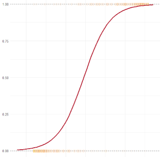

# ¿De qué trata la clase de hoy?

En la clase anterior exploramos los modelos de regresión lineal (*OLS*), ideales para predecir variables dependientes continuas no acotadas (como el PIB per cápita). Sin embargo, a menudo nos enfrentamos a **decisiones binarias**: votar a favor o en contra, declarar la guerra o firmar la paz, aprobar o rechazar una ley. Para ese tipo de problemas existe la **Regresión Logística Binaria**, la herramienta estadística por excelencia para modelar probabilidades de eventos dicotómicos.

Vamos a usar datos de la encuesta nacional realizada en **Chile**, entre abril y mayo de **1988**, unos meses antes del **Plebiscito Nacional** en el cual los ciudadanos decidieron **si Pinochet debía continuar en el poder por ocho años más** (voto "Sí") o si se debía convocar a elecciones presidenciales democráticas (voto "No").

El objetivo central es que se lleven una vista general sobre

1.  **Exploración y Justificación:** cómo decidir transformaciones y términos de interacción mirando **distribuciones y relaciones entre variables** (el paso previo a cualquier modelo).
2.  **Estimación e Interpretación Base:** cómo segmentar los datos para evitar *overfitting* e interpretar el `summary()` de un modelo logístico.
3.  **Interpretación de los pesos del modelo:** cómo pasar de coeficientes en *log-odds* a **medidas interpretables** para tomar decisiones : **Odds Ratios (OR)** y **Efectos Marginales Promedio.**
4.  **Evaluación y Diagnóstico:** cómo evaluar la bondad del ajuste con métricas globales, análisis de residuos, matriz de confusión y la curva ROC / AUC.

------------------------------------------------------------------------

## Librerías necesarias

```{r}
#| label: load-packages
#| message: false
#| warning: false
#| cache: false

# Instalamos pacman si no está disponible para gestionar paquetes
if (!require("pacman")) install.packages("pacman")

# Cargamos todas las librerías requeridas para la sesión
pacman::p_load(
  tidyverse,        # Manipulación de datos (dplyr, tidyr) y visualización (ggplot2)
  carData,          # Contiene el dataset 'Chile' que usaremos hoy
  caret,            # Herramientas para partición de datos (train/test split)
  scales,           # Formateo de ejes y etiquetas en gráficos (porcentajes, comas)
  broom,            # Convertir outputs de modelos en dataframes (tidy, glance, augment)
  modelsummary,     # Creación de tablas de regresión estilo publicación académica
  kableExtra,       # decoración de tablas kable
  marginaleffects,  # Cálculo de efectos marginales y predicciones 
  yardstick,        # Métricas de evaluación de clasificación (ROC, AUC, Matriz de Confusión)
  patchwork         # Organizar el apilado y composición de figuras
)

# Definimos una paleta de colores consistente para toda el notebook
# Azul para el "No" (a favor de elecciones democráticas)
# Rojo para el "Sí" (a favor del régimen)
paleta_plebiscito <- c("N" = "#2166AC", "Y" = "#B2182B")
```

# La base de datos de `Chile`

El dataset `Chile` contiene 2700 observaciones y varias variables demográficas e ideológicas. La variable objetivo es `vote`, que originalmente contiene las opciones: "Y" (Yes/Sí), "N" (No), "U" (Undecided/Indecisos) y "A" (Abstain/Abstención).

Como hoy estamos viendo regresión logística *binaria*, filtraremos la base para quedarnos únicamente con los votantes decididos ("Y" y "N"), el resto los ignoramos.

## Datos Balanceados

```{r}
#| label: cargar-datos
#| message: false
#| warning: false

data("Chile")

# Transformación y limpieza 
datos_chile <- Chile |> 
  as_tibble() |> 
  # Filtramos solo los que declararon intención de votar Y o N
  filter(vote %in% c("Y", "N")) |> 
  # Eliminamos las filas con valores nulos (NA). 
  drop_na() |> 
  # Eliminamos datos faltantes en educacion porque la incluimos como predictora
  drop_na(education) |>
  # Limpieza y recodificación de variables
  mutate(
    # Aseguramos que la variable dependiente sea un factor limpio con 2 niveles.
    # Establecemos "N" como nivel base/referencia e "Y" como la clase positiva.
    # Esto significa que modelaremos la "Probabilidad de votar Sí a Pinochet".
    vote = factor(vote, levels = c("N", "Y")),
    
    # Misma idea para primaria, secundaria, post-secundaria
    education = factor(education, levels = c("P", "S", "PS")),
    
    # Creamos una versión numérica de la variable dependiente (0 y 1).
    # Esto es útil para graficar curvas de probabilidad y calcular residuos.
    vote_num = ifelse(vote == "Y", 1, 0),
    
    # La variable 'income' viene como un factor con montos en pesos de la época
    # la convertiremos a una variable numérica continua.
    income_num = as.numeric(as.character(income)),
    
    # Convertimos 'sex' a factor para forzar un orden en los gráficos
    sex = factor(sex, levels = c("M", "F"), labels = c("Hombre", "Mujer"))
  )

# Comprobamos el balance de nuestra variable objetivo
message("Distribución de la variable objetivo (Voto):")
print(table(datos_chile$vote))
message("Proporciones:")
print(prop.table(table(datos_chile$vote)) |> round(3))
```

::: callout-note
**Un balance perfecto**

A la hora de hacer una estimación es importante verificar que los datos se encuentren balanceados. Noten que después de filtrar, nos quedan 867 votos para el "No" y 836 para el "Sí". Es un dataset casi perfectamente balanceado (51% vs 49%).

En la vida real (por ejemplo, prediciendo default bancarios), los eventos objetivo suelen ser muy raros (es decir, pocos defaults por sobre el total de clientes) lo que requiere técnicas adicionales (subsampleo, resampleo sintético, ajustes ponderados, etc.). Hoy, este balance nos permite enfocarnos puramente en la interpretación del modelo.
:::

## División de Datos: particiones Train / Test

Una regla importante a tener en cuenta **si nuestro objetivo es predecir es** **nunca evaluar el modelo con los mismos datos que fueron usados para entrenarlo**. Si hacemos esto, el modelo podría parecer mejor de lo que realmente es, haciendo que a la hora de predecir sobre datos nuevos la performance decaiga (*overfitting*).

Sin embargo, **si nuestro objetivo no es predecir, sino caracterizar la muestra** es correcto sobreajustar el modelo a los datos que tenemos ya que el objetivo en este caso es describir la muestra en función de las variables.

En general, si nuestra perspectiva es histórica, como este caso o el de la clase pasada, lo que buscamos hacer es una caracterización de la muestra (un aumentó del PBI incrementó en promedio el porcentaje asignado al PT en tantos puntos porcentuales).

De todos modos, como hicimos esto mismo la clase pasada, **vamos a suponer que estamos en Chile en el 88 y a la luz de la encuesta queremos predecir cómo será el resultado en el plebiscito. Es decir, tenemos como objetivo, armar un modelo predictivo.**

Dividiremos nuestros datos: usaremos el 70% para ajustar (entrenar) el modelo y guardaremos un 30% para evaluar su rendimiento al final de la clase.

```{r}
#| label: train-test-split
#| message: false
#| warning: false

# Fijamos una semilla para que los resultados sean reproducibles (como la partición es aleatoria, no quiero que cada vez que corra el código el resultado cambie)
set.seed(42) 

# createDataPartition de 'caret' asegura que la proporción de Y/N 
# se mantenga igual en ambos conjuntos (muestreo estratificado)
indice_entrenamiento <- caret::createDataPartition(
  datos_chile$vote, 
  p = 0.7, 
  list = FALSE
)

# Separamos los datos
train_data <- datos_chile[indice_entrenamiento, ]
test_data  <- datos_chile[-indice_entrenamiento, ]

cat("Observaciones para entrenamiento (Train):", nrow(train_data), "\n")
cat("Observaciones para evaluación (Test):", nrow(test_data), "\n")
```

```{r}
head(train_data)
```

------------------------------------------------------------------------

# Exploración Visual: decisiones de especificación del modelo

El criterio fundamental para decidir si debemos aplicar una transformación a los datos o incluir un término de interacción **no es correr modelos a ciegas**, sino **ver la distribución de los datos**.

En regresión logística, miramos cómo se distribuyen las variables independientes ($X$) en función de las categorías de nuestra variable dependiente ($Y$), y cómo se relacionan las variables independientes entre sí ($X_1$ vs $X_2$).

### ¿Qué variables separan a los votantes del Sí y del No? ($Y$ vs $X$)

Vamos a analizar tres variables clave:

- `statusquo` → un índice continuo que mide el apoyo general al régimen. Se construyó en base a un cuestionario con múltiples preguntas en escala Likert, orientadas a definir un nivel de "conservadurísmo" común.

- `age` → edad

- `income_num` → ingreso

```{r}
#| label: fig-distribucion-y-x
#| fig-width: 14
#| fig-height: 10
#| message: false
#| warning: false

# ----------------------------------------------------------
# Status Quo vs Voto (Violin + Boxplot)

# El índice statusquo es una escala estandarizada (media 0)
p_status <- train_data |> 
  ggplot(aes(x = vote, y = statusquo, fill = vote, color = vote)) +
  geom_violin(alpha = 0.3, linewidth = 0.5, width = 0.8) +
  geom_boxplot(width = 0.2, alpha = 0.8, color = "gray20", outlier.shape = NA) +
  scale_fill_manual(values = paleta_plebiscito, guide = "none") +
  scale_color_manual(values = paleta_plebiscito, guide = "none") +
  labs(
    title = "Índice de Apoyo al Status Quo",
    x = "Intención de Voto",
    y = "Índice Status Quo"
  ) +
  theme_minimal(base_size = 14) +
  theme(plot.title = element_text(face = "bold", size = 15))

# ----------------------------------------------------------
# Edad vs Voto (Density Plot)
# Usamos densidad para ver la forma de la distribución por edad.
p_age <- train_data |> 
  ggplot(aes(x = age, fill = vote, color = vote)) +
  geom_density(alpha = 0.5, linewidth = 0.8) +
  scale_fill_manual(values = paleta_plebiscito, name = "Voto") +
  scale_color_manual(values = paleta_plebiscito, name = "Voto") +
  labs(
    title = "Distribución por Edad",
    x = "Edad (años)",
    y = "Densidad"
  ) +
  theme_minimal(base_size = 14) +
  theme(
    plot.title = element_text(face = "bold", size = 15),
    legend.position = "bottom"
  )

# ----------------------------------------------------------
# Log(Ingreso) vs Voto (Violin + Boxplot)
p_income <- train_data |> 
  ggplot(aes(x = vote, y = income_num, fill = vote, color = vote)) +
  geom_violin(alpha = 0.3, linewidth = 0.5, width = 0.8) +
  geom_boxplot(alpha = 0.5, width = 0.6, color = "gray20") +
  scale_fill_manual(values = paleta_plebiscito, guide = "none") +
  scale_color_manual(values = paleta_plebiscito, guide = "none") +
  # scale_y_continuous(labels = scales::label_dollar(prefix = "$")) +
  scale_y_log10(labels = scales::label_dollar(prefix = "$")) +
  labs(
    title = "Ingreso Mensual (escala logarítmica)",
    x = "Intención de Voto",
    y = "Ingreso (Pesos)"
  ) +
  theme_minimal(base_size = 14) +
  theme(plot.title = element_text(face = "bold", size = 15))

# ----------------------------------------------------------
# Nivel Educativo vs Voto (Gráfico de Barras Proporcional)
p_edu <- train_data |> 
  ggplot(aes(x = education, fill = vote)) +
  geom_bar(position = "fill", alpha = 0.8, color = "white") +
  scale_fill_manual(values = paleta_plebiscito, name = "Voto") +
  scale_y_continuous(labels = scales::label_percent()) +
  labs(
    title = "Voto por Nivel Educativo",
    x = "Educación (P, S, PS)",
    y = "Proporción"
  ) +
  theme_minimal(base_size = 14) +
  theme(
    plot.title = element_text(face = "bold", size = 15),
    panel.grid.major.x = element_blank() # Limpiamos la grilla vertical en barras
  )


# Usamos patchwork para combinar los gráficos
((p_status | p_income) / (p_age|p_edu)) + 
  plot_annotation(
    title = "Distribución de variables predictoras según intención de voto (Train Data)",
    subtitle = "El 'Status Quo' muestra una separación perfecta. La edad y el ingreso muestran tendencias más sutiles.",
    theme = theme(plot.title = element_text(face = "bold", size = 18))
  )
```

::: callout-tip
**Interpretación de las distribuciones:**

1.  **Status Quo:** la separación es abismal. Quienes votan "No" tienen valores fuertemente negativos en esta escala, y quienes votan "Sí" tienen valores positivos. Esta variable será un predictor *extremadamente* fuerte en nuestro modelo, casi determinístico.
2.  **Edad:** observamos que la curva roja "Sí" está ligeramente desplazada hacia la derecha en comparación con la curva azul "No". Esto sugiere que las personas mayores tenían una mayor propensión a apoyar la continuidad del régimen.
3.  **Ingreso:** las distribuciones son muy heterogéneas, lo cual indica que puede haber diferencias en esta variable. Además, vemos que la distribución de los datos es logarítmica.
4.  **Nivel educativo:** para nivel inicial es más alta la proporción de votantes del "Sí", lo cual indica que seguramente, los pesos asignados al resto de los niveles sea más bajo.
:::

### ¿Necesitamos una interacción? Analizando $X_1$ vs $X_2$

En datos sociales los efectos rara vez son aislados. En este caso, una **interacción** va a ocurrir cuando el efecto de una variable sobre la probabilidad de votar "Sí" depende del valor de otra variable.

Una hipótesis podría ser que **la brecha de género en el conservadurismo se amplía con el nivel educativo**. Es decir, podríamos sospechar que el efecto de estar más capacitado sobre la probabilidad de votar "Sí" es diferente para las mujeres que para los hombres.

Para justificar la inclusión de un término de interacción (`education * sex`), primero debemos ver si la distribución del nivel educativo varía significativamente entre hombres y mujeres en nuestra muestra, y cómo se relaciona esto con el voto.

```{r}
#| label: fig-interaccion-justificacion
#| fig-width: 12
#| fig-height: 6
#| message: false
#| warning: false

# ----------------------------------------------------------
# Grafico de barras para entender la distribución del voto
# segun nivel educativo, facetado por sexo.

p_interaccion_barras <- train_data |> 
  ggplot(aes(x = education, fill = vote)) +
  geom_bar(position = "fill", alpha = 0.8) +
  # Facetamos por la otra variable de la interacción
  facet_wrap(~ sex) +
  scale_fill_manual(values = paleta_plebiscito, name = "Voto") +
  scale_y_continuous(labels = label_percent()) +
  labs(
    title = "Intención de Voto por Nivel Educativo, separado por Sexo",
    subtitle = "¿Cambia el efecto de la educación dependiendo de si se es hombre o mujer?",
    x = "Nivel Educativo",
    y = "Proporción"
  ) +
  theme_minimal(base_size = 14) +
  theme(plot.title = element_text(face = "bold"))

p_interaccion_barras 
```

::: callout-tip
**Justificando la interacción**

En los hombres (panel izquierdo), el salto de la educación primaria (P) a la secundaria (S) produce una caída brusca en el apoyo al "SÍ" (rojo), pero luego el efecto se estanca: tener educación post-secundaria (PS) no parece reducir sustancialmente más su conservadurismo en comparación con la secundaria.

En las mujeres (panel derecho), la dinámica es un poco distinta. Parten de una base de apoyo conservador mucho más alta en la educación primaria (casi 70%), y presentan una caída progresiva a través de todos los niveles; la educación post-secundaria (PS) sigue reduciendo su apoyo al régimen respecto a la secundaria (S).

Esta asimetría en la tendencia sugiere que avanzar hacia la educación superior tiene un efecto combinado particular según el género: el impacto 'liberalizador' de la universidad parece ser más continuo en las mujeres que en los hombres, lo cual **no se explicaría simplemente sumando los efectos aislados de 'ser mujer' y 'estar educado'**
:::

------------------------------------------------------------------------

# El modelo: especificación e interpretación

## ¿Por qué no usar Mínimos Cuadrados Ordinarios (OLS)?

Si intentáramos usar una regresión lineal clásica (OLS) para predecir la probabilidad de ocurrencia de una variable dicotómica nos encontraríamos con un problema.

**Predicciones absurdas:** la recta de regresión lineal se extiende hacia el infinito. Inevitablemente, para valores muy bajos de $X$ el modelo predecirá probabilidades negativas, lo cual no tiene sentido. Tal como sucedió la vez pasada.

La **Regresión Logística** soluciona este problema aplicando una transformación matemática llamada **Logit**. Esta función deforma la recta lineal para convertirla en una curva en forma de "S" (sigmoide) que queda perfectamente contenida entre 0 y 1.

```{r}
#| label: fig-ols-vs-logit
#| fig-width: 14
#| fig-height: 8
#| echo: true

plot_1 <- train_data |> 
  ggplot(aes(x = statusquo, y = vote_num)) +
  # Puntos reales (0 y 1) representados como marcas
  geom_point(alpha = 0.1, shape = "|", color = "darkorange", size = 3) +
  # Recta OLS (Mínimos Cuadrados Ordinarios)
  geom_smooth(method = "lm", se = FALSE, color = "#2166AC", linewidth = 1.2) +
  
  # Líneas de referencia para los límites de probabilidad
  geom_hline(yintercept = c(0, 1), linetype = "dashed", color = "gray50") +
  labs(
    x = "Status Quo",
    y = "Probabilidad de votar Sí"
  ) +
  theme_minimal(base_size = 12) +
  theme(plot.title = element_text(face = "bold"))

plot_2 <- train_data |> 
  ggplot(aes(x = statusquo, y = vote_num)) +
  # Puntos reales (0 y 1) representados como marcas
  geom_point(alpha = 0.1, shape = "|", color = "darkorange", size = 3) +
  
  # Curva Logística (Sigmoide)
  geom_smooth(method = "glm", method.args = list(family = "binomial"), 
              se = FALSE, color = "#B2182B", linewidth = 1.2) +
  
  # Líneas de referencia para los límites de probabilidad
  geom_hline(yintercept = c(0, 1), linetype = "dashed", color = "gray50") +
  labs(
    x = "Status Quo",
    y=""
  ) +
  theme_minimal(base_size = 12) 

# Combinamos los gráficos y agregamos la anotación global
(plot_1 | plot_2) + 
  plot_annotation(
    title = "Comparación: Mínimos Cuadrados vs. Regresión Logística.", 
    subtitle = "La recta azul (OLS) predice < 0. La curva roja (Logística) se ajusta a [0, 1].",
    theme = theme(
      plot.title = element_text(face = "bold", size = 14),
      plot.subtitle = element_text(size = 11)
    )
  )
```

La ecuación del modelo ya no predice la probabilidad $P(Y=1)$ directamente, sino el **logaritmo de las chances (*log-odds*)** de que el evento ocurra

$$ \ln\left(\frac{P(Y=1)}{1 - P(Y=1)}\right) = \beta_0 + \beta_1 X_1 + \beta_2 X_2 + \dots + \beta_k X_k $$

## Estimando los modelos con `glm()`

En R utilizamos la función `glm()` (*Generalized Linear Models*) que engloba muchos tipos de modelos lineales. Para usar la logística, el argumento clave es `family = "binomial"`, que le indica a R que utilice la función de enlace logit para una variable aleatoria dependiente dicotómica (que sigue una distribución binomial).

Vamos a estimar dos modelos:

- **Modelo 1 (Base):** incluye el índice de status quo, edad, sexo, log de los ingresos y educación.

- **Modelo 2 (Interacción):** añade además la interacción entre educación y sexo (`education * sex`).

```{r}
#| label: modelos-logisticos
#| message: false
#| warning: false

# Modelo 1
modelo_base <- glm(
  vote ~ statusquo + age + sex + log(income_num) + education, 
  family = "binomial", 
  data = train_data
)

# Modelo 2
# Recordemos que 'sex * education' automáticamente incluye los 2 términos y la interacción 'age:sex'
modelo_int <- glm(
  vote ~ statusquo + log(income_num) + age + education*sex, 
  family = "binomial", 
  data = train_data
)

# Revisamos el resumen del modelo con interacción
summary(modelo_base)
summary(modelo_int)

```

::: callout-caution
**Interpretando el `summary()`: los *Log-Odds***

- **El Modelo 1 (Base):** supone que el efecto de estudiar en la secundaria o en la universidad es exactamente el mismo para hombres y mujeres (curvas paralelas). Bajo esta hipótesis, el género solo te da un "empujón" inicial fijo hacia el Sí o hacia el No, pero la educación te afecta igual sin importar quién seas.

- **El Modelo 2 (Interactivo):** plantea que la experiencia educativa impacta distinto según el género. El AIC (la métrica que sirve para comparar modelos —como regla de dedo gordo, cuando la diferencia entre ambos modelos es mayor que 10, el modelo con el valor más alto debería descartarse—) ajusta un poco mejor a la realidad (cae de 521.43 a 519.94).

Al mirar la columna `Estimate` (que está en la indigerible escala de *log-odds*), vemos cómo impacta la interacción en los resultados:

- **(Intercept):** es el *log-odds* esperado de votar "Sí" para un perfil irreal: hombre, de 0 años, log-ingreso 0, status quo 0 y nivel educativo inicial ("P"). Carece de sentido práctico.

- **statusquo:** \~3.12. La estrella indiscutida en ambos modelos (p \< 2e-16). Por cada punto que aumenta el "índice de conservadurismo" el *log-odds* de votar "Sí" se dispara, manteniendo el resto constante.

- **age y log(income_num):** Negativos, pero no son significativos en ninguno de los dos escenarios.

- **Sobre la adición de la interacción**

  - En el **Modelo 1** parecía mostrar que a mayor nivel educativo el logg-odds de votar por el "Sí" crecía sin distinguir el genero. Y que, el efecto de ser mujer era positivo y casi significativo (p = 0.076).

  - Pero en el **Modelo 2**, la historia se aclara: descubrimos que **ser mujer con educación primaria** sí aumenta fuertemente las chances de apoyar al régimen (`sexMujer` = 1.09, p = 0.004). Sin embargo, cuando las mujeres acceden a la educación secundaria, ese apoyo inicial se desploma drásticamente (`educationS:sexMujer` = -1.22, p = 0.023).

  - Por el contrario, para los hombres (la categoría de referencia), el paso por la educación secundaria ni siquiera es un predictor significativo por sí solo (`educationS` p = 0.615).

Como hablar de "caídas en *log-odds*" bastante críptico necesitamos transformar estos números urgentemente a métricas interpretables.
:::

------------------------------------------------------------------------

# De *Log-Odds* a métricas interpretables: OR y AME

Existen dos caminos principales para traducir los resultados de una regresión logística a un lenguaje comprensible: los ***Odds Ratios*** **(OR)** y los **Efectos Marginales Promedio (AME)**.

## Camino 1: *Odds Ratios*

Una *Odd* (chance) es la probabilidad de que un evento ocurra dividida por la probabilidad de que no ocurra:

$$\text{Odds}=\frac{p}{1-p}.$$

Si la probabilidad de llover es del 80%, las *odds* son $0.8 / 0.2 = 4$. Es decir que las chances están 4 a 1 a favor de la lluvia.

Si aplicamos la función exponencial ($e^x$) a nuestros coeficientes en *log-odds* ($\beta$), obtenemos los ***Odds Ratios*** **(OR)**. Matemáticamente, si aumentamos $X$ en 1 unidad, el nuevo Odd es: $$ \text{Odds}_{nuevo} = e^{\beta_0 + \beta_1 (X + 1)} = e^{\beta_0 + \beta_1 X} \cdot e^{\beta_1} = \text{Odds}_{viejo} \cdot e^{\beta_1} $$

Por lo tanto, $e^{\beta_1}$ es el factor multiplicativo. De esta forma,

- Si $OR > 1$: la variable *aumenta* las chances del evento.

- Si $OR < 1$: la variable *disminuye* las chances del evento.

- Si $OR = 1$: La variable es *neutra* (no hay efecto).

```{r}
#| label: odds-ratios
#| message: false
#| warning: false

# Usamos broom::tidy con exponentiate = TRUE para obtener los OR automáticamente.
# conf.int = TRUE nos da los intervalos de confianza.
or_modelo <- broom::tidy(modelo_int, exponentiate = TRUE, conf.int = TRUE) |> 
  select(term, estimate, conf.low, conf.high, p.value) |> 
  mutate(
    interpretacion = case_when(
      estimate > 1 & p.value < 0.05 ~ "Aumenta chances (Sig.)",
      estimate < 1 & p.value < 0.05 ~ "Reduce chances (Sig.)",
      TRUE ~ "No significativo"
    )
  )

# Mostramos la tabla formateada
or_modelo |> 
  rename(
    `Predictor` = term,
    `Odds Ratio` = estimate,
    `IC Inferior` = conf.low,
    `IC Superior` = conf.high,
    `Valor p` = p.value,
    `Interpretación` = interpretacion
  ) |> 
  knitr::kable(
    digits = 3, 
    caption = "Odds Ratios del Modelo con Interacción"
  ) |> 
  # La hacemos más coqueta
  kable_styling(
    bootstrap_options = c("striped", "hover", "condensed", "responsive"), 
    full_width = FALSE,
    position = "center"
  ) |> 
  # Resaltamos con un color de fondo las filas significativas
  row_spec(
    row = which(or_modelo$p.value < 0.05), 
    bold = TRUE, 
    color = "black", 
    background = "#e6f2ff" # Un azul muy clarito
  )
```

*Ejemplos de interpretación:*

- el OR de `statusquo` es $\approx 22.72$. Esto significa que por cada punto adicional en la escala de apoyo al status quo, las chances (odds) de votar "Sí" se multiplican por 23. Es un efecto masivo y eso es porque ese índice seguramente correlaccione a la perfección con la intención de voto.

- el OR de `sexMujer` es 2.98. **¡Cuidado aquí con la interpretación!** Como el modelo tiene un término de interacción, este no es el efecto general de ser mujer. Es el efecto específico cuando la otra variable está en su nivel base (Educación Primaria, "P"). Esto significa que, **entre los votantes con educación primaria, ser mujer multiplica las chances (odds) de votar "Sí" por casi 3 en comparación con los hombres. En la base de la pirámide educativa, la brecha de género conservadora era enorme.**

## Camino 2: efectos marginales promedio (AME)

Los *Odds Ratios* son útiles, pero "chances" sigue sin ser lo mismo que "probabilidad" (del 0 al 100%), que a fines cuantitativos y opereacionales es más cómodo. Si queremos entender qué variables empujan los resultados, los OR serán la herramienta más útil, pero si queremos cuantificar de forma intuitiva los resultados, la herramienta predilecta son los **Efectos Marginales**.

En una regresión lineal (OLS), la pendiente $\beta$ es constante: un año más de edad siempre suma los mismos puntos. Pero en la logística, la curva es una "S". Entonces, el efecto de un año extra de edad depende de dónde estés en la curva: si ya tenes un 99% de probabilidad de votar Sí, un año más no cambia casi nada; si estás indeciso (50%), un año más puede empujarte decisivamente.

{fig-align="center" width="282"}

Matemáticamente, el efecto marginal es la derivada de la curva de probabilidad respecto a $X$: $$ \frac{\partial P}{\partial X} = \beta \cdot P(X) \cdot (1 - P(X)) $$

Como $P(X)$ es distinto para cada individuo (porque cada persona tiene distinta edad, ingreso, etc.), **el efecto marginal es distinto para cada persona**.

El ***Average Marginal Effect*** **(AME)** resuelve esto calculando el efecto exacto para *cada individuo* en nuestra base de datos y luego **promediando todos esos efectos individuales**.

Su valor responde a la pregunta:

*"En promedio poblacional, si aumento X en una unidad, ¿en cuántos puntos porcentuales cambia la probabilidad del evento?"*

```{r}
#| label: average-marginal-effects
#| message: false
#| warning: false


# Calculamos el AME estándar (dY/dX) SOLO para las variables lineales/categóricas
ame_estandar <- avg_slopes(
  modelo_int,
  # Especificamos las variables que NO queremos tratar como elasticidades
  variables = c("statusquo", "age", "sex", "education"),
  slope = "dydx"
)
# Calculamos la semi-elasticidad (dY/ex) SOLO para el ingreso
ame_ingreso <- avg_slopes(
  modelo_int,
  # Aislamos la variable de ingreso
  variables = "income_num", 
  slope = "dyex"
)

# Apilamos los resultados en una sola tabla combinada
efectos_marginales <- bind_rows(ame_estandar, ame_ingreso)

# Lo mostramos en una tabla limpia
efectos_marginales |> 
  select(term, contrast, estimate, conf.low, conf.high, p.value) |> 
  
  mutate(
    # Multiplicamos por 100 y le pegamos el símbolo % para lectura humana
    estimate_pct = paste0(round(estimate * 100, 2), "%"),
    interpretacion = case_when(
      estimate > 0 & p.value < 0.05 ~ "Aumenta prob. (Sig.)",
      estimate < 0 & p.value < 0.05 ~ "Reduce prob. (Sig.)",
      TRUE ~ "No significativo"
    )
  ) |> 
  select(
    term, contrast, estimate_pct, conf.low, conf.high, p.value, interpretacion
  )|> 
  rename(
    `Predictor` = term,
    `Contraste` = contrast,
    `Efecto (Prob)` = estimate_pct,
    `IC Inferior` = conf.low,
    `IC Superior` = conf.high,
    `Valor p` = p.value,
    `Interpretación` = interpretacion
  ) |> 
  knitr::kable(
    digits = 4, 
    caption = "Efectos Marginales Promedio (Cambio en Probabilidad)"
  ) |> 
  kable_styling(
    bootstrap_options = c("striped", "hover", "condensed", "responsive"), 
    full_width = FALSE,
    position = "center"
  ) |> 
  # Sombreado azul clarito para las filas significativas
  row_spec(
    row = which(efectos_marginales$p.value < 0.05), 
    bold = TRUE, 
    color = "black", 
    background = "#e6f2ff"
  )
```

::: callout-tip
**Interpretación directa (AME):**

- `statusquo` **(dY/dX):** en promedio poblacional, un aumento de 1 punto en el índice de status quo aumenta la probabilidad absoluta de votar "Sí" en **18.5 puntos porcentuales**. Es, por lejos, el predictor más fuerte.
- `education` **(S - P):** en promedio, haber alcanzado la educación secundaria reduce la probabilidad de votar "Sí" en **4.87 puntos porcentuales**, en comparación con quienes solo tienen educación primaria.
- `education` **(PS - P):** en promedio, acceder a la educación post-secundaria reduce la probabilidad de votar "Sí" en **6.00 puntos porcentuales** frente a la educación primaria.
- `incom_num` **(dy/deX):** no dió significativo, al promediar sobre todas las observaciones.
- `sex` **(Mujer-Hombre):** aunque en promedio las mujeres tienen una probabilidad **2.55 puntos porcentuales** mayor de votar "Sí" que los hombres, el p-valor es apenas no significativo ($0.0780$) Esta pérdida de significancia ocurre porque en el modelo interactivo el efecto del género depende fuertemente del nivel educativo; al promediarlo todo en un solo número, la señal se diluye.
:::

------------------------------------------------------------------------

# Comunicando el Modelo

## Gráfico de Coeficientes (Odds Ratios) con barras graduadas

Para mostrar la robustez de nuestras estimaciones, es una excelente práctica graficar los coeficientes mostrando intervalos de confianza a distintos niveles (ej. 80%, 95%, 99%).

Un coeficiente que sobrevive al 99% sin cruzar la línea del 1 (en escala de OR) es evidencia irrefutable.

```{r}
#| label: fig-coefplot-graduado
#| fig-width: 14
#| fig-height: 8
#| message: false
#| warning: false

# Extraemos los coeficientes y calculamos los intervalos manualmente
# para tener control total sobre los niveles (80%, 95%, 99%)
df_plot_or <- broom::tidy(modelo_int) |> 
  # Excluimos el intercepto y statusquo (porque su OR de 23 va a romper la escala visual del gráfico → ya sabemos que es hipersiginificativo)
  filter(!term %in% c("(Intercept)", "statusquo")) |> 
  mutate(
    # Calculamos los límites en log-odds usando cuantiles de la distribución normal
    lo_80 = estimate - qnorm(0.90) * std.error,
    hi_80 = estimate + qnorm(0.90) * std.error,
    lo_95 = estimate - qnorm(0.975) * std.error,
    hi_95 = estimate + qnorm(0.975) * std.error,
    lo_99 = estimate - qnorm(0.995) * std.error,
    hi_99 = estimate + qnorm(0.995) * std.error,
    
    # Exponenciamos todo para pasarlo a escala de Odds Ratios
    across(c(estimate, starts_with("lo_"), starts_with("hi_")), exp),
    
    # Etiquetas limpias para el gráfico
    term_clean = case_match(
      term,
      "age" ~ "Edad (Años)",
      "log(income_num)" ~ "Log(Ingreso)",
      "educationS" ~ "Educación Sec. (vs Primaria)",
      "educationPS" ~ "Educación Post-sec. (vs Primaria)",
      "sexMujer" ~ "Sexo: Mujer (vs Hombre)",
      "educationS:sexMujer" ~ "Interacción: Mujer × Secundaria",
      "educationPS:sexMujer" ~ "Interacción: Mujer × Post-sec.",
      .default = term # Salvavidas por si queda alguna sin clasificar
    )
  )

ggplot(df_plot_or, aes(y = reorder(term_clean, estimate), x = estimate)) +
  # Línea vertical de referencia en OR = 1 (Efecto nulo)
  geom_vline(xintercept = 1, linetype = "dashed", color = "gray40", linewidth = 1) +
  
  # Barra 99% (Fina y clara)
  geom_linerange(aes(xmin = lo_99, xmax = hi_99), color = "#74ADD1", linewidth = 1.5) +
  # Barra 95% (Media)
  geom_linerange(aes(xmin = lo_95, xmax = hi_95), color = "#4575B4", linewidth = 3.5) +
  # Barra 80% (Gruesa y oscura)
  geom_linerange(aes(xmin = lo_80, xmax = hi_80), color = "#313695", linewidth = 6) +
  
  # Punto del estimador central
  geom_point(color = "#D73027", size = 4) +
  
  # Escala logarítmica en X es CRUCIAL cuando se grafican Odds Ratios
  # para que la distancia entre 0.5 y 1 sea visualmente igual a la de 1 a 2.
  # Osea, que la chance sea la mitad, esta igual de lejos de que sea igual, que sea el doble 
  scale_x_log10(breaks = c(0.1, 0.25, 0.5, 0.8, 1, 1.2, 1.5, 2, 2.5, 3, 4, 5)) +
  
  labs(
    title = "Efectos Demográficos sobre el Voto al 'Sí' (Odds Ratios)",
    subtitle = "Barras de error graduadas: 80% (gruesa), 95% (media), 99% (fina)",
    x = "Odds Ratio (Escala Logarítmica)",
    y = NULL,
    caption = "Nota: Si la barra cruza la línea punteada (OR=1), el efecto no es significativo a ese nivel de confianza."
  ) +
  theme_minimal(base_size = 15) +
  theme(
    plot.title = element_text(face = "bold", size = 16),
    panel.grid.minor = element_blank(),
    panel.grid.major.y = element_blank(),
    axis.text.y = element_text(face = "bold", size = 13),
    axis.text.x = element_text(size = 12)
  )
```

::: callout-note
**Lectura del gráfico:**

Vemos que el estimador central de `Sexo: Mujer (vs Hombre)` está claramente a la derecha del 1 y ninguna de sus barras de error cruza la línea punteada; es un efecto positivo y fuertemente significativo. **Esto indica que**, en promedio, **una mujer tendrá cerca de tres veces más chances** de votar por el 'Sí' **respecto a un hombre con el mismo nivel educativo inicial ("P").**

Por el contrario, los términos de interacción (`Interacción: Mujer x Secundaria` e `Interacción: Mujer x Post-sec.`) se ubican a la izquierda del 1. Osea que, en promedio, una **mujer con nivel secundario (no significativo) y post-secundario (significativo) tendrá entre la mitad y un cuarto de chances de votar por el "Sí" respecto a un hombre con nivel educativo inicial ("P")**
:::

## Vizualización de la interacción: el impacto real en la probabilidad

Los coeficientes de interacción son engañosos. La mejor forma de entender qué hace la interacción `age * sex` es graficar las **probabilidades predichas** del mode en los distintos niveles educativos, separando por hombres y mujeres.

Vamos a comparar el Modelo Base (sin interacción) con el Modelo Interactivo para ver *la influencia real* de haber agregado este término.

```{r}
#| label: fig-efecto-interaccion
#| fig-width: 14
#| fig-height: 8
#| message: false
#| warning: false

# Usamos plot_predictions de marginaleffects para generar los gráficos
# Mantenemos las otras variables (statusquo, income) en su media/moda automáticamente.

p_base <- plot_predictions(modelo_base, condition = c("education", "sex")) +
  scale_color_manual(values = c("Hombre" = "#1B9E77", "Mujer" = "#D95F02")) +
  scale_fill_manual(values = c("Hombre" = "#1B9E77", "Mujer" = "#D95F02")) +
  scale_y_continuous(labels = scales::label_percent(), limits = c(0, 1)) +
  labs(
    title = "Modelo 1: Sin Interacción",
    subtitle = "Los puntos siguen la misma tendencia. El efecto de adquirir\nmás estudios se asume idéntico para ambos sexos.",
    x = "Máximo nivel educativo alcanzado", y = "Probabilidad Predicha de Votar 'Sí'"
  ) +
  theme_minimal(base_size = 14) +
  theme(legend.position = "none", plot.title = element_text(face = "bold"))

p_int <- plot_predictions(modelo_int, condition = c("education", "sex")) +
  scale_color_manual(values = c("Hombre" = "#1B9E77", "Mujer" = "#D95F02"), name = "Sexo") +
  scale_fill_manual(values = c("Hombre" = "#1B9E77", "Mujer" = "#D95F02"), name = "Sexo") +
  scale_y_continuous(labels = scales::label_percent(), limits = c(0, 1)) +
  labs(
    title = "Modelo 2: Con Interacción (Educación × Sexo)",
    subtitle = "Las puntos divergen. La brecha de género a favor del 'Sí'\nse amplía significativamente en el primer nivel educativo.",
    x = "Máximo nivel educativo alcanzado", y = "Probabilidad Predicha de Votar 'Sí'"
  ) +
  theme_minimal(base_size = 15) +
  theme(plot.title = element_text(face = "bold"))

# Combinamos con patchwork
p_base + p_int + 
  plot_annotation(
    title = "¿Por qué importa modelar la interacción?",
    caption = "Bandas representan intervalos de confianza al 95%. Predicciones marginales manteniendo el resto de variables constantes.",
    theme = theme(plot.title = element_text(face = "bold", size = 18))
  )
```

::: callout-note
**La interacción se vuelve clara**

En el Modelo 1, el algoritmo estaba forzado matemáticamente a mantener una distancia constante entre hombres y mujeres a lo largo de todos los niveles educativos. Si miramos el panel izquierdo, el modelo asume que acceder a la educación superior reduce el conservadurismo de manera idéntica para ambos sexos.

Sin embargo, en el Modelo 2, al liberar esa restricción, el patrón se esclarece. En la base de la pirámide educativa (nivel "P"), la brecha de género era enorme; las mujeres mostraban un apoyo probabilístico al régimen radicalmente mayor (casi 75%) en comparación con los hombres de su mismo estrato sociodemográfico (apenas sobre el 50%). Sin embargo, al observar los niveles "S" (Secundaria) y "PS" (Post-secundaria), esta brecha colapsa. Las probabilidades de hombres y mujeres convergen y se vuelven estadísticamente indistinguibles (noten cómo se solapan por completo sus intervalos de confianza).

En el Chile de 1988, la escolarización media y superior tuvo un impacto muchísimo más profundo y transformador en las preferencias políticas de las mujeres que en las de los hombres.
:::

------------------------------------------------------------------------

# Evaluación: bondad de Ajuste, residuos y clasificación

Hasta ahora hemos interpretado el modelo, pero ¿qué tan bien aprendió el modelo del pasado? → Vamos a estudair la bondad del ajuste sobre el entrenamiento.

Y, ¿qué tan bueno es prediciendo la realidad? → Para esto usaremos nuestro `test_data` (el 30% de los datos que el modelo nunca ha visto) para evaluar el poder predictivo del modelo.

En caso de tomar una perspectiva meramente descriptiva, el procedimiento sería exactamente igual, pero sobre el conjunto completo de datos.

## Métricas Globales del ajuste con `glance()`

Al igual que en OLS, usamos `broom::glance()` para comparar modelos.

En logística no se suele mirar el $R^2$ sinola **Deviance** (desviación) residual y nula, el pseudo-$R^2$, y el **AIC** (Criterio de Información de Akaike).

Menor AIC indica un modelo que ajusta mejor, penalizando por la inclusión de variables innecesarias. Su valor aislado, es decir, sin comparación con un modelo externo, carece de sentido.

Por otro lado, la **Deviance** mide cuánta "información" le falta al modelo para predecir la realidad a la perfección.

- La **deviance nula** mide la información que le falta al modelo cuando estimamos utilizando los promedios (el intercepto) únicamente.

- La **deviance residual** mide la información que le falta al modelo cuando estimamos utilizando el modelo completo (edad, sexo, etc.

- La diferencia entre estas cantidades dice cuánta incertidumbre resolvió el modelo.

De aquí sale la definición

$$\text{pseudo-R}^2 = 1 - \frac{ \text{deviance_nula}} {\text{deviance_residual}},$$ cuya interpretación es parecida a la del $R^2$.

```{r}
#| label: comparacion-ajuste
#| message: false
#| warning: false

bind_rows(
  broom::glance(modelo_base) |> mutate(Modelo = "1. Sin Interacción"),
  broom::glance(modelo_int) |> mutate(Modelo = "2. Con Interacción")
) |> 
  # Agregamos el cálculo del Pseudo R2 usando la fórmula de McFadden
  mutate(pseudo_r2 = 1 - (deviance / null.deviance)) |> 
  # Seleccionamos las columnas que importan, sacando el BIC
  select(Modelo, null.deviance, deviance, pseudo_r2, AIC, nobs) |> 
  # Renombramos las columnas para la tabla final
  rename(
    `Deviance Nula` = null.deviance,
    `Deviance Residual` = deviance,
    `Pseudo-R² (McFadden)` = pseudo_r2,
    `Observaciones` = nobs
  ) |> 
  knitr::kable(
    digits = c(0, 1, 1, 3, 1, 0), # Le damos 3 decimales al Pseudo-R2
    caption = "Métricas de Ajuste Global (Datos de Entrenamiento)"
  ) |> 
  kable_styling(
    bootstrap_options = c("striped", "hover", "condensed", "responsive"), 
    full_width = FALSE,
    position = "center"
  ) |> 
  # Resaltamos la fila del modelo ganador
  row_spec(
    row = 2, 
    bold = TRUE, 
    color = "black", 
    background = "#e6f2ff" 
  )
```

## Diagnóstico Visual: predicciones vs. realidad (Residuos)

En regresión logística, el gráfico clásico de residuos de OLS (nube de puntos) no funciona porque $Y$ solo toma valores 0 ó 1. Sin embargo, podemos hacer un gráfico que muestre la curva de probabilidad predicha y dibujar **líneas verticales (residuos)** desde los datos reales (0 o 1) hasta la curva.

Para este gráfico, usaremos la variable más fuerte (`statusquo`) en el eje X para visualizar la forma sigmoidea.

```{r}
#| label: fig-residuos-logistica
#| fig-width: 13
#| fig-height: 8
#| message: false
#| warning: true

# Aumentamos los datos de prueba con las predicciones del modelo sobre el test
df_diagnostico <- broom::augment(modelo_int, newdata = test_data, type.predict = "response") |> 
  mutate(
    # Clasificamos si la predicción fue correcta usando el umbral estándar de 0.5
    prediccion_clase = ifelse(.fitted > 0.5, 1, 0),
    acierto = ifelse(
      vote_num == prediccion_clase, "Predicción Correcta", "Error de Clasificación"
      )
  )

# Gráfico de curva logística con segmentos de residuos
ggplot(df_diagnostico, aes(x = statusquo)) +
  # Segmentos (Residuos): Línea desde el valor real (0 o 1) hasta la curva predicha
  geom_segment(
    aes(xend = statusquo, y = vote_num, yend = .fitted, color = acierto),
    alpha = 0.4, linewidth = 0.6
  ) +
  
  # Puntos reales (0 o 1)
  geom_point(
    aes(y = vote_num, color = acierto), 
    alpha = 0.6, size = 2, shape = 16
  ) +
  
  # Curva suavizada de las probabilidades predichas
  geom_smooth(
    aes(y = vote_num), 
    method = "glm",
    method.args = list(family = "binomial"),
    formula = y ~ x,
    color = "black", linewidth = 1.2, se = FALSE
  ) +
  # Verde correcto, rojo incorrecto
  scale_color_manual(
    values = c("Predicción Correcta" = "#54915e", "Error de Clasificación" = "#E41A1C"),
    name = "Evaluación\n(Umbral 50%)"
  ) +
  scale_y_continuous(breaks = c(0, 0.5, 1), labels = c("0 (Votó NO)", "0.5", "1 (Votó SÍ)")) +
  labs(
    title = "Diagnóstico Visual: Curva Logística y Residuos en Datos de Prueba",
    subtitle = "Las líneas verticales rojas representan los errores del modelo al clasificar nuevos votantes.",
    x = "Índice de Apoyo al Status Quo",
    y = "Probabilidad Predicha / Voto Real",
    caption = "Los puntos rojos en Y=1 son Falsos Negativos (votaron Sí, predecimos No).\nLos puntos rojos en Y=0 son Falsos Positivos (votaron No, predecimos Sí)."
  ) +
  theme_minimal(base_size = 15) +
  theme(
    plot.title = element_text(face = "bold", size = 16),
    panel.grid.minor = element_blank(),
    legend.position = "right"
  )
```

::: callout-warning
**¿Qué observamos en los residuos?**

**Extremos limpios:** a la izquierda (fuerte rechazo al status quo), el modelo predice probabilidad casi 0, y casi todos los puntos verdes están en 0. A la derecha, predice casi 1, y los puntos están en 1. El modelo es muy seguro y muy preciso en los extremos ideológicos.

**Problemas en el centro:** alrededor del status quo = 0 la curva cruza el umbral del 50%. Aquí es donde vemos la concentración de **líneas rojas largas**. Son los votantes moderados o "de centro", donde el modelo se confunde con más frecuencia.
:::

## Matriz de Confusión y Curva ROC

Para evaluar formalmente la capacidad de clasificación del modelo en el mundo real, usamos la **Matriz de Confusión** (que tabula aciertos y errores bajo un umbral específico, usualmente 50%) y la **Curva ROC** (que evalúa el modelo en *todos* los umbrales posibles).

```{r}
#| label: evaluacion-clasificacion
#| fig-width: 14
#| fig-height: 6
#| message: false
#| warning: false

# Preparamos los datos para el paquete yardstick
df_eval <- test_data |>
  mutate(
    # Obtenemos la probabilidad predicha de votar "Y"
    pred_prob = predict(modelo_int, newdata = test_data, type = "response"),
    # Convertimos la probabilidad a una clase dura (Y/N) usando el umbral 0.5
    pred_class = factor(
      ifelse(pred_prob > 0.5, "Y", "N"), 
      levels = c("N", "Y")
      )
  )

# ----------------------------------------------------------
# Matriz de Confusión
conf_mat <- yardstick::conf_mat(df_eval, truth = vote, estimate = pred_class)

p_conf <- autoplot(conf_mat, type = "heatmap") +
  scale_fill_gradient(low = "#F7FBFF", high = "#08519C") +
  labs(
    title = "Matriz de Confusión (Umbral 50%)",
    subtitle = "Evaluación sobre el 30% de datos de evaluación (Test Data)",
    x = "Predicción del Modelo",
    y = "Voto Real"
  ) +
  theme_minimal(base_size = 14) +
  theme(
    plot.title = element_text(face = "bold"),
    panel.grid = element_blank()
  )

# ----------------------------------------------------------
# Curva ROC y AUC
# event_level = "second" indica que nuestra clase de interés es "Y" (el segundo nivel del factor)
roc_data <- yardstick::roc_curve(df_eval, truth = vote, pred_prob, event_level = "second")
auc_val <- yardstick::roc_auc(df_eval, truth = vote, pred_prob, event_level = "second")

p_roc <- ggplot(roc_data, aes(x=1-specificity,  y=sensitivity)) +
  geom_line(color = "#B2182B", linewidth = 1.5) +
  # Línea diagonal de referencia (modelo aleatorio)
  geom_abline(slope = 1, intercept = 0, linetype = "dashed", color = "gray50") +
  scale_y_continuous(breaks = c(0, 0.5, 1), limits = c(0, 1)) +
  annotate(
    "text", x = 0.75, y = 0.25, 
    label = paste("AUC =", round(auc_val$.estimate, 3)), 
    size = 7, fontface = "bold", color = "#B2182B"
  ) +
  labs(
    title = "Curva ROC (Receiver Operating Characteristic)",
    subtitle = "Capacidad del modelo para discriminar entre votantes del Sí y del No",
    x = "Tasa de Falsos Positivos (1 - Especificidad)",
    y = "Tasa de Verdaderos Positivos (Sensibilidad)"
  ) +
  theme_minimal(base_size = 14) +
  theme(plot.title = element_text(face = "bold"))

# Combinamos los gráficos
p_conf + p_roc
```

::: callout-important
**Interpretación de la Evaluación:**

**1. La Matriz de Confusión:** nos muestra los 4 cuadrantes posibles de nuestra predicción.

- **Verdaderos Positivos (abajo a la derecha):** 227 personas que votaron "Sí" y el modelo predijo correctamente que votarían "Sí" (sensibilidad alta).

- **Verdaderos Negativos (arriba a la izquierda):** 244 personas que votaron "No" y el modelo predijo correctamente (especificidad alta).

- **Falsos Positivos (abajo a la izquierda):** 16 personas que en realidad votaron "No", pero el modelo se equivocó y predijo "Sí".

- **Falsos Negativos (Arriba a la derecha):** 22 personas que votaron "Sí", pero el modelo predijo "No".

La **Exactitud (Accuracy)** global es altísima: $(244 + 228) / (244 + 228 + 16 + 22) *100 \%= 92.5\%$. El modelo se equivoca muy poco, en gran parte gracias al poder predictivo de la variable `statusquo`.

**2. La Curva ROC y el AUC:**

La Matriz de Confusión asume que cortamos en el 50% de probabilidad. ¿Pero qué pasa si somos más conservadores y solo predecimos "Sí" si la probabilidad supera el 80%?

La Curva ROC grafica el rendimiento del modelo en *todos* los umbrales posibles de 0 a 100.

- **Eje Y (Sensibilidad):** de todos los que realmente votaron Sí, ¿qué porcentaje logramos capturar? Con el umbral al 50%, la matriz de confusión nos dice que esta cantidad se calcula como TP/(TP+FP)=228/(228+16).

- **Eje X (1 - Especificidad):** De todos los que votaron No, ¿a qué porcentaje clasificamos erróneamente como Sí (Falsos Positivos)? Con el umbral al 50%, la matriz nos dice que vale FN/(TN+FN)=22/(22+244)

Un modelo perfecto subiría recto hasta la esquina superior izquierda (100% sensibilidad, 0% falsos positivos). La línea punteada diagonal representa tirar una moneda al azar. Nuestra curva roja se acerca muchísimo a la esquina perfecta. El **AUC (Área Bajo la Curva)** resume esto en un solo número, **la probabilidad de que una observación aleatoria de la clase positiva tenga una probabilidad mayor que una observación aleatoria de la clase negativa.**

**¿Qué significa un AUC de 0.972?**

Significa que si tomamos al azar a un votante del "Sí" y a un votante del "No", hay un **97.2% de probabilidad** de que nuestro modelo le haya asignado una probabilidad predicha más alta al votante del "Sí".
:::
