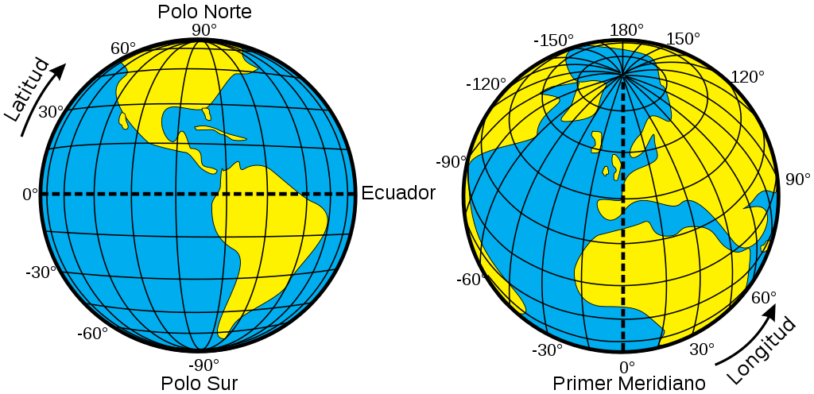
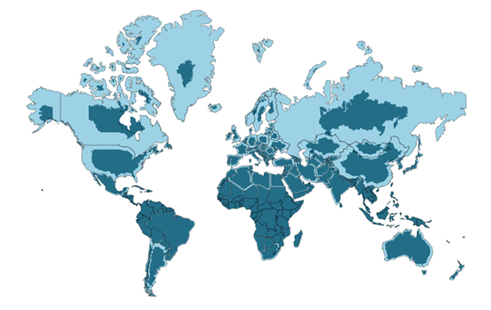
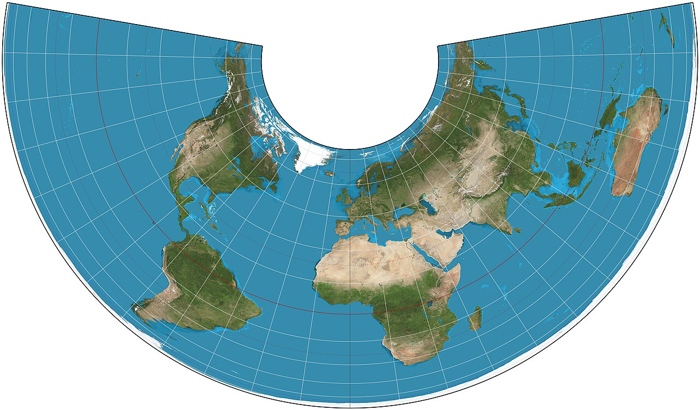
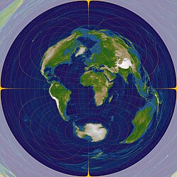
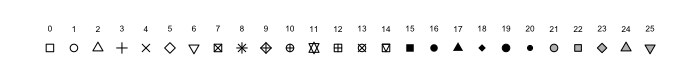

# ¿De qué trata la clase de hoy?

Hay preguntas que no se pueden responder mirando una tabla de números. ¿Dónde está concentrado el voto del PT? ¿Los municipios que reciben más transferencias federales son los más pobres o los más ricos? ¿Las ciudades bajo la órbita económica de São Paulo gastan diferente en salud que las del interior de Bahia? Para responder este tipo de preguntas necesitamos una herramienta que combine datos tabulares con información geográfica: los **datos espaciales**.

Hoy vamos a aprender a trabajar con datos espaciales en R. Vamos a usar **Brasil** como laboratorio, un caso ideal para estudiar distribución territorial del poder porque combina una heterogeneidad brutal (26 estados, más de 5.000 municipios, diferencias enormes entre el norte amazónico y el sur industrializado) con datos electorales y fiscales.

El recorrido de la clase va a ser este:

1.  **El esqueleto conceptual:** qué es un objeto espacial, qué es un CRS y cómo se apilan las capas en `ggplot2`.
2.  **Preparación de datos:** cómo descargar geometrías espaciales (para eso vamos a usar la libería `geobr`) y cómo podemos cruzarlas con nuestros los datos tabulares que estuvimos trabajando en clases pasadas.
3.  **Visualización estática:** mapas coroplétocos, problemas de escala, comparación entre niveles de agregación y cartogramas.
4.  **Visualización dinámica:** mapas interactivos con `leaflet` para explorar los datos a través de una interfaz gráfica.

La idea es que este material les sirva como punto de partida para construir visualizaciones útiles en sus proyectos finales.

------------------------------------------------------------------------

## Librerías necesarias

```{r}
#| label: load-packages
#| message: false
#| warning: false
#| cache: false

# Instalamos pacman si no está disponible para gestionar paquetes
if (!require("pacman")) install.packages("pacman")

# Cargamos todas las librerías requeridas para la sesión
pacman::p_load(
  tidyverse,    # Manipulación de datos y visualización base
  sf,           # Simple Features: el estándar para datos vectoriales en R
  geobr,        # Geometrías oficiales de Brasil → (son datos del IBGE -Instituto Brasilero de Geografía y Estadística-)
  cartogram,    # Cartogramas: distorsionar polígonos según una variable
  leaflet,      # Mapas interactivos en HTML
  patchwork,    # Componer múltiples gráficos en una sola figura
  ggrepel,      # Etiquetas de texto que no se superponen en ggplot2
  scales,       # Formateo de ejes y etiquetas (miles, porcentajes)
  here          # Rutas relativas al proyecto
)
```

------------------------------------------------------------------------

# El Esqueleto de los Datos Espaciales

Antes de escribir una sola línea de código con nuestros datos de Brasil, necesitamos entender qué es exactamente un objeto espacial en R.

## ¿Qué es un Simple Feature (`sf`)?

La respuesta corta es: **un Simple Feature es un** `dataframe` **de toda la vida, con una columna extra que contiene la geometría**.

Imaginemos que partimos de uno de los `dataset` de Brasil con los que estuvimos trabajando; en ese caso, tendríamos columnas como `nombre_estado`, `poblacion`, `pbi`. Si se tratara de un objeto `sf`, tendríamos además **una columna especial llamada `geometry`** que es una *list-column*: en cada fila, en lugar de un número o un texto, hay un objeto geométrico complejo (un polígono, un punto, una línea) que describe la forma del territorio.

Esto es enormemente poderoso. Significa que podemos hacer todo lo que ya sabemos hacer con `dplyr` —`filter()`, `mutate()`, `left_join()`, `group_by()`— y el objeto sigue siendo espacial. No es necesario aprender un lenguaje nuevo: es el mismo `tidyverse` con una columna especial adicional.

Osea, vamos a pasar de algo así

`id_estado | nombre | poblacion`

`35 | São Paulo | 46289333`

A otra cosa, así

`id_estado | nombre | poblacion | geometry`

`35 | São Paulo | 46289333 | MULTIPOLYGON (((... coordenadas ...)))`

::: callout-note
**¿Por qué "Simple Feature"?**

"Simple Features" es un estándar internacional (ISO 19125) definido por el Open Geospatial Consortium que especifica cómo representar objetos geométricos del mundo real en sistemas computacionales. Cuando R, Python (geopandas), PostGIS o QGIS hablan de "simple features", todos hablan el mismo idioma. Aprender `sf` en R es aprender el estándar universal del análisis geoespacial moderno.
:::

## El Sistema de Referencia de Coordenadas (*Coordinate Reference System*)

Este es el concepto más importante. Un **Sistema de Referencia de Coordenadas** responde a una pregunta fundamental: *¿Cómo traduzco una posición sobre una esfera imperfecta y en movimiento (la Tierra) a un par de números coordenados sobre una pantalla plana?*

La respuesta tiene cinco componentes áltamente relacionados, pero que vale la pena entender por separado.

**1. El Datum / Modelado de la Tierra**

La Tierra no es una esfera perfecta sino un geoide irregular. Para poder hacer geometría, necesitamos aproximarla a una forma matemática manejable (un elipsoide). El datum define ese elipsoide de referencia y el punto de anclaje respecto al centro de la Tierra. El más usado hoy es **WGS84**, que es el que usa el GPS. En Brasil, el sistema oficial es **SIRGAS2000**, que usa prácticamente el mismo elipsoide pero está definido específicamente para América del Sur.

**2. El Sistema de Coordenadas**

Una vez que tenemos el modelo de la Tierra, ¿cómo nombramos las posiciones?

{fig-align="center" width="497"}

Hay dos familias:

- **Geográficas:** se expresan en relación a la geometría de la Tierra y se construyen tomando como referencia los polos Norte y Sur y el meridiano de Greenwich. En general, se usan *grados* de latitud y longitud (**unidades de medida angular**). Son intuitivas (por ejemplo, sabemos que Buenos Aires está a -34.6° de latitud), pero matemáticamente incómodas para calcular distancias o áreas.

- **Proyectadas:** la más usual ser el plano cartesiano (eje X, eje Y), tomando como referencia un punto arbitrario que sea relevante. Las unidades pueden variar acorde a la proyección, para el cartesiano se usan **unidades de distancia**, metros o equivalente. Otra posible es una proyección polar, también sobre un plano. En general, uno proyecta los datos para facilitar cálculos geométricos, la desventaja es que requieren haber "aplanado" la esfera primero.

**3. La Proyección: el problema fundamental de la cartografía**

Aplanar una esfera sobre un papel es matemáticamente imposible sin distorsionar *algo*. Las proyecciones son soluciones de compromiso, y cada una sacrifica una propiedad diferente:

- **Proyecciones conformes** (ej. Mercator): preservan las *formas* locales, pero distorsionan enormemente las *áreas*.
- **Proyecciones equivalentes o de igual área** (ej. Equal Earth, Albers): preservan las *áreas* relativas, pero deforman las formas.
- **Proyecciones equidistantes:** preservan las *distancias* desde un punto central.

{fig-align="center" width="442"}

{fig-align="center" width="340"}

{fig-align="center" width="286"}

Para análisis político, **importa mucho cuál usamos**: si queremos mostrar la distribución electoral, una proyección que distorsione las áreas puede engañar al lector haciéndole creer que una región con territorio enorme, pero poca población, tiene más peso electoral del que realmente tiene.

**4. La Unidad de Medida**

Directamente ligada al tipo de coordenadas: grados (para CRS geográficos) o metros (para CRS proyectados en cartesianas). Cuando hagamos operaciones espaciales como `st_buffer()` o `st_distance()`, R va a preguntar "¿en qué unidades?"—y la respuesta va a depender del CRS activo.

**5. El Código EPSG: un atajo**

Cada CRS estandarizado tiene un código numérico del registro EPSG que actúa como un identificador único (EPSG viene de *European Petroleum Survey Group* que fueronlos primeros en armar un diccionario para identificar numéricamente sistemas de coordenadas). Así nos ahorramos especificar todos los parámetros cada vez. Algunos estándares útiles son

- EPSG 4326 → WGS84 geográfico (grados). El del GPS, Google Maps, etc.

- EPSG 4674 → SIRGAS2000 geográfico (grados). El oficial de Brasil y Argentina.

- EPSG 5880 → SIRGAS2000 / Polyconic proyectado (metros). Bueno para Brasil entero.

- EPSG 22185 → Gauss-Krüger faja 5, el tradicional de Argentina proyectado.

Para transformar un objeto `sf` a otro CRS se usa este comando:

```{r}
#| label: crs-demo
#| eval: false

# mi_objeto_sf |> st_transform(crs = 5880)
```

::: callout-warning
**Un error común en análisis espacial**

En general es fácil marearese con los CRS. Si dos capas tienen CRS distintos, sus coordenadas no son comparables y el resultado visual va a ser un mapa en blanco o polígonos que "se escapan" a coordenadas absurdas.

Por eso, siempre es importante verificar el CRS con `st_crs(mi_objeto)$epsg` antes de combinar capas.

`sf` suele avisar con un *warning*, pero no siempre detiene la ejecución.
:::

## La Lógica de Capas en `ggplot2`

La buena noticia es que si ya sabemos usar `ggplot2`, ya sabemos hacer mapas. La única función nueva que necesitamos es `geom_sf()`, que sabe leer y dibujar objetos `sf`.

La lógica es exactamente igual al apilado de capas que ya conocemos:

``` r
# La primera capa define el "lienzo" espacial y el CRS base.
# Todas las capas siguientes se proyectan automáticamente al mismo CRS.

ggplot() +
  # Capa 1 (el lienzo): polígonos de estados, pintados de gris
  geom_sf(data = sf_estados,  color = "white") +

  # Capa 2: encima de los estados, pintamos municipios de un partido político
  geom_sf(
    data = sf_municipios_datos |> filter(pct_pt>0), 
    aes(fill=pct_pt, alpha = 0.7)
    ) +

  # Capa 3: encima de todo, puntos marcando las capitales
  geom_sf(data = sf_capitales, color = "black", size = 2) +

  # Capa 4: y etiquetas con los nombres de las capitales (ggrepel evita solapamientos)
  geom_sf_label(data = sf_capitales, aes(label = name), size = 2.5) +

  # El resto es ggplot2 de siempre
  labs(title = "mapa multicapa") +
  theme_void()  
```

::: callout-tip
**`theme_void()` vs `theme_minimal()` para mapas**

Para la mayoría de los mapas, `theme_void()` es la mejor opción base: elimina los ejes de coordenadas (que en un mapa no agregan información) y el fondo gris.

Si tenemos intención de mostrar las coordenadas o las líneas de latitud/longitud, podemos usar `theme_minimal()` y agregar, por ejemplo, `coord_sf(datum = sf::st_crs(4326))` para que aparezcan el sistema de referencia.
:::

------------------------------------------------------------------------

# Preparación y Cruce de Datos en el Territorio

Ahora sí, vamos a armar visualizaciones. El flujo de trabajo tiene tres pasos:

1.  **Cargar los datos tabulares** que ya tenemos (información política, económica, demográfica).
2.  **Descargar las geometrías** oficiales (los polígonos de los estados y municipios).
3.  **Cruzar ambas cosas** mediante un `left_join`, usando el código identificador de municipio como `key`.

## Cargando los Datos Tabulares

```{r}
#| label: cargar-datos
#| message: false
#| warning: false

# ----------------------------------------------------------
# Cargamos todas las fuentes de datos individuales
# Cada archivo .rds es una tabla con información de Brasil entre 2012 y 2020 aprox.

df_elections      <- readRDS(here("09_tutorial/data/elections.rds"))
df_finance        <- readRDS(here("09_tutorial/data/finance.rds"))
df_transfers      <- readRDS(here("09_tutorial/data/transfers_combined.rds"))
df_socioeconomic  <- readRDS(here("09_tutorial/data/socioeconomic.rds"))
df_municipalities <- readRDS(here("09_tutorial/data/municipalities.rds"))
```

Antes de hacer cualquier mapa, exploramos la estructura de cada tabla para entender con qué estamos trabajando (de todos modos, siguen siendo los mismos datos reciclados).

```{r}
#| label: explorar-datos
#| message: false
#| warning: false

# Elecciones: votos por municipio, año y partido
head(df_elections)

# Finanzas municipales: gasto en salud, educación, urbano
head(df_finance)

# Transferencias federales: monto total y cantidad de transferencias por municipio
head(df_transfers)

# Socioeconómico: población y PBI municipal
head(df_socioeconomic)

# Maestro de municipios: nombres, estados, región, variables categóricas
head(df_municipalities)
```

::: callout-important
**La columna `id_municipio`: el identificador**

Fijense que todas las tablas comparten la columna `id_municipio`. Este es el código del IBGE (Instituto Brasileiro de Geografia e Estatística), el equivalente al INDEC argentino.

Cada identificador tiene 7 dígitos: los dos primeros identifican el estado, los cinco siguientes al municipio dentro del estado. Este código es el que vamos a usar para cruzar los datos tabulares con las geometrías espaciales.

Nunca hay que usar el nombre del municipio como `key` de `join`: la misma ciudad puede llamarse "São João" en doce municipios distintos o tener errores de tipeo o acentuación que se nos pasaron por alto en la decodificación de la tabla.
:::

## Descargando las Geometrías con `geobr`

`geobr` es una librería desarrollada por el IPEA (Instituto de Pesquisa Econômica Aplicada) que da acceso directo a las geometrías oficiales del IBGE desde R, sin necesidad de descargar y descomprimir *shapefiles* (el formato más popular y utilizado para almacenar datos vectoriales geoespaciales)manualmente.

Es el equivalente brasileño a lo que sería `ggmap` o `rnaturalearth` para otros contextos, como vieron en la clase de la teórica.

```{r}
#| label: descargar-geometrias
#| message: false
#| warning: false
#| cache: true  

# cache: true al comienzo de la celda (↑) es importante: la descarga de 5000+ municipios tarda unos segundos y no queremos repetirla cada vez que renderizamos el documento

# Descargamos los polígonos de los 26 estados + el Distrito Federal
# year = 2020 para coincidir con los datos electorales y económicos que tenemos
sf_estados <- geobr::read_state(
  year = 2020,
  showProgress = FALSE
)


# Descargamos los polígonos de los 5.570 municipios de Brasil
sf_municipios <- geobr::read_municipality(
  year = 2020,
  showProgress = FALSE
)

# Hay una banda de datos interesantes: acá les dejo algunos ejemplos para que piensen posibles visualizaciones
sf_amazonia <- geobr::read_amazon(
  year = 2020,
  showProgress = FALSE
)
# sf_regiones <- geobr::read_region(
  # year = 2020,
  # showProgress = FALSE
# )
# sf_favelas <- geobr::read_favela(
#   year = 2020,
#   showProgress = FALSE
# )


# Verificamos la estructura del objeto sf resultante
head(sf_estados)
head(sf_municipios)
```

::: callout-tip
**¿Qué nos dice el output del** `head()` **sobre un `sf`?**

Cuando llamamos a `head` sobre un objeto `sf`, R primero nos muestra un resumen crucial antes de las filas del `tibble`:

- **Geometry type:** el tipo de geometría (`MULTIPOLYGON` para polígonos que pueden tener "islas" desconectadas, como São Paulo con la Ilha de Santo Amaro).
- **Dimension:** `XY` indica que tenemos dos dimensiones (longitud y latitud). `XYZ` agregaría altitud.
- **Bounding box:** las coordenadas extremas del dataset (el rectángulo que lo envuelve todo).
- **CRS:** el sistema de referencia. Noten que `geobr` entrega los datos en **SIRGAS2000** (EPSG:4674), el CRS oficial de Brasil.

Toda esta información está disponible programáticamente con `st_geometry_type()`, `st_bbox()` y `st_crs()`.
:::

```{r}
#| label: verificar-crs
#| message: false
#| warning: false

# Verificamos que ambas geometrías tengan el mismo CRS
cat("CRS de estados:", st_crs(sf_estados)$epsg, "\n")
cat("CRS de municipios:", st_crs(sf_municipios)$epsg, "\n")
```

## Preparando los Datos para el Cruce

Antes de hacer el `left_join`, necesitamos preparar los datos. El paso más importante es **asegurarnos de que la llave de cruce tenga el mismo tipo y formato** en ambas tablas.

```{r}
#| label: preparar-datos-cruce
#| message: false
#| warning: false

# Datos socioeconómicos: filtramos el año más reciente disponible
# y calculamos variables derivadas que vamos a necesitar
df_socio_2020 <- df_socioeconomic |>
  filter(year == 2020) |>
  mutate(
    # PBI per cápita: la variable que reemplaza al PBI total en los mapas
    gdp_per_capita = gdp / population,
    # Logaritmo del PBI per cápita: útil para visualización por la asimetría
    log_gdp_pc     = log10(gdp_per_capita)
  )

# Datos electorales: calculamos el % de votos del PT por municipio
df_voto_pt_2020 <- df_elections |>
  filter(year == 2020) |>
  # Sumamos todos los votos por municipio (todos los partidos)
  group_by(id_municipio) |>
  mutate(total_votos_municipio = sum(total_votes, na.rm = TRUE)) |>
  ungroup() |>
  # Filtramos solo el PT
  filter(sigla_partido == "PT") |>
  mutate(pct_pt = total_votes / total_votos_municipio * 100) |>
  select(id_municipio, total_votes_pt = total_votes, 
         total_votos_municipio, pct_pt)

# Subsidios
df_transf_2020 <- df_transfers |>
  filter(year == 2020) |>
  group_by(id_municipio) |>
  summarise(
    transfer_total = sum(transfer_amount, na.rm = TRUE),
    transfer_n_total = sum(transfer_n, na.rm = TRUE),
    .groups = "drop"
  )

# Unimos todo en un solo data frame de municipios
df_municipios_completo <- df_municipalities |>
  left_join(df_socio_2020,    by = "id_municipio") |>
  left_join(df_voto_pt_2020,  by = "id_municipio") |>
  left_join(df_transf_2020,   by = "id_municipio")

# -------------------------------------------------------
# El cruce espacial: la operación central de esta clase

# Verificamos que el tipo de la llave sea igual en ambas tablas
# geobr entrega 'code_muni' como numérico; nuestros datos tienen 'id_municipio' como character
sf_municipios <- sf_municipios |>
  mutate(id_municipio = as.character(code_muni))

sf_estados <- sf_estados |>
  mutate(sigla_uf = abbrev_state)

# Hacemos el join: el objeto sf va siempre a la IZQUIERDA del left_join
# lo que garantiza que el resultado sea un objeto sf (con la columna geometry)
sf_municipios_datos <- sf_municipios |>
  left_join(df_municipios_completo, by = "id_municipio")

# Verificamos que sigue siendo un sf y que no perdimos filas
cat("Clase del objeto resultante:", class(sf_municipios_datos)[1], "\n")
cat("Número de municipios:", nrow(sf_municipios_datos), "\n")
cat("Municipios con datos de población:", 
    sum(!is.na(sf_municipios_datos$population)), "\n")

head(sf_municipios_datos)


```

::: callout-warning
**El `left_join` espacial: el objeto `sf` siempre a la izquierda**

Cuando cruzamos un objeto `sf` con un `dataframe`, el `sf` tiene que ser el argumento de la izquierda en el `left_join()`. Si lo ponemos a la derecha, el resultado va a ser un tibble ordinario y vamos a perder la columna `geometry`.

R no tira un error obvio, porque podría ser una operación deseada. Simplemente pierde la información geométrica.
:::

Ahora preparamos los datos a nivel estado para los ejemplos que lo requieren:

```{r}
#| label: preparar-datos-estados
#| message: false
#| warning: false

# Agrupamos datos de municipios para generar métricas a nivel estado
df_estados_datos <- df_municipios_completo |>
  group_by(sigla_uf) |>
  # Agregamos los datos como la suma total de los municipios de cada estado
  summarise(
    population_total  = sum(population, na.rm = TRUE),
    gdp_total         = sum(gdp, na.rm = TRUE),
    gdp_pc_estado     = sum(gdp, na.rm = TRUE) / sum(population, na.rm = TRUE),
    pct_pt_promedio   = mean(pct_pt, na.rm = TRUE),
    transfer_total    = sum(transfer_total, na.rm = TRUE),
    transfer_pc       = sum(transfer_total, na.rm = TRUE) / sum(population, na.rm = TRUE),
    .groups = "drop"
  )

# Cruzamos con el sf de estados
sf_estados_datos <- sf_estados |>
  left_join(df_estados_datos, by = "sigla_uf")

cat("Estados con datos completos:", 
    sum(!is.na(sf_estados_datos$population_total)), "\n")

head(sf_estados_datos)
```

------------------------------------------------------------------------

# Visualizaciones

## El Problema de la Unidad de Área Modificable (MAUP)

Empecemos con el error más frecuente en la visualización de datos territoriales: **mapear variables absolutas**.

### El mapa que "miente": PBI total absoluto

```{r}
#| label: mapa-pbi-absoluto
#| fig-width: 9
#| fig-height: 8
#| message: false
#| warning: false

p_pbi_c_overlay <- ggplot() +
  # Capa 1: Los estados coloreados por su PBI absoluto
  geom_sf(data = sf_estados_datos, aes(fill = gdp_total), color = "white", linewidth = 0.3) +
  
  # # Capa 2: un overlay de la Amazonia Legal (solo el contorno para no tapar los datos de abajo) --> no suma nada respecto al analisis
  # geom_sf(data = sf_amazonia, fill = NA, color = "darkgreen", linewidth = 3, linetype = "dashed") +
  # Capa 2: un overlay del estado Amazonas (solo el contorno para no tapar los datos de abajo) --> no suma nada respecto al analisis
  geom_sf(
    data = sf_estados_datos |> filter(abbrev_state=="AM"), 
    fill = NA, color = "darkgreen", linewidth = 3, linetype = "dashed") +
  geom_sf(
    data = sf_estados_datos |> filter(abbrev_state=="SP"), 
    fill = NA, color = "darkred", linewidth = 3, linetype = "dashed") +
  
  # Escalas de color e indicaciones estéticas
  scale_fill_viridis_c(
    option    = "plasma",
    name      = "PBI Total\n(R$ miles de mill.)",
    labels    = label_number(scale = 1e-9, suffix = "B", big.mark = "."),
    na.value  = "grey80"
  ) +
  labs(
    title    = "Estructura Económica y la Amazonia Legal (2020)",
    subtitle = "El contorno verde y rojo discontinuo delimita el estado Amazonas y el de Sao Pablo sobre el PBI estadual",
    caption  = "Fuente: IBGE / geobr."
  ) +
  theme_void(base_size = 13) +
  theme(
    plot.title    = element_text(face = "bold", size = 15, color = "#2C3E50"),
    plot.subtitle = element_text(color = "grey40"),
    legend.position = "bottom",
    legend.key.width = unit(2, "cm")
  )

# Mostramos el mapa integrado
p_pbi_c_overlay
```

::: callout-warning
**¿Por qué este mapa "miente" visualmente?**

Acá se conjugan **dos problemas que pueden entorpecer la visualización**.

1.  El **Problema de la Unidad de Área Modificable** (*Modifiable Area Unit Problem*) describe la distorsión que ocurre cuando los datos estadísticos están atados a unidades geográficas de tamaño variable. Por ejemplo, el estado Amazonas ocupa gran parte del territorio brasileño; si tuviese un PBI relativamente alto en términos absolutos, dominaría visualmente el mapa aunque en términos per cápita sea uno de los más pobres → **la solución es graficar densidades (per capita).** Otra alternativa, es usar **cartogramas** (que veremos más adelante).

    Este sesgo visual no es trivial: influye directamente en la forma en que los lectores interpretan mapas políticos. Un mapa de votos *totales* por estado haría parecer que el norte amazónico es más relevante electoralmente que estados más chicos cuando podría ocurrir lo contrario.

2.  Las fuertres **asimetrías regional no son tenidas en cuenta**. Países con diferente densidad poblacional también pueden inclinar fuertemente la escala. Esto no es en principio un problema, pero sí debería ser contemplado a la hora de elegir la escala. Por ejemplo, Sao Paulo tiene cerca de 46 millones de habitantes, mientras que Amazonas tiene apenas 4 millones.
:::

### La corrección: PBI per cápita en escala logarítmica

```{r}
#| label: mapa-pbi-percapita
#| fig-width: 9
#| fig-height: 8
#| message: false
#| warning: false

p_pbi_percapita <- ggplot(sf_estados_datos) +
  geom_sf(aes(fill = population_total), color = "white", linewidth = 0.3) +
  scale_fill_viridis_c(
    option    = "plasma",
    name      = "PBI per cápita\n(R$)",
    trans     = "log10", # <-- la transformación logarítmica
    labels    = label_number(big.mark = ".", prefix = "R$ "),
    na.value  = "grey80"
  ) +
  geom_sf(
    data = sf_estados_datos |> filter(abbrev_state=="AM"), 
    fill = NA, color = "darkgreen", linewidth = 3, linetype = "dashed") +
  geom_sf(
    data = sf_estados_datos |> filter(abbrev_state=="SP"), 
    fill = NA, color = "darkred", linewidth = 3, linetype = "dashed") +
  labs(
    title    = "PBI per cápita por Estado — Brasil, 2020",
    subtitle = "Variable relativa + escala logarítmica: la desigualdad regional aparece",
    caption  = "Fuente: IBGE / geobr. Elaboración propia."
  ) +
  theme_void(base_size = 13) +
  theme(
    plot.title    = element_text(face = "bold", size = 15),
    plot.subtitle = element_text(color = "grey40"),
    legend.position = "bottom",
    legend.key.width = unit(2, "cm")
  )

p_pbi_percapita
```

**Ahora, la visualización se adecúa a la distribución de ingresos por estado y la extensión no confunde lo que, en verdad, queremos visualizar.**

::: callout-note
**¿Por qué `trans = "log10"` en la escala de color?**

Los datos socioeconómicos como el PBI per cápita son típicamente *asimétricamente distribuidos a la derecha*: la gran mayoría de los estados tiene valores similares y moderados, pero unos pocos (São Paulo, Rio de Janeiro, el Distrito Federal) tienen valores extremadamente altos que "estiran" la escala.

Si usamos una escala lineal, todo el gradiente de colores se va a concentrar en el rango inferior (donde están la mayoría de los estados) y los contrastes relevantes desaparecen. La transformación logarítmica "comprime" los valores extremos y "expande" los valores bajos, haciendo que el gradiente de color represente proporcionalmente las diferencias relativas en lugar de las absolutas.

Esto no es un truco estético: es la escala analíticamente correcta para variables con distribución log-normal, que es exactamente lo que son la mayoría de las variables económicas.
:::

Combinamos ambos mapas para mostrar el contraste:

```{r}
#| label: comparacion-absoluta-relativa
#| fig-width: 16
#| fig-height: 8
#| message: false
#| warning: false

(p_pbi_c_overlay | p_pbi_percapita) +
  plot_annotation(
    title   = "Dos formas de ver la distribución de ingresos",
    caption = "Izq.: PBI total absoluto (dominado por el área). Der.: PBI per cápita en escala log (muestra la desigualdad real).",
    theme   = theme(
      plot.title   = element_text(face = "bold", size = 17),
      plot.caption = element_text(color = "grey40", size = 10)
    )
  )
```

------------------------------------------------------------------------

## Cambios de escala — Estados vs. Municipios

Una de las discusiones metodológicas cuantitativas más importantes es la **falacia ecológica**: el error de inferir comportamientos individuales (o locales) a partir de agregados de mayor escala. VEamos un ejemplo usando el voto del PT.

### El voto del PT a nivel de estados

```{r}
#| label: mapa-pt-estados
#| fig-width: 9
#| fig-height: 8
#| message: false
#| warning: false

p_pt_estados <- ggplot(sf_estados_datos) +
  geom_sf(aes(fill = pct_pt_promedio), color = "white", linewidth = 0.4) +
  scale_fill_gradient2(
    low      = "#F7F7F7",
    mid      = "#FC8D59",
    high     = "#D73027",
    midpoint = 15,
    name     = "% votos PT\n(promedio municipal)",
    labels   = label_number(suffix = "%"),
    na.value = "grey80"
  ) +
  geom_sf(
    data = sf_estados_datos |> filter(abbrev_state=="AM"), 
    fill = NA, color = "darkgreen", linewidth = 3, linetype = "dashed") +
  labs(
    title    = "Voto al PT — Nivel Estado (2020)",
    subtitle = "Promedio del % de votos del PT a nivel municipal, agregado por estado",
    caption  = "Fuente: TSE / geobr. Elaboración propia."
  ) +
  theme_void(base_size = 13) +
  theme(
    plot.title    = element_text(face = "bold", size = 14),
    plot.subtitle = element_text(color = "grey40", size = 10),
    legend.position = "bottom",
    legend.key.width = unit(2, "cm")
  )

p_pt_estados
```

### El voto del PT a nivel de municipios

```{r}
#| label: mapa-pt-municipios
#| fig-width: 9
#| fig-height: 8
#| message: false
#| warning: false

p_pt_municipios <- ggplot(sf_municipios_datos) +
  geom_sf(aes(fill = pct_pt), color = NA) +  # color = NA elimina los bordes (demasiados polígonos)
  scale_fill_gradient2(
    low      = "#F7F7F7",
    mid      = "#FC8D59",
    high     = "#D73027",
    midpoint = 15,
    name     = "% votos PT",
    labels   = label_number(suffix = "%"),
    na.value = "grey80"
  ) +
  geom_sf(
    data = sf_estados_datos |> filter(abbrev_state=="AM"), 
    fill = NA, color = "darkgreen", linewidth = 3, linetype = "dashed") +
  labs(
    title    = "Voto al PT — Nivel Municipio (2020)",
    subtitle = "% de votos del PT por municipio en las elecciones municipales 2020",
    caption  = "Fuente: TSE / geobr. Elaboración propia."
  ) +
  theme_void(base_size = 13) +
  theme(
    plot.title    = element_text(face = "bold", size = 14),
    plot.subtitle = element_text(color = "grey40", size = 10),
    legend.position = "bottom",
    legend.key.width = unit(2, "cm")
  )

p_pt_municipios
```

### Comparación lado a lado con `patchwork`

```{r}
#| label: comparacion-escalas
#| fig-width: 18
#| fig-height: 9
#| message: false
#| warning: false

(p_pt_estados | p_pt_municipios) +
  plot_annotation(
    title   = "Falacia ecológica en acción: el voto al PT según la escala de análisis",
    caption = "La misma variable muestra patrones radicalmente diferentes según el nivel de agregación geográfica.",
    theme   = theme(
      plot.title   = element_text(face = "bold", size = 17),
      plot.caption = element_text(color = "grey40", size = 10)
    )
  )
```

::: callout-note
**Falacia Ecológica: la escala importa (y mucho)**

¿Qué diferencias notan entre los dos mapas? La agregación a nivel estado "suaviza" la geografía política: convierte una distribución compleja, con regiones de alto y bajo apoyo al PT intercalados, en un mapa más homogéneo donde los estados del noroeste aparecen como bloques de color uniforme.

El mapa municipal revela algo que el estatal oculta: **enclaves políticos subnacionales**. Dentro de un estado con promedio bajo o medio de voto al PT, puede haber municipios con un apoyo muy alto. Noten la municipalidad al norte del estado de Amazonas, por ejemplo. O, cómo se dispersan los municipios en el estado con más porcentaje de votos.

En términos metodológicos, la **falacia ecológica** nos advierte que no podemos inferir el comportamiento de los individuos (o de las unidades más pequeñas) a partir del comportamiento de las unidades agregadas. Si un estado tiene un promedio de 20% de voto al PT, eso *no* significa que todos sus municipios votaron 20% al PT, y mucho menos que todos sus ciudadanos lo hicieron.
:::

------------------------------------------------------------------------

## Cartogramas → distorsionando mapas en favor del relato

El mapa estándar de Brasil miente de otra manera: el Amazonas, con apenas 4 millones de habitantes, ocupa un espacio visual equivalente a más de cuarenta veces el de São Paulo, que tiene 46 millones. Si queremos representar *poder electoral* o *impacto de política pública*, deberíamos ver Brasil de otra forma.

Los **cartogramas** son mapas en los que el tamaño de cada unidad geográfica no refleja su área real sino una variable de interés, típicamente la población.

```{r}
#| label: cartograma
#| fig-width: 16
#| fig-height: 8
#| message: false
#| warning: false
#| cache: true  # La generación de cartogramas es costosa computacionalmente

# Para el cartograma necesitamos un CRS proyectado (en metros, no grados)
# Usamos SIRGAS2000 Polyconic (EPSG:5880), que minimiza la distorsión en Brasil
sf_estados_proj <- sf_estados_datos |>
  st_transform(crs = 5880) |>
  filter(!is.na(population_total))

# Cartograma continuo: deforma los polígonos proporcionalmente a la población
# itermax y maxSizeError controlan la convergencia del algoritmo
set.seed(42)
sf_carto_cont <- cartogram_cont(
  sf_estados_proj,
  weight     = "population_total",
  itermax    = 15,
  maxSizeError = 1.05
)

# Mapa tradicional 
p_mapa_trad <- ggplot(sf_estados_proj) +
  geom_sf(aes(fill = pct_pt_promedio), color = "white", linewidth = 0.4) +
  scale_fill_gradient2(
    low = "#F7F7F7", mid = "#FC8D59", high = "#D73027",
    midpoint = 15, name = "% PT", 
    labels = label_number(suffix = "%"),
    na.value = "grey80"
  ) +
  geom_sf(
    data = sf_estados_datos |> filter(abbrev_state=="AM"), 
    fill = NA, color = "darkgreen", linewidth = 3, linetype = "dashed") +
  geom_sf(
    data = sf_estados_datos |> filter(abbrev_state=="SP"), 
    fill = NA, color = "darkred", linewidth = 3, linetype = "dashed") +
  labs(title = "Mapa tradicional", subtitle = "Área proporcional al territorio real") +
  theme_void(base_size = 12) +
  theme(
    plot.title    = element_text(face = "bold"),
    legend.position = "bottom",
    legend.key.width = unit(1.5, "cm")
  )

# Cartograma 
p_cartograma <- ggplot(sf_carto_cont) +
  geom_sf(aes(fill = pct_pt_promedio), color = "white", linewidth = 0.4) +
  scale_fill_gradient2(
    low = "#F7F7F7", mid = "#FC8D59", high = "#D73027",
    midpoint = 15, name = "% PT", 
    labels = label_number(suffix = "%"),
    na.value = "grey80"
  ) +
  geom_sf(
    data = sf_carto_cont |> filter(abbrev_state=="AM"), 
    fill = NA, color = "darkgreen", linewidth = 3, linetype = "dashed") +
  geom_sf(
    data = sf_carto_cont |> filter(abbrev_state=="SP"), 
    fill = NA, color = "darkred", linewidth = 3, linetype = "dashed") +
  labs(
    title    = "Cartograma por población", 
    subtitle = "Área proporcional a la población de cada estado"
  ) +
  theme_void(base_size = 12) +
  theme(
    plot.title    = element_text(face = "bold"),
    legend.position = "bottom",
    legend.key.width = unit(1.5, "cm")
  )

# Combinamos
(p_mapa_trad | p_cartograma) +
  plot_annotation(
    title   = "Brasil Electoral: ¿Cuánto pesa cada estado?",
    caption = "Izq.: mapa convencional. Der.: cartograma continuo donde el área refleja la población (IBGE 2020).",
    theme   = theme(
      plot.title   = element_text(face = "bold", size = 16),
      plot.caption = element_text(color = "grey40")
    )
  )
```

::: callout-note
**¿Qué le hace el cartograma a nuestra percepción de Brasil?**

La transformación es radical. En el mapa convencional, la región Norte (Amazonas, Pará, Roraima, Acre) domina visualmente el 45% de la superficie del mapa, aunque concentra apenas el 9% de la población brasileña. São Paulo —el estado que por sí solo aporta el 32% del PBI nacional y el 22% de la población— aparece como un polígono relativamente pequeño en el sudeste.

En el cartograma, esta distorsión se invierte: el Amazonas se contrae dramáticamente y São Paulo, Rio de Janeiro, Minas Gerais y el nordeste densamente poblado (Bahia, Ceará, Pernambuco) ganan protagonismo visual proporcional a su peso real en la política nacional.

Para los estudios electorales, este cambio de perspectiva es fundamental: **las elecciones nacionales brasileñas se ganan en el nordeste y el sudeste**. Un candidato que arrasa en la Amazonia, pero pierde São Paulo y Minas Gerais, pierde la elección. El mapa convencional oscurece esta realidad; el cartograma la hace evidente de un vistazo.

Los cartogramas también son herramientas poderosas para visualizar el peso relativo de los países en variables como PBI, emisiones de CO₂ o destinos de inversión extranjera directa, corriendo el mapa de su sesgo eurocéntrico hacia países de gran extensión territorial pero pequeña población o economía.

Un detalle no menor**, si el mapa tradicional no es conocido por la audiencia es vital ponerlo como referencia, para acentuar justamente la distorsión que sufre el territorio.**
:::

------------------------------------------------------------------------

## Operaciones espaciales y capas combinadas

Hasta ahora trabajamos con los polígonos como contenedores de datos tabulares. Pero los datos espaciales también permiten operaciones *geométricas* genuinas: calcular distancias, generar zonas de influencia (*buffers*), detectar intersecciones. Esto abre un mundo de preguntas de investigación que antes eran imposibles de responder sin un GIS especializado.

### Capa de capitales sobre los polígonos (¡Vaaamos Manaaos!)

Primero añadimos una capa de puntos: las capitales de cada estado.

El lugar donde elegimos poner la marca de la capital dentro de la municipalidad es importante: debe solaparse lo mínimo posible con anotaciones lindantes y, además, debe estar lo más centrada posible en la región de interés para no generar confusiones.

Algo usual es calcular el centroide del polígono que es el centro geométrico de una figura.

Acá les dejo un atajo de *shapes* posibles (si escriben *?points* en la consola van a ver una ventana con ayudas). Yo seleccioné el 21.

{fig-align="center" width="725"}

```{r}
#| label: capitales-layer
#| fig-width: 9
#| fig-height: 8
#| message: false
#| warning: false

# Filtramos los municipios que son capitales de estado
sf_capitales <- sf_municipios_datos |>
  filter(capital == 1) |>   # capital == 1 en el df_municipalities
  # Calculamos el centroide del polígono del municipio para evitar solapamiento y tener un punto
  mutate(geometry = st_centroid(geometry))

# Mapa con capas combinadas
ggplot() +
  # Capa 1: polígonos de estados (el fondo)
  geom_sf(
    data  = sf_estados_datos,
    aes(fill = gdp_pc_estado),
    color = "white",
    linewidth = 0.4
  ) +
  # Capa 2: puntos de capitales
  geom_sf(
    data  = sf_capitales,
    color = "black", 
    fill = "white",
    shape = 21, size = 3, stroke = 1.2
  ) +
  # Capa 3: etiquetas de capitales (ggrepel evita solapamientos)
  geom_sf_label(
    data   = sf_capitales,
    aes(label = name_muni),
    size       = 2.8,
    nudge_y    = 1.2,
    label.size = 0.2,
    fill       = "white",
    alpha      = 0.8
  ) +
  # volvemos a agregar la capa de logpbi
  scale_fill_viridis_c(
    option   = "magma",
    name     = "PBI per cápita\n(R$)",
    trans    = "log10",
    labels   = label_number(big.mark = ".", prefix = "R$ "),
    na.value = "grey80"
  ) +
  labs(
    title    = "PBI per cápita y capitales estatales — Brasil, 2020",
    subtitle = "Las capitales se superponen como capa de puntos sobre los polígonos de estados",
    caption  = "Fuente: IBGE / TSE / geobr."
  ) +
  theme_void(base_size = 12) +
  theme(
    plot.title    = element_text(face = "bold", size = 14),
    plot.subtitle = element_text(color = "grey40"),
    legend.position = "right"
  )
```

### Buffer alrededor de São Paulo y análisis de municipios

Ahora hacemos algo más sofisticado: **generamos una zona de influencia de 200 km alrededor de São Paulo (la capital financiera de Brasil) y evaluamos si los municipios dentro de esa zona tienen un nivel de transferencias federales diferente al resto.**

```{r}
#| label: buffer-sao-paulo
#| fig-width: 10
#| fig-height: 9
#| message: false
#| warning: false

# Para operaciones de distancia y buffer necesitamos un CRS proyectado (metros)

# A nivel municipio
sf_mun_proj <- sf_municipios_datos |>
  st_transform(crs = 5880)
# A nivel estado
sf_est_proj <- sf_estados_datos |>
  st_transform(crs = 5880)

# Extraemos el centroide de São Paulo (capital)
sp_capital <- sf_mun_proj |>
  filter(id_municipio == "3550308") |>   # código IBGE de São Paulo capital, lo busque filtrando el dataset de arriba
  st_centroid()

# Creamos un buffer de 200 km alrededor del centroide
buffer_sp <- st_buffer(sp_capital, dist = 200000)  #la unidad es metros

# Identificamos municipios que intersectan el buffer
# st_intersects devuelve una list de índices 
indices_en_buffer <- st_intersects(
  sf_mun_proj, buffer_sp, 
  sparse = FALSE # Para convertir la lista a valores booleanos
)[, 1]

# Asignamos esa lista booleana a la proyección en municipios
sf_mun_proj <- sf_mun_proj |>
  mutate(en_zona_sp = indices_en_buffer)

# Armamos el mapa
ggplot() +
  # Polígonos de municipios coloreados por zona
  geom_sf(
    data  = sf_mun_proj,
    aes(fill = en_zona_sp),
    color = NA
  ) +
  # El buffer en sí
  geom_sf(
    data   = buffer_sp,
    fill   = NA,
    color  = "#E41A1C",
    linewidth = 1,
    linetype  = "dashed"
  ) +
  # Contorno de estados encima
  geom_sf(
    data  = sf_est_proj,
    fill  = NA,
    color = "white",
    linewidth = 0.5
  ) +
  # Punto de São Paulo capital
  geom_sf(
    data   = sp_capital,
    color  = "#E41A1C",
    size   = 4,
    shape  = 18
  ) +
  scale_fill_manual(
    values = c("TRUE" = "#FDAE61", "FALSE" = "#ABD9E9"),
    labels = c("TRUE" = "Dentro del área\nde influencia (200 km)",
               "FALSE" = "Fuera del área\nde influencia"),
    name   = ""
  ) +
  labs(
    title    = "Zona de influencia de São Paulo — Radio de 200 km",
    subtitle = "Operación espacial: st_buffer + st_intersects sobre ~5.570 municipios",
    caption  = "Fuente: IBGE / geobr. CRS: SIRGAS2000 Polyconic (EPSG:5880)."
  ) +
  theme_void(base_size = 13) +
  theme(
    plot.title    = element_text(face = "bold", size = 14),
    plot.subtitle = element_text(color = "grey40"),
    legend.position = "bottom"
  )
```

Ahora hacemos la pregunta de investigación: **¿los municipios dentro del radio de São Paulo reciben más o menos transferencias federales per cápita que los de fuera?**

```{r}
#| label: analisis-buffer
#| message: false
#| warning: false

# Comparamos las transferencias per cápita por zona
comparacion_buffer <- sf_mun_proj |>
  st_drop_geometry() |> # st_drop_geometry() convierte sf a tibble plano
  # Filtramos valores nules
  filter(!is.na(transfer_total), !is.na(population), population > 0) |>
  
  # Calculamos la asignación por unidad de habitante dentro y fuera del radio
  mutate(
    transfer_pc    = transfer_total / population,
    zona           = ifelse(en_zona_sp, "Dentro 200km SP", "Fuera 200km SP")
  ) |>
  group_by(zona) |>
  summarise(
    n_municipios        = n(),
    mediana_transfer_pc = median(transfer_pc, na.rm = TRUE),
    media_transfer_pc   = mean(transfer_pc, na.rm = TRUE),
    .groups             = "drop"
  )

print(comparacion_buffer)
```

::: callout-note
**Geografía fiscal y poder central**

La comparación entre municipios dentro y fuera de la zona de influencia de São Paulo nos abre una posible pregunta de investigación: ¿El federalismo fiscal brasileño compensa las desigualdades regionales transfiriendo más recursos a los municipios más alejados del centro económico o las refuerza favoreciendo a los municipios mejor conectados políticamente con el poder federal?

Este tipo de operación espacial —definir zonas de influencia y comparar indicadores dentro y fuera de ellas— es exactamente el tipo de análisis que permite ir más allá de las categorías administrativas formales (estados, regiones) y explorar geografías funcionales alternativas.
:::

------------------------------------------------------------------------

## Mapas dinámicos con `leaflet`

Hasta acá trabajamos con mapas estáticos, que son perfectos para reportes y presentaciones. Pero, para la exploración de datos, la comunicación web, y sobre todo cuando no estamos para defender los gráficos, los mapas interactivos se vuelven clave porque fuerzan al interlocutor a involcurarse con aquello que queremos contar.

`leaflet` es la librería estándar para mapas interactivos en R. Genera mapas HTML que funcionan en cualquier navegador y se pueden embeber en documentos Quarto como este.

Para no saturar la memoria del navegador con los 5.570 municipios de Brasil, vamos a filtrar a un solo estado: **São Paulo**, el más poblado y económicamente relevante del país.

```{r}
#| label: mapa-leaflet-sp
#| message: false
#| warning: false

# Filtramos los municipios de São Paulo (sigla_uf == "SP")
# Para leaflet necesitamos el CRS geográfico WGS84 (EPSG:4326)
sf_sp_mun <- sf_municipios_datos |>
  # filter(sigla_uf == "SP"|sigla_uf == "RJ") |>
  filter(sigla_uf == "SP") |>
  # filter(sigla_uf == "RJ") |> # OTRA VARIANTE RIO DE JANEIRO
  st_transform(crs = 4326) |>
  # Tomamos muchos recaudos sobre los valores numéricos
  # para que los popups funcionen bien
  mutate(
    pct_pt        = round(pct_pt, 1),
    population    = replace_na(population, 0),
    gdp_per_capita = round(gdp / population, 0),
    transfer_total = replace_na(transfer_total, 0),
    transfer_pc    = round(transfer_total / ifelse(population > 0, population, 1), 0)
  )

# Paleta de colores para el % de votos del PT
# colorNumeric de leaflet mapea valores numéricos a una escala de colores
paleta_pt <- colorNumeric(
  palette = "YlOrRd",
  domain  = sf_sp_mun$pct_pt,
  na.color = "#CCCCCC"
)

# Construcción del mapa
leaflet(sf_sp_mun) |>
  
  # Capa base: mapa de fondo (tiles de OpenStreetMap o CartoDB)
  addProviderTiles(providers$CartoDB.Positron) |>
  
  # Ajustamos el zoom inicial para que entre todo el estado
  fitBounds(
    # latitudes y longitudes de saopulo, lo google y prompte chat para ajustar
    lng1 = -53.2, lat1 = -25.3,
    lng2 = -44.2, lat2 = -19.8
  ) |>
  
  # Capa de polígonos: municipios pintados por % de votos al PT
  addPolygons(
    # Estética de los polígonos
    fillColor   = ~paleta_pt(pct_pt),
    fillOpacity = 0.75,
    color       = "white",
    weight      = 0.7,
    opacity     = 1,
    
    # Interacción: resaltar al pasar el mouse
    highlight = highlightOptions(
      weight      = 2.5,
      color       = "#333333",
      fillOpacity = 0.95,
      bringToFront = TRUE
    ),
    
    # un cartelito que aparece al pasar el mouse, sin click, con el noombre 
    # y el porcentaje del pt
    label = ~paste0(name_muni, " — ", pct_pt, "% PT"),
    labelOptions = labelOptions(
      style    = list("font-size" = "13px", "font-weight" = "bold"),
      textsize = "13px"
    ),
    
    # Popup (aparece al hacer click): información detallada (escrito en HTML)
    popup = ~paste0(
      "<div style='font-family: sans-serif; font-size: 13px;'>",
      "<b style='font-size: 15px;'>", name_muni, "</b><br>",
      "<hr style='margin: 4px 0;'>",
      "<b>Estado:</b> ", sigla_uf, "<br>",
      "<b>Población (2020):</b> ", 
        format(population, big.mark = ".", scientific = FALSE), "<br>",
      "<b>Votos al PT (2020):</b> ", 
        ifelse(is.na(pct_pt), "Sin datos", paste0(pct_pt, "%")), "<br>",
      "<b>PBI per cápita:</b> R$ ", 
        format(gdp_per_capita, big.mark = ".", scientific = FALSE), "<br>",
      "<b>Transferencias per cápita:</b> R$ ", 
        format(transfer_pc, big.mark = ".", scientific = FALSE), "<br>",
      "</div>"
    )
  ) |>
  
  # Leyenda de la escala de color
  addLegend(
    position = "bottomright",
    pal      = paleta_pt,
    values   = ~pct_pt,
    title    = "% votos PT<br>(elecciones 2020)",
    labFormat = labelFormat(suffix = "%"),
    opacity  = 0.85
  )
```

::: callout-tip
**¿Qué explorar en este mapa interactivo?**

Hacer zoom sobre la Región Metropolitana de São Paulo (capital + municipios del Gran São Paulo). ¿Los municipios más pequeños y periféricos tienen más o menos apoyo al PT que las ciudades medianas?

Hacer click en cualquier municipio para ver el *popup* completo con los datos para notar cómo la información agregada en un solo lugar (% PT + PBI per cápita + transferencias) permite generar hipótesis sobre las bases sociales del voto en un instante.

Este tipo de exploración visual es un primer paso indispensable antes de cualquier modelo estadístico: nos permite identificar outliers, detectar patrones espaciales que sugieren autocorrelación, diagnosticar futuros resultados y formular preguntas de investigación específicas sobre casos anómalos.
:::

::: callout-note
**Leaflet y la comunicación de resultados**

Los mapas dinámicos tienen un papel especial en la comunicación de resultados de ciencias sociales hacia audiencias no académicas. Un funcionario, un periodista o un activista político puede interactuar con un mapa como este sin ningún entrenamiento estadístico y extraer información relevante sobre su municipio o región.
:::
