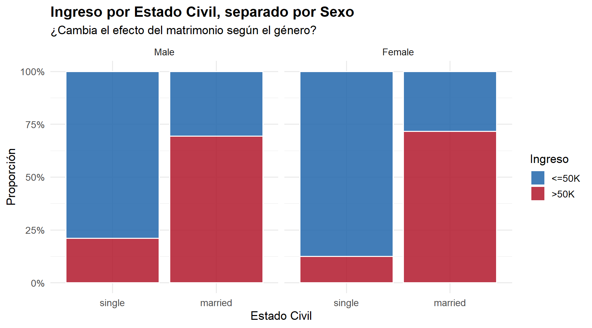
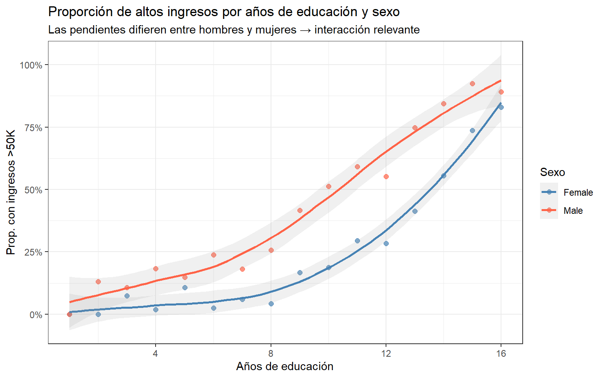

**1. Justificación de términos de interacción**

A muchos les faltó poner un respaldo visual a la justificación teórica del término de interacción. *¿Cómo se hace esto?* Se arma una distribución vibariada para cada categoría de la predicción Y (*low/high income*) vs variable de X1 y se "facetea" en la variable X2.

Por ejemplo, para ver una interacción entre estado civil y sexo, podemos graficar la distribución de ingresos para cada variable de estado civil (single y married) y facetearla por género.

El respaldo es positivo, si efectivamente las distribuciones son diferentes en cada caso. En este ejemplo, para mujeres solteras hay menor proporción de *high income* que para los hombres → probablemente sea buena predictora.

{width="583"}

Para variables numéricas podemos graficar curvas superpuestas. Esta es una visualización excelente, también ejemplo de un TP.

{width="536"}

**2. ¿Por qué no aparecen las interacciones en la tabla de AMEs?**

El **efecto marginal es la derivada de la curva de probabilidad respecto a** $X$, si el término es simple, tenemos que \
$$ \frac{\partial P}{\partial X_1} = \beta_1 \cdot P(X) \cdot (1 - P(X)) $$

y el AME es promediar esta cantidad sobre todas las observaciones.

Pero si tenemos dos variables y su término de interacción. Entonces partimos de

$$Z=\beta_0 + \beta_1 X_1 + \beta_2 X_2 + \beta_3 (X_1 X_2)$$

Y sabemos que la probabilidad es $P(X) = \frac{1}{1 + e^{-Z}}$. Entonces, por la regla de la cadena, la derivada de $P$ respecto a $X_1$ no es solo el $\beta_1$, sino que incluye a $X_2$ (debido la interacción) multiplicada por la derivada de la función logística:

$$\frac{\partial P}{\partial X_1} = (\beta_1 +\beta_3 X_2)\cdot P(X) \cdot (1-P(X))$$

Al hacer el promedio, el término de interacción es tenido en cuenta dentro del efecto marginal, por lo tanto, **el AME de X1 va a diferir del modelo base (la interacción se promedia en todas las observaciones)**.

Sin embargo, si sólo queremos cuantificar cómo cambia el efecto marginal de $X_1$ cuando movemos $X_2$, tenemos que volver a derivar la expresión anterior, esta vez respecto a $X_2$. Es decir, calculamos $\frac{\partial^2 P}{\partial X_1 \partial X_2}$. El problema es que si hacemos eso, aparecerán todavía más términos que hacen que el efecto de interacción no sea completamente interpretable como veníamos haciendo.

De hecho, debido a la no linealidad, la cuenta da distinta de cero incluso si no consideramos términos de interacción.

*¿Cómo se soluciona?* La forma correcta de analizar esto es calculando efectos condicionales (agrupando con el argumento `by = variable_interaccion`). Como esto quedó fuera del *scope* del tutorial 10, para evaluar interacciones alcanza con guiarse por los coeficientes (Log-Odds/Odds Ratios) del `summary()` original.

**3. Variables logarítmicas y la regla de la cadena (Semi-elasticidades)**

Varios calcularon el AME estándar (`dY/dX`) para variables a las que les habían aplicado logaritmo (ej. ingreso o capital). Como R no sabe que X es log, a priori, entonces aplica directamente

$$AME=\langle\frac{\partial P}{\partial \ln(X)}\rangle.$$

"En promedio poblacional, un aumento del **1%** en el ingreso aumenta la probabilidad del evento en **AME** puntos porcentuales."

Si en cambio, tratábamos con un valor lineal,

$$AME=\langle\frac{\partial P}{\partial X}\rangle.$$

"En promedio poblacional, un aumento de **1 unidad** en X aumenta la probabilidad del evento en **AME\*100** puntos porcentuales".
